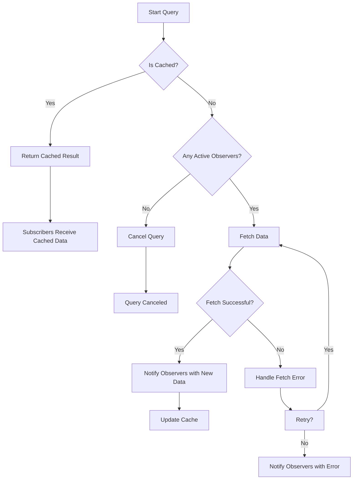

This changeset introduces several significant updates and new features to enhance the query utility package, aiming to improve its functionality, ease of use, and flexibility. Here's a thorough breakdown of the changes in layman's terms:
In this update, significant enhancements were made to how query tasks handle cancellation, especially focusing on scenarios where there are no subscribers or observers left for a particular task.

In asynchronous programming, especially when dealing with data fetching operations (like API calls), tasks or queries are initiated to retrieve data. These tasks continue to run unless they complete, fail, or are explicitly cancelled. Without proper cancellation mechanisms, redundant tasks could consume unnecessary resources, leading to inefficiency and potential memory leaks in applications.

> the problem with existing code was:
>
> 1. Cache was included in task, not individual for each query
> 2. Request was not canceled when client request had no observers.

The updated query utility introduces an improved system for automatically cancelling tasks when there are no active observers or subscribers. This means if you start a task to fetch data and then, for some reason, all interested parties (components, services, etc.) unsubscribe or stop listening for the result, the utility will automatically cancel the task to save resources.

1. **Observation Mechanism**: Each query task now keeps track of its subscribers (observers). When a task is initiated, it's "observed" by whoever needs its result (e.g., a component waiting for data to display).

2. **Cancellation Triggers**: The task continuously checks if it still has any observers. If, at any point, the task finds that all its observers have unsubscribed or there were no observers to start with, it triggers a cancellation process.
3. **Executing Cancellation**: Upon triggering cancellation, the task sends a signal to halt the data fetching operation. This could mean aborting an HTTP request, stopping a database query, or any other data retrieval operation that's in progress. The exact mechanism depends on the type of operation but typically involves using features like `AbortController` with fetch API in web environments.
4. **Resource Management**: This automatic cancellation helps in managing resources more efficiently. It ensures that the application's bandwidth, memory, and processing power are not wasted on tasks that are no longer needed. This is particularly important in scenarios where data fetching operations are costly or when the application is running in resource-constrained environments.

- **`chalk` Library**: We've included a new library called `chalk` that allows us to add colors and styles to the text we print out in the console. This makes our log messages much easier to read and helps distinguish between different types of messages, like errors or general information.
- **`@types/node` for Development**: To make our code smarter about what functions and features are available in Node.js, we've added type definitions specifically for Node.js. This is only used during development to help with things like code completion and checking for mistakes.

- **Improved Error Handling with Custom Errors**: We've created a custom error class to handle different types of errors more effectively. This means we can provide more specific and helpful error messages, making it easier to understand what went wrong.
- **Advanced Logging with Colors**: We've set up a new logging system that uses the `chalk` library to color-code messages. This update makes the logs stand out more, so you can quickly spot what's important or needs attention.
- **Ability to Change Cached Data (Mutation) and Refresh Data (Invalidation)**: Sometimes, the data we saved (cached) for quick access might need to be updated or completely refreshed. We've added features to mutate (update) this cached data or invalidate it, which means marking it as outdated so fresh data can be fetched.
- **Fetch Cancellation Support**: There's now support for stopping (canceling) data fetch operations if we no longer need the results. This is particularly useful to avoid unnecessary work and save resources.
- **Detailed Status Tracking for Queries**: We introduced a way to track more details about each data fetch operation, such as whether it's actively fetching data, has completed, or has been canceled. This provides better insight into what's happening behind the scenes.
- **Concurrent and Sequential Query Handling**: The updates introduce strategies to handle multiple data fetch requests at once, either by running them at the same time (concurrently) or one after the other (sequentially). This flexibility allows the utility to be more efficient in different scenarios.
- **Comprehensive Testing**: We've added a bunch of tests to check that all these new features and updates are working correctly. Testing helps catch any issues early on and ensures that the utility behaves as expected.

- **Logging Level Control**: There's a new setting (`FUSION_LOG_LEVEL`) that lets you control how much detail you want in the logs. This can make it easier to focus on the information that's important to you, especially when debugging.
- **Test Environment Improvements**: The setup for running tests has been upgraded to use a library called `vitest`, which offers a modern approach to testing JavaScript projects. This should make the tests run faster and more reliably.

In essence, these changes make the query utility more powerful and user-friendly. Error messages are clearer, logging is more descriptive, and there's now the ability to update or refresh cached data on demand. Additionally, the introduction of fetch cancellation helps in managing resources better. The new testing setup and environmental control options further enhance the development experience, making it easier to maintain and improve the utility going forward.
