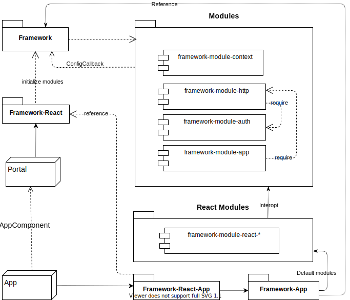
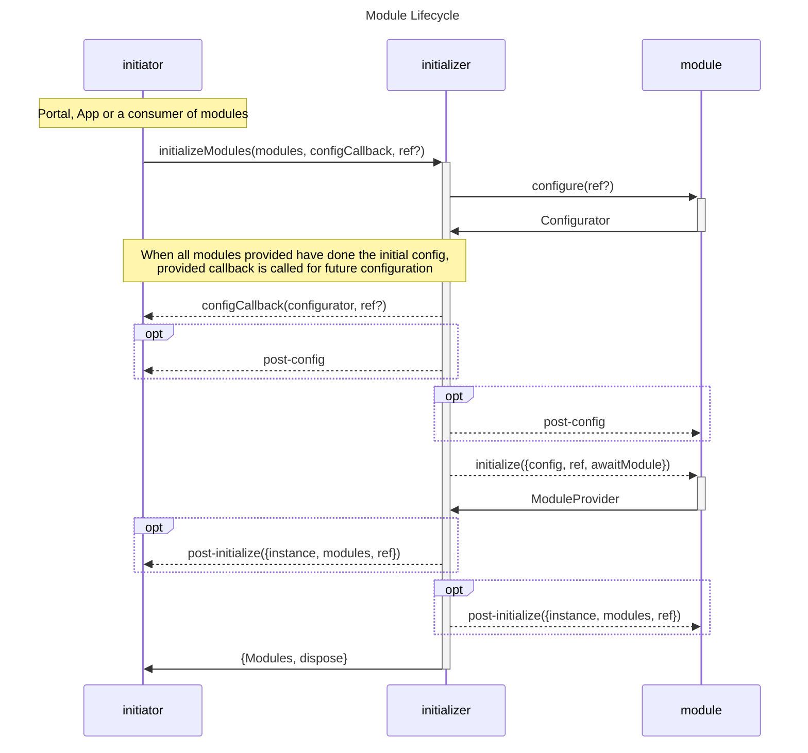

## Concept


### Framework (Fusion)

<ModuleBadge module="framework" package="@equinor/fusion-framework" />

The provider initiates the framework, which means it configures and initializes the framework.
When initializing sub modules (app) the framework is provided as an reference.

  - [module-event](event/)
  - [module-http](http/)
  - [module-msal](msal/)
  - [module-service-discovery](service-discovery/)

### App

<ModuleBadge module="app" />

An app can configure the default modules, but also add and configure additional modules.

  - [module-app-config](app-config/)
  - [module-event](event/)
  - [module-http](http/)
  - [module-msal](msal/)
  - [module-service-discovery](service-discovery/)

### Modules
<ModuleBadge module="module" />




#### Configure

When adding a module for initialization, the module could (most cases) create a configurator.
A configurator is an instance of preset configuration that exposes interface which that initiator can configure.

#### Initialize

When all configuration is done, the `initializer` will initialize provided modules.
When the module has initialized it will return a provider interface for that module.

> if a module requires another module, the `initializer` will provide an async hook which the module
> can await, this might throw a `ModuleNotProvidedError` or `TimeOutError`.

::: details Example
```ts
import { initializeModules } from '@equinor/fusion-framework-module';

import msal from '@equinor/fusion-framework-module-msal';
import http from '@equinor/fusion-framework-module-http';

const instance = initializeModules(([msal, http], (config) => {
  /** configure an auth client */
  config.auth.configureDefault({
    tenantId: 'foobar12-foo1-foo2-foo3-f0obarfoobar',
    clientId: 'foobar12-foo1-foo2-foo3-f0obarfoobar',
    redirectUri: '/authentication/login-callback',
  });

  /** configure a http client to use */
  config.http.configureClient('foo', {
    baseUri: 'https://foo.bar.net/api',
    defaultScopes: ['foobar12-foo1-foo2-foo3-f0obarfoobar/.default'],
  });

  config.onAfterConfiguration(() => {
    console.debug('config done');
  });

  config.onAfterInit(() => {
    console.debug('modules initialized');
  });
}));

instance.then(module => {
  /** use the initialized module */
  modules.http.createClient('foo').fetch('bar');
});
```
:::

### React

<ModuleBadge module="framework-react" package="@equinor/fusion-framework-react"/>
<br>
<ModuleBadge module="react-app" />

> Since the framework is async, these modules requires [Suspense](https://reactjs.org/docs/react-api.html#reactsuspense).
> Only React 17 or higher works with these modules

Modules have thin inter-opt modules for making it easier for developers to get started with React.

::: tip You never know what your boss gonna ask for tomorrow
The framework is built on plain JavaScript (TypeScript), with the ideology that libraries are just flavours of the day.
No core logic should exist in 3rd party libraries
:::
