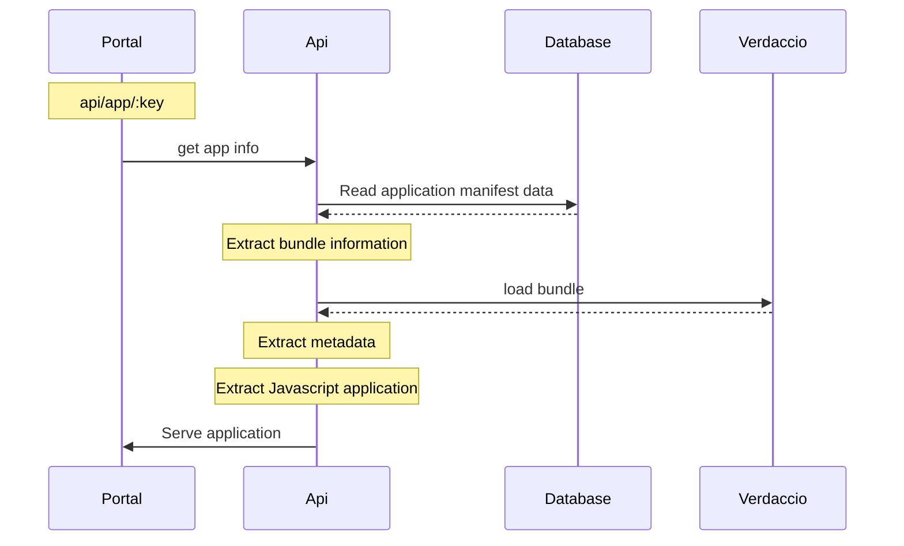
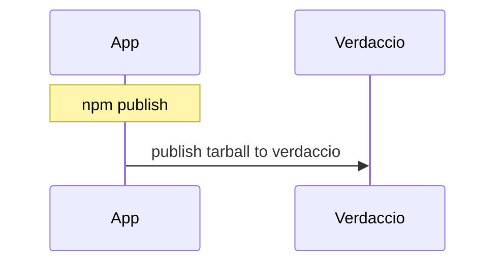
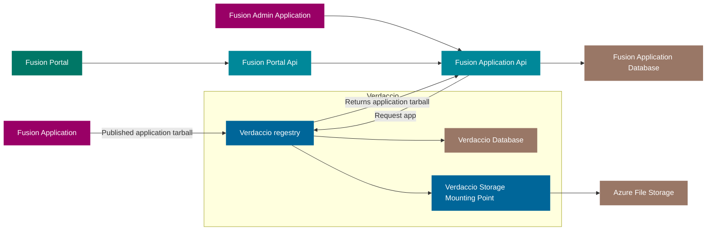

# Application adn widget loading and publishing

An `AppAPI Service` should serve as proxy api for Verdaccio se fig.1. extending it with fusion `appManifest`. It should handle cashing and file verification.

> Fig.1 AppLoading



## App Publishing

As an Fusion app developer the proses of deploying a application should be as simple as
`npm publish`, but of corse, some setup is requeued.

it has ben purposed to use Verdaccio the managing for version and handling the application / widgets. Verdaccio is a lightweight Node.js private proxy registry.

> Fig.1 Code Publish



>Verdaccio is a simple, zero-config-required local private NPM registry. No need for an entire database just to get started.

Verdaccio comes out of the box with its own tiny database, and the ability to proxy other registries (eg. npmjs.org), also introduces caching the downloaded modules along the way. For those who are looking to extend their storage capabilities, Verdaccio supports various community-made plugins to hook into services such as Amazon's S3, Google Cloud Storage or create your own plugin.

```bash
docker pull verdaccio/verdaccio
```



## Fusion App

```TS

    export type RenderTeardown = VoidFunction;

    export const renderComponent = (renderer: ComponentRenderer) => {
        return (el: HTMLElement, args: ComponentRenderArgs): RenderTeardown => {
            const Component = renderer(args.fusion, args.env);
            return render(el, Component);
        };
    };

    const render = (el: Element, Component: FunctionComponent): RenderTeardown => {
        ReactDOM.render(
            <StrictMode>
                <Suspense fallback={<AppLoading/>}>
                    <Component />
                </Suspense>
            </StrictMode>,
            el
        );
        return () => {
            ReactDOM.unmountComponentAtNode(el);
        };
    };

```
