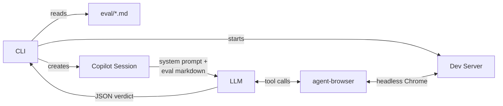
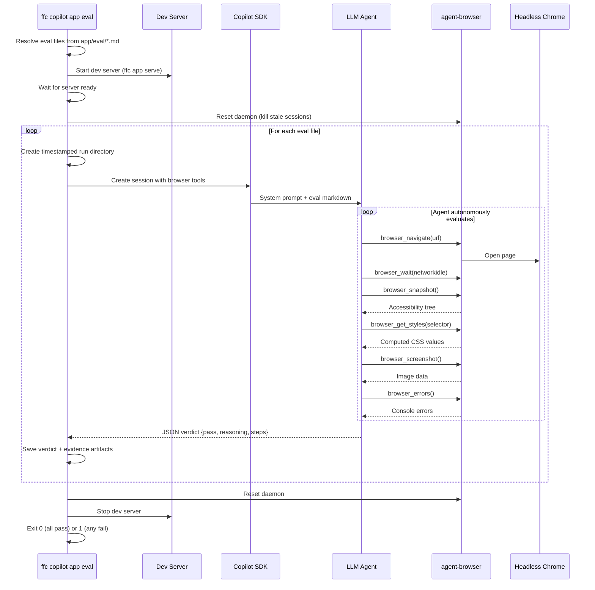
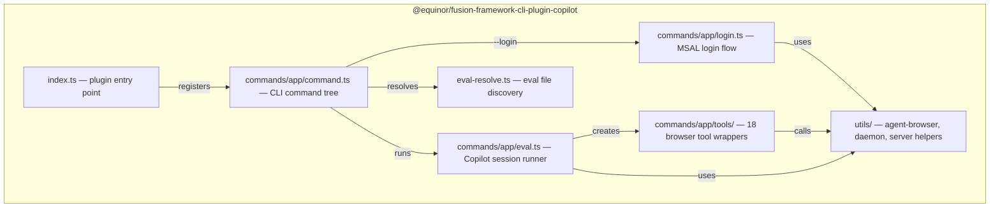

# @equinor/fusion-framework-cli-plugin-copilot

Agentic evaluation plugin for the Fusion Framework CLI. It uses the [GitHub Copilot SDK](https://www.npmjs.com/package/@github/copilot-sdk) to create a conversational session in which an LLM autonomously drives [`agent-browser`](https://www.npmjs.com/package/agent-browser) to navigate, interact with, and judge a running Fusion application against eval criteria written in plain markdown.

## When to use this

- You have a Fusion application (cookbook or production app) and want to verify it works end-to-end.
- You want an LLM to autonomously explore and validate acceptance criteria without writing Playwright scripts.
- You want structured, evidence-backed pass/fail verdicts with screenshots, snapshots, and computed style checks.

## How it works

The plugin follows a single-session agentic workflow: the Copilot agent reads your eval markdown, decides what to check, drives the browser through tool calls, collects evidence, and produces a structured JSON verdict in one session.



### Eval lifecycle



## Quick start

```bash
# Evaluate all eval files in a cookbook
ffc copilot app eval ./cookbooks/app-react

# Or use the workspace-root shortcut
pnpm eval:app ./cookbooks/app-react

# Run a specific eval
ffc copilot app eval ./cookbooks/app-react --eval smoke

# Use a specific LLM model
ffc copilot app eval ./cookbooks/app-react --model claude-sonnet-4

# Point at an already-running server
ffc copilot app eval . --url http://localhost:3000/apps/my-app
```

### MSAL login (first-time setup)

If the application requires authentication, run the login flow once to persist MSAL tokens in the Chrome profile:

```bash
ffc copilot app eval ./cookbooks/app-react --login
# Alias
ffc copilot app eval ./cookbooks/app-react --logon
```

This opens a **headed** browser for interactive login. After you authenticate, press Ctrl+C. Subsequent eval runs reuse the saved session automatically.

## Writing eval files

Eval files are plain markdown files placed in the app's `eval/` directory. The plugin passes the raw markdown directly to the LLM as the user prompt. No special parsing is required.

```
my-app/
├── eval/
│   ├── smoke.md
│   └── accessibility.md
├── src/
└── package.json
```

### Eval file format

Write eval files as you would a user story or test plan. The LLM reads the markdown and decides how to verify each criterion.

```markdown
---
name: smoke-test
---

## User Story

As a user, I need to see the application load successfully so I know
the deployment is healthy.

## Acceptance Criteria

- must see a heading with the application name
- must not have any JavaScript errors in the console
- should load within 5 seconds
- should display navigation elements
```

Both story-driven formats (user story + acceptance criteria) and instruction-driven formats (numbered steps + assertions) work. The LLM adapts to the structure you provide.

## CLI reference

```
ffc copilot app eval <path> [options]
```

| Option | Description | Default |
|--------|-------------|---------|
| `<path>` | Path to the Fusion application directory | required |
| `--eval <name-or-path>` | Run a specific eval by name or file path | All files in `eval/` |
| `--port <port>` | Port for the app dev server | `3000` |
| `--host <host>` | Host for the app dev server | `0.0.0.0` |
| `--url <url>` | Skip server start and use an already-running URL | none |
| `--verbose` | Show `agent-browser` commands and app server output | `false` |
| `--login`, `--logon` | Open a headed browser for interactive MSAL login | `false` |
| `-m, --model <model>` | LLM model to use, for example `claude-sonnet-4` | SDK default |
| `-o, --output <dir>` | Output directory for run artifacts | `.tmp/copilot/` |

## Run artifacts

Each eval run creates a timestamped directory containing evidence and metadata:

```
.tmp/copilot/smoke-test_143052/
├── copilot-log.jsonl      # Tool call log (timestamp, tool name, arguments)
├── copilot-response.md    # Full LLM response text
├── verdict.json           # Structured pass/fail verdict
└── evidence/
    ├── snapshot.txt        # Accessibility tree snapshot
    ├── errors.txt          # JavaScript console errors
    ├── url.txt             # Final page URL
    ├── screenshot-*.jpg    # Visual evidence screenshots
    ├── styles-*.txt        # Computed CSS style captures
    └── eval-*.json         # JavaScript evaluation results
```

## Available browser tools

The LLM can use 18 browser tools during an eval session:

| Tool | Description |
|------|-------------|
| `browser_navigate` | Open a URL in the browser |
| `browser_snapshot` | Capture an accessibility tree with element refs (`@e1`, `@e2`) |
| `browser_screenshot` | Take a screenshot and return the image to the model |
| `browser_get_styles` | Get computed CSS styles of an element |
| `browser_eval` | Evaluate a JavaScript expression in the page context |
| `browser_click` | Click an element by ref, CSS selector, or text |
| `browser_fill` | Fill a form field (clears existing content first) |
| `browser_type` | Type text character by character |
| `browser_press_key` | Press a keyboard key (Enter, Tab, Escape, etc.) |
| `browser_hover` | Hover over an element |
| `browser_select` | Select an option from a dropdown |
| `browser_scroll` | Scroll the page or scroll an element into view |
| `browser_wait` | Wait for load state, text, element, or timeout |
| `browser_find` | Semantic element lookup by role, text, or label |
| `browser_errors` | Get JavaScript console errors |
| `browser_get_url` | Get the current page URL |
| `browser_go_back` | Navigate back in browser history |
| `browser_reload` | Reload the current page |

## Package structure



## Prerequisites

- **Node.js** >= 20
- **pnpm** as the workspace package manager
- **agent-browser** installed globally or available on `PATH`
- **GitHub Copilot** access in VS Code, because the SDK authenticates through the GitHub Copilot extension
