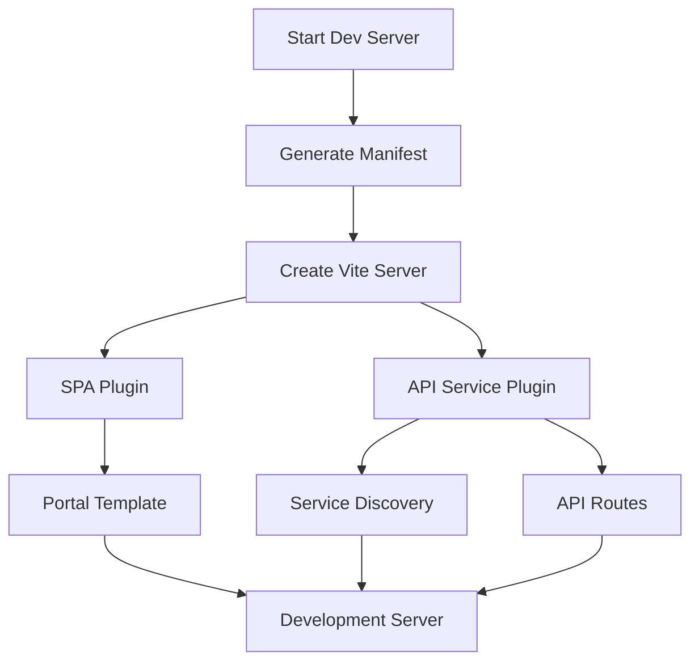
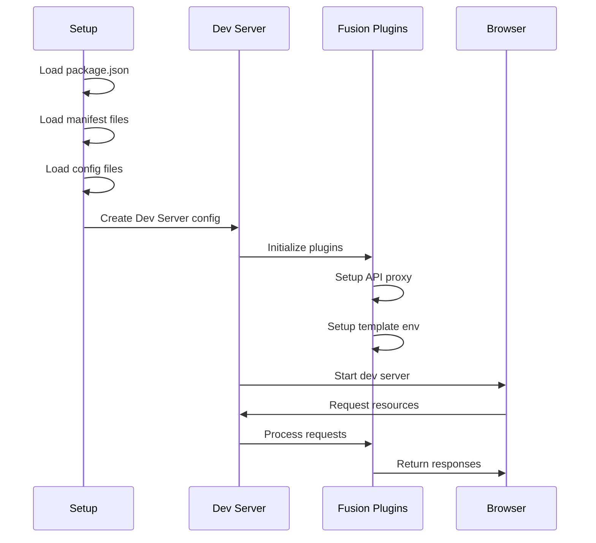
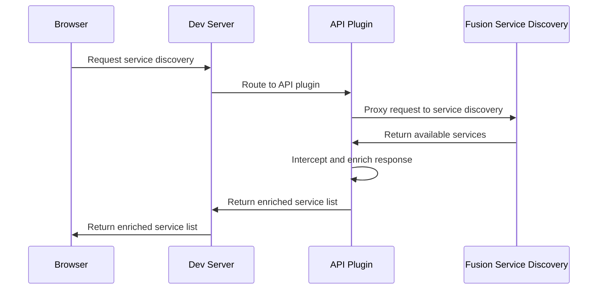
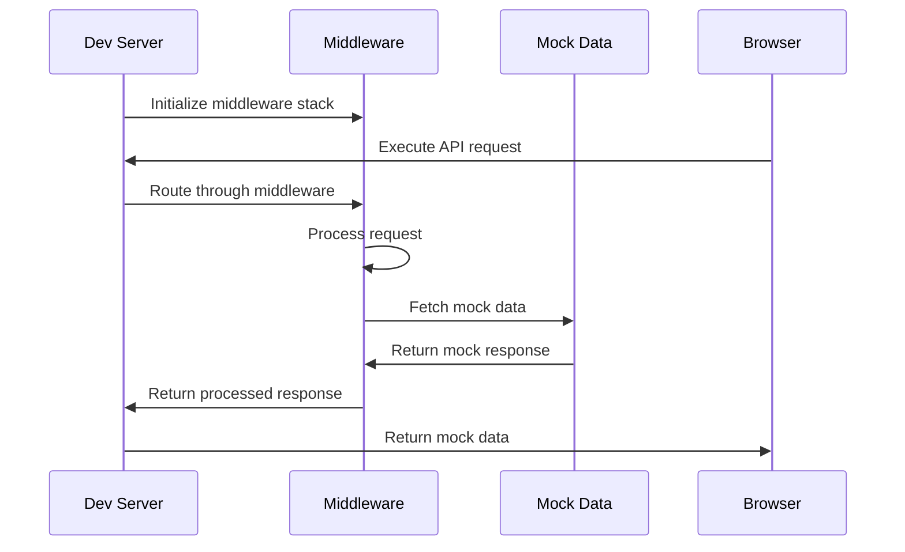
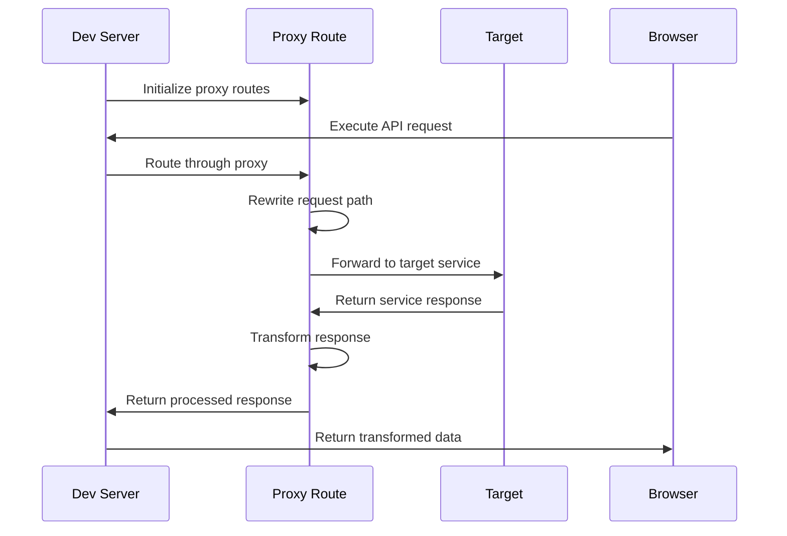
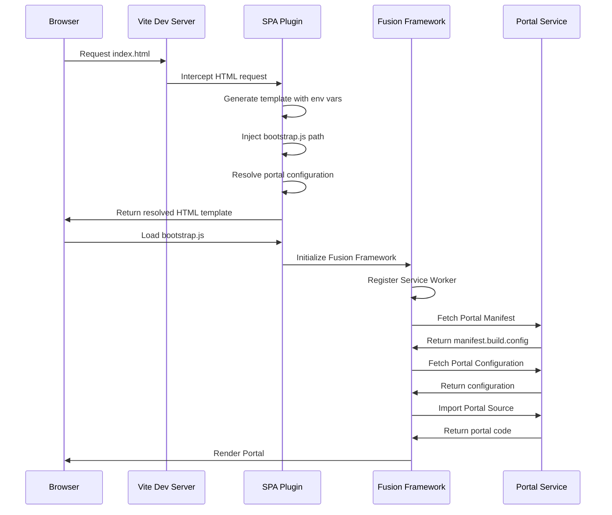
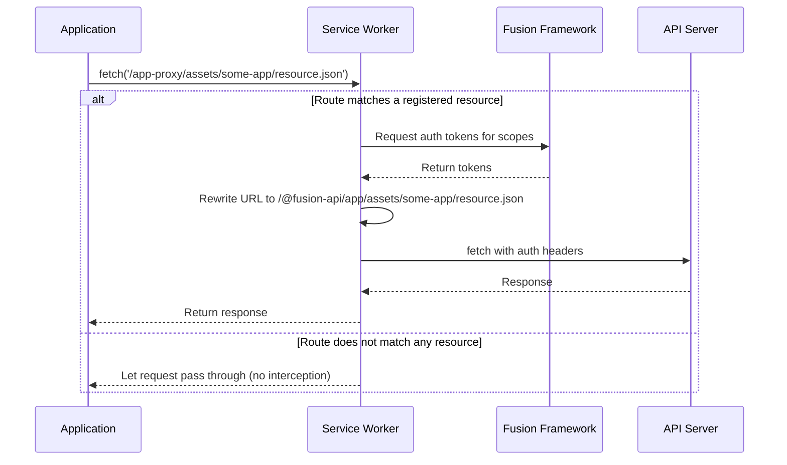

# Fusion Framework Dev Server

The Fusion Framework dev-server is your complete local development solution for building and testing Fusion Framework applications and portals. Whether you're developing a new application or working on an existing portal, the dev-server provides everything you need to get up and running quickly.

## What You Get

🚀 **Instant Development Environment** - Start coding immediately with hot module replacement, live reloading, and instant feedback

🔧 **Fusion Framework Integration** - Built-in support for service discovery, API proxying, and portal configuration

⚡ **Modern Tooling** - Powered by Vite for lightning-fast builds and optimal development experience

🛠️ **Flexible Configuration** - Easy setup for both applications and portals with environment-specific overrides

## Quick Start

```bash
# For applications
ffc app dev

# For portals  
ffc portal dev
```

The dev-server automatically detects your project type, loads configuration files, and starts a development server with all Fusion Framework features ready to use. No complex setup required - just run the command and start building.

## Key Features

- **Service Discovery Integration** - Automatically connects to Fusion service discovery and enables local API mocking
- **Template Generation** - Dynamic HTML template generation with environment variable injection
- **API Proxying** - Seamless API integration with request/response transformation capabilities
- **Portal Support** - Full portal development with manifest loading and configuration management
- **Hot Module Replacement** - Instant updates as you code without losing application state

## Architecture Overview

The dev-server is built on a modular architecture that combines Vite's powerful development tooling with Fusion Framework-specific capabilities. Here's how the components work together:



## Core Components

#### 🎯 CLI Orchestrator
**`@equinor/fusion-framework-cli`**
- **Role**: Command-line interface and project coordinator
- **Responsibilities**: 
  - Resolves project configuration from `package.json` and manifest files
  - Generates application manifests and environment configs
  - Initializes and configures the Vite development server
  - Handles command-line options and project type detection

#### 🏗️ Development Server Core
**`@equinor/fusion-framework-dev-server`**
- **Role**: Core development infrastructure
- **Responsibilities**:
  - Provides the base Vite development server
  - Integrates Fusion Framework-specific plugins
  - Manages hot module replacement and file watching
  - Handles development-specific configurations and optimizations

#### 🎨 SPA Template Engine
**`@equinor/fusion-framework-vite-plugin-spa`**
- **Role**: HTML template generation and application bootstrapping
- **Responsibilities**:
  - Generates dynamic HTML templates for applications and portals
  - Injects environment variables and configuration data
  - Manages portal-specific manifest loading
  - Handles application-specific routing and navigation

#### 🔌 API Integration Layer
**`@equinor/fusion-framework-vite-plugin-api-service`**
- **Role**: API service discovery and request handling
- **Responsibilities**:
  - Proxies requests to Fusion service discovery endpoints
  - Enables local API mocking and development overrides
  - Manages dynamic route mapping for discovered services
  - Provides request/response transformation capabilities

#### 🏠 Development Portal
**`@equinor/fusion-framework-dev-portal`**
- **Role**: Portal source code for development
- **Responsibilities**:
  - Provides minimal portal implementation for development
  - Integrates with Fusion Framework for authentication and service discovery
  - Acts as placeholder for testing applications in portal environment
  - Enables development without full production portal setup

### How They Work Together

1. **CLI** analyzes your project and determines the appropriate configuration
2. **Dev Server Core** creates a Vite instance with Fusion Framework plugins
3. **SPA Plugin** generates the HTML template with your app's specific settings
4. **API Plugin** sets up service discovery and API proxying
5. **Dev Portal** provides portal source code when developing portal applications
6. **All components** work together to provide a seamless development experience

This modular approach ensures that each component has a clear responsibility while working together to provide a unified development environment tailored specifically for Fusion Framework applications. 

> [!TIP]
> The **Developer Portal** serves as a minimal template for Fusion ecosystem development. It can be substituted with any portal implementation, including production portals from the portal store, enabling comprehensive testing across different portal configurations and environments.

## Development Environment Startup

The dev-server follows a systematic startup sequence that automatically configures your development environment through intelligent project analysis, configuration resolution, and plugin initialization. This comprehensive process ensures all Fusion Framework integrations are properly initialized, service discovery is configured, API proxying is established, and the development portal is ready for immediate use.



The development workflow follows a systematic process that ensures proper configuration and seamless integration:

1. **Start**: The development process begins when the CLI command (`ffc app dev` or `ffc portal dev`) is executed with user-specified options and parameters.
2. **Setup**: The system automatically discovers and loads project configuration files, including `package.json`, manifest files, and application configs, with environment-specific overrides.
3. **Dev Server Creation**: A development server is instantiated with Fusion Framework-specific plugins and configurations tailored for the project type.
4. **Plugin Initialization**: The SPA and API service plugins are configured with project-specific settings, including template environment variables and service discovery endpoints.
5. **Server Startup**: The development server becomes available with hot module replacement, file system access, and API proxy capabilities.
6. **Runtime Processing**: As developers interact with the application, requests are processed through the plugin system, which handles API proxying, template generation, and resource serving.

This workflow ensures that developers have immediate access to a fully functional development environment with all Fusion Framework integrations ready for use.

## Service Discovery

The API plugin (`@equinor/fusion-framework-vite-plugin-api-service`) acts as an intelligent proxy that intercepts and enriches service discovery requests, enabling flexible service integration and local development capabilities. This plugin transforms the development server into a sophisticated service gateway that can dynamically modify service endpoints, inject mock services, and provide seamless integration between local development and production services.

### Service Discovery Sequence



1. **Browser Request**: The application or framework requests available services from the service discovery endpoint
2. **Plugin Interception**: The API plugin intercepts this request before it reaches the external service
3. **Proxy to Fusion**: The plugin forwards the request to the actual Fusion service discovery endpoint
4. **Response Interception**: When the response returns, the plugin intercepts it before sending it back to the user
5. **Service Enrichment**: The plugin enriches the response by:
   - Adding mock services for local development
   - Altering service endpoints for testing
   - Injecting additional metadata or configuration
   - Modifying service capabilities or scopes
6. **Enhanced Response**: The user receives an enriched list of services that may include both real and mock services

## Mocking

The API plugin implements a **middleware pattern** that creates dynamic processing routes for mocking API responses during development. While these middleware routes can handle various request processing tasks, their primary purpose is to provide mock data when backend services aren't available or when you need to test specific scenarios without hitting real APIs.



1. **Middleware Initialization**: The dev-server initializes the middleware stack with configured routes and processing rules
2. **Request Interception**: API requests from the browser are routed through the middleware layer
3. **Request Processing**: The middleware processes the request according to its configured rules and logic
4. **Data Resolution**: The middleware fetches appropriate data (mock or real) based on the request and configuration
5. **Response Processing**: The middleware processes and transforms the response before returning it
6. **Response Delivery**: The processed response is returned to the browser through the dev-server

#### Usage Example

```typescript
import type { MiddlewareRoute } from '@equinor/fusion-framework-vite-plugin-api-service';

const mockDataRoute: MiddlewareRoute = {
  match: '/api/users',
  middleware: (req, res, next) => {
    // Return mock data for users endpoint
    res.setHeader('Content-Type', 'application/json');
    res.end(JSON.stringify([
      { id: 1, name: 'John Doe' },
      { id: 2, name: 'Jane Smith' }
    ]));
  }
};
```

## Re-Routing requests

The API plugin implements a **proxy pattern** that configures routes to be proxied to other services based on service discovery results. When your application makes API calls, these routes are automatically forwarded to the appropriate backend services. The service worker handles authentication by adding the necessary tokens to these proxied requests, ensuring your app can seamlessly communicate with Fusion services during development.



1. **Proxy Initialization**: The dev-server initializes proxy routes with configured targets and rules
2. **Request Reception**: The browser sends an API request to the dev-server
3. **Proxy Routing**: The dev-server routes the request through the appropriate proxy configuration
4. **Path Rewriting**: The proxy rewrites the request path according to configured rules
5. **Target Forwarding**: The proxy forwards the rewritten request to the target service
6. **Response Reception**: The target service processes the request and returns a response
7. **Response Transformation**: The proxy transforms the response data according to configured rules
8. **Response Delivery**: The transformed response is returned to the browser through the dev-server

#### Usage Example

```typescript
import type { ProxyRoute } from '@equinor/fusion-framework-vite-plugin-api-service';

const apiProxyRoute: ProxyRoute = {
  match: '/api/users',
  proxy: {
    target: 'https://api.example.com',
    rewrite: (path) => path.replace('/api', '/v1'),
    transformResponse: (data) => {
      // Transform the response data
      return {
        ...data,
        transformed: true,
        timestamp: new Date().toISOString()
      };
    },
    configure: (proxy, options) => {
      // Configure the proxy server
      proxy.on('proxyReq', (proxyReq, req, res) => {
        proxyReq.setHeader('X-Forwarded-For', req.socket.remoteAddress);
      });
    }
  }
};
```

## SPA Template Concept

The SPA plugin (`@equinor/fusion-framework-vite-plugin-spa`) provides a sophisticated template system that automates HTML generation, environment variable injection, and application bootstrapping for Fusion Framework applications. This intelligent system dynamically generates HTML templates based on project configuration, injects environment-specific variables, and seamlessly integrates with the Fusion Framework initialization process. When developing portals, the plugin serves the **`@equinor/fusion-framework-dev-portal`** as the source code, providing a complete portal environment for testing and development.



1. **HTML Request**: The browser requests the index.html file from the Vite dev server
2. **Template Interception**: The SPA plugin intercepts the HTML request before it reaches the file system
3. **Environment Injection**: The plugin generates the HTML template with environment variables and configuration data
4. **Bootstrap Injection**: The plugin injects the bootstrap.js path for Fusion Framework initialization
5. **Portal Resolution**: The plugin resolves portal configuration and determines the appropriate portal source
6. **Template Delivery**: The complete HTML template is returned to the browser
7. **Framework Initialization**: The browser loads bootstrap.js, which initializes the Fusion Framework
8. **Service Worker Registration**: The framework registers the service worker for API request handling
9. **Portal Manifest Fetch**: The framework fetches the portal manifest to understand available services
10. **Portal Configuration**: The framework retrieves portal-specific configuration settings
11. **Portal Source Import**: The framework imports the actual portal source code (dev-portal or custom portal)
12. **Portal Rendering**: The framework renders the portal in the browser, completing the application startup

### Service Worker

The service worker acts as a critical intermediary for API requests, providing seamless authentication and request transformation without requiring changes to application code. While we could inject MSAL tokens directly into the API plugin, this would break the production pattern where applications handle their own authentication. Additionally, the CLI uses a different app registration than web applications, making the service worker approach essential for maintaining consistent authentication patterns and enabling transparent API integration in the Fusion Framework ecosystem.



1. **Request Initiation**: The application initiates a fetch request to a resource endpoint
2. **Service Worker Interception**: The service worker intercepts the request before it reaches the network
3. **Route Matching**: The service worker checks if the request matches any registered resource patterns
4. **Authentication Request**: If matched, the service worker requests authentication tokens from the Fusion Framework
5. **Token Retrieval**: The Fusion Framework returns the appropriate authentication tokens for the required scopes
6. **URL Rewriting**: The service worker rewrites the request URL to the proper API endpoint format
7. **Authenticated Request**: The service worker makes the request to the API server with authentication headers
8. **Response Processing**: The API server processes the request and returns the response
9. **Response Delivery**: The service worker delivers the response back to the application
10. **Pass-Through Handling**: If the route doesn't match any registered resources, the request passes through without interception


