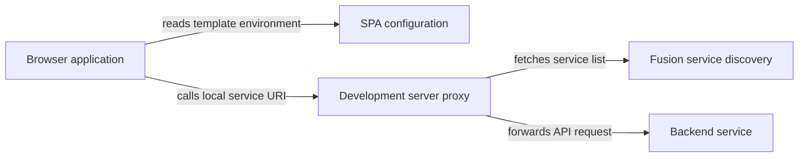

# Getting started

Use `@equinor/fusion-framework-dev-server` to create a Fusion-aware Vite server programmatically.
Application projects that only need to run locally should prefer `ffc app dev`, which builds on
these lower-level primitives and supplies application conventions.

## Install the package

```sh
pnpm add -D @equinor/fusion-framework-dev-server vite
```

The package supports Vite 7 and 8.

## Understand the request flow



`spa.templateEnv.serviceDiscovery` tells browser-side Fusion modules where discovery is.
`api.serviceDiscoveryUrl` tells the Node server where to fetch services before rewriting them
through local proxy routes. Keeping the roles separate supports custom portals and proxy setups.

## Create the server

```typescript
import { createDevServer } from '@equinor/fusion-framework-dev-server';

const server = await createDevServer({
  spa: {
    templateEnv: {
      portal: { id: 'my-portal' },
      title: 'My application',
      serviceDiscovery: { url: 'https://service-discovery.example.com', scopes: [] },
      msal: {
        clientId: 'client-id',
        tenantId: 'tenant-id',
        redirectUri: '/authentication/login-callback',
        requiresAuth: 'true',
      },
    },
  },
  api: { serviceDiscoveryUrl: 'https://service-discovery.example.com' },
});

await server.listen();
server.printUrls();
```

> [!NOTE]
> `createDevServer` returns a Vite server but does not call `listen()`. Your command chooses when
> startup happens and how startup failures are handled.

## Generate configuration instead

Use `createDevServerConfig` when another tool owns the Vite lifecycle:

```typescript
import { createDevServerConfig } from '@equinor/fusion-framework-dev-server';
import { createServer } from 'vite';

const config = createDevServerConfig({
  api: { serviceDiscoveryUrl: 'https://service-discovery.example.com' },
});

const server = await createServer(config);
await server.listen();
```

The generated configuration includes React Fast Refresh, SPA template injection, service
discovery proxying, and the default logger.

## Next steps

- [Configure the dev server](configuration.md) for environment factories, API routes, and logs.
- [Develop with mock services](mocking.md) for local or deterministic backends.
- [Advanced usage](advanced.md) for discovery transforms and Vite plugins.