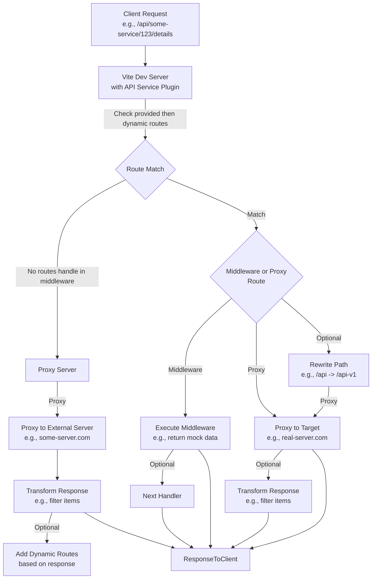

# API Service Vite Plugin

> __This plugin main purpose is to proxy or mock `Service Discovery` APIs.__
>
> It also allows you to mock or override services from the `Service Discovery` API.

> [!WARNING]
> This plugin is only intended for development purposes and should not be used in production environments.
>  
> The plugin is designed to be used with the Vite development server and is not compatible with other server implementations.

## Gist

This Vite plugin offers a powerful and flexible solution for handling and intercepting API calls during development. Whether you're mocking APIs for testing, proxying requests to external services, or dynamically managing routes based on server responses, this plugin simplifies the process without requiring changes to your application code. Key features include custom route handling (via middleware or proxies), advanced proxy capabilities with response processing, and utility functions to streamline development workflows.



## Usage

Integrate the plugin into your Vite project by adding it to your `vite.config.ts`. You can configure it with an optional `proxyHandler` for advanced proxying and a `routes` array for custom route definitions.

```ts
import { defineConfig } from 'vite';  
import { plugin as apiServicePlugin } from '@equinor/fusion-dev-server/plugin-api-service';

export default defineConfig({
  plugins: [
    apiServicePlugin({
      proxyHandler: {
        // Optional: Define proxy handler configuration here
      },
      routes: [
        // Optional: Define custom routes here
      ]
    })
  ]
});
```

- `proxyHandler`: Configures a proxy to an external server with options for response processing and dynamic route generation.

- `routes`: An array of route objects to intercept and handle specific API requests. Each route can be configured with middleware or proxy settings.

## API Routes

The plugin enables you to define custom routes to intercept API requests, which can be processed using middleware or proxied to another server. You can configure routes with various options to match specific paths, process responses, and add dynamic functionality to the development server.

### Route matching

Every route requires a `match` property to determine which requests it handles. This can be a string (path pattern) or a function (custom matcher).

- `String`: A path pattern (e.g., `/api/:id`) that supports parameters using `path-to-regexp`.

- `Function`: A custom function that takes the request path and returns a boolean.

```ts
// String-based matching
const routeWithStringMatch = {
  match: '/my-api/some-service/:id/items',
  // Additional route configuration
};

// Function-based matching
const routeWithFunctionMatch = {
  match: (path: string) => path.startsWith('/my-api'),
  // Additional route configuration
};

const routeWithRequestMatch = {
  match: (path: string, req: IncomingRequest) => {
    if(req.method.match(/GET/i)){
      return path.startsWith('/my-api'),
    } 
  }
};
```

### Middleware Routing

Middleware routes let you handle requests directly within the Vite server, making them ideal for mocking responses or adding custom logic. You can define a middleware function that processes the request and sends a response.

```ts
const myMiddlewareRoute = {
  match: '/my-api/some-service/:id/details',
  middleware: (req, res, next) => {
    const someCondition = true; // Replace with your logic
    if (!someCondition) {
      next(); // Pass to the next handler
    } else {
      res.setHeader('Content-Type', 'application/json');
      res.end(JSON.stringify({ id: 'foo', name: 'foo' }));
    }
  }
};
```

In this example, if `someCondition` is false, the request proceeds to the next handler. Otherwise, it returns a custom JSON response.

### Proxy Routing

Proxy routes forward requests to an external server, with options to rewrite paths and process responses.

#### Basic Proxy Route

```ts
// Configure a proxy route
const myProxyRoute: ProxyRoute = {
  match: '/api/some-service/:id/details',
  proxy: {
    target: 'http://some-other-server.com',
    rewrite: path => path.replace('/api', '/api-v1')
  }
};
```

Here, a request to `/api/some-service/123/details` is proxied to `http://some-other-server.com/api-v1/some-service/123/details`.

#### Proxy Route with response processing

You can enhance proxy routes with the configure option to modify responses:

```ts
import { createResponseInterceptor } from '@equinor/fusion-dev-server/plugin-api-service';

const myProxyRouteWithInterceptor = {
  match: '/some-service/:id/items',
  proxy: {
    target: 'http://some-other-server.com',
    transformResponse: (response) => {
      return response.items.map(item => ({ id: item.id, name: item.name }));
    }
  }
};
```

This example intercepts the proxy response and transforms the `items` array before sending it to the client.

## Proxy Handler

The `proxyHandler` option enables advanced proxying with features like response processing and dynamic route creation. 
It’s perfect for scenarios like mocking a discovery service that lists APIs to proxy or mock.

> [!IMPORTANT]
> The `Proxy endpoint` must be called before any other API requests to ensure that the routes are added to the server.

> [!TIP]
> __Why use a Proxy Handler over just adding routes?__
>
> We could have built into the `ProxyRoute` the ability to process the response and add routes, but this would have made the configuration more complex and harder to understand. By separating the concerns, we can keep the configuration simple and focused.

> [!TIP]
> __Why does not the Proxy Handler support multiple proxy targets?__
>
> The `Vite.server.proxy` supports multiple, so simply configure multiple `ApiServicePlugin` instances with different `proxyHandler` configurations.
>
> This way, you can keep the configuration simple and focused 😘. 

### Basic Proxy Handler

Create a simple proxy to forward requests:

```ts
import { createProxyHandler } from '@equinor/fusion-dev-server/plugin-api-service';

const proxyHandler = createProxyHandler(
  'http://some-server.com/discovery-service',
  {
    route: '/@my-discovery-service',
  }
);
```

Requests to `/@my-discovery-service` are proxied to `http://some-server.com/discovery-service`.

### Proxy Handler with Response Processing

Process the proxy response before returning it:

```ts
import { createProxyHandler } from '@equinor/fusion-dev-server/plugin-api-service';

type ApiResponse = Array<{ name: string; url: string }>;

const transformResponse = (response: ApiResponse) => {
  const data = response.map(service => ({
    name: service.name,
    url: `https://pr-33.my-api.com/${new URL(service.url).pathname}`
  }));
  return { data };
};

const proxyHandler = createProxyHandler(
  'http://some-server.com/discovery-service',
  {
    route: '/@my-discovery-service',
    transformResponse
  }
);

// will be proxied to http://some-server.com/discovery-service
const services = fetch('/@my-discovery-service/discovery-service');

// { name: 'some-service', url: 'https://pr-33.my-api.com/some-service' }
const service = services.find(service => service.name === 'some-service');

// execute fetch request to https://pr-33.my-api.com/items/1/relations
const items = fetch(`${service.url}/items/1/relations`);
```

### Proxy Handler with Dynamic Routes

When processing proxy response the handler can also add routes to the server.

This can be useful for creating a proxy server that dynamically adds routes based on the response data.

This way you can mock or proxy for example a discovery service that provides a list of services and changes the services url to mock or/and proxy the services.

```ts
import { createProxyHandler } from '@equinor/fusion-dev-server/plugin-api-service';

type ApiResponse = { services: Array<{ name: string; url: string }> };

const processResponse = (response: ApiResponse) => {
  const services = [];
  const routes = [];

  for (const service of response.services) {
    const url = new URL(service.url);
    const proxyUrl = `/@my-proxy-api/${service.name}${url.pathname}`;
    services.push({ ...service, url: proxyUrl });
    routes.push({
      match: proxyUrl,
      proxy: {
        target: url.origin,
        rewrite: (path) => path.replace(`/${service.name}`, '')
      }
    });
  }

  return { data: services, routes };
};

const proxyHandler = createProxyHandler(
  'http://some-server.com/discovery-service',
  processResponse,
  {
    route: '/@my-discovery-service',
  }
);

// /@my-proxy-api/some-service/1/relations -> http://some-service.com/items/1/relations
const items = fetch(`${service.url}/items/1/relations`);
```

### Combined Proxy Handler and Routes

```ts
import { createProxyHandler } from '@equinor/fusion-dev-server/plugin-api-service';

const mockRoutes = [
  {
    // intercept a service route and return a mock response
    match: '/some-service/not-implemented-feature',
    middleware: (req, res) => {
      res.setHeader('Content-Type', 'application/json');
      res.end(JSON.stringify({ mockData }));
    }
  },
  {
    // route to redirect a service route to another service
    match: '/some-service/:id/items',
    proxy: {
      target: 'http://pr-33.my-api.com',
      rewrite: path => path.replace('/some-service', '')
    }
  },
  {
    // route to proxy a service route and process the response 🤯
    match: '/some-service/:id/relations',
    proxy: {
      target: 'http://pr-33.my-api.com',
      transformResponse: (response) => {
        return response.items.map(item => ({ id: item.id, name: item.name, $type: 'foobar' }));
      }
    }
  }
];

const proxyHandler = createProxyHandler(
  'http://some-server.com/discovery-service',
  processResponse, // see previous example
);

ApiServicePlugin({
  proxyHandler,
  routes
});

// { name: 'some-service', url: '/@api-proxy/some-service' }
const service = services.find(service => service.name === 'some-service');

// /@services/some-service
console.log(service.url); 

// mock to { mockData }
fetch(`${service.url}/not-implemented-feature`);


// proxy to http://pr-33.my-api.com/1/items
fetch(`${service.url}/1/items`);

// proxy to http://pr-33.my-api.com/items/1/relations 
// post-process { id: '1', name: 'foo', $type: 'foobar' }
fetch(`${service.url}/1/relations`);
```

## Utilities

The plugin includes helper functions to simplify route matching and response manipulation.

### createResponseInterceptor

Modify proxy responses with this utility:

```ts
import httpProxy from 'http-proxy';
import { createResponseInterceptor } from '@equinor/fusion-dev-server/plugin-api-service';

const proxyServer = httpProxy.createProxyServer({
  target: 'http://some-server.com',
  selfHandleResponse: true, // Required for response interception
});

const interceptor = createResponseInterceptor((response) => {
  return response.items.map(item => ({ id: item.id, name: item.name }));
});

proxyServer.on('proxyRes', interceptor);
```

### createRouteMatcher

Match paths and extract parameters:

```ts
import { createRouteMatcher } from '@equinor/fusion-dev-server/plugin-api-service';

const matcher = createRouteMatcher('/my-api/some-service/:id/items');

// match.params.id === '123'
const match = matcher('/my-api/some-service/123/items');
```