# Context Routing — Event-Driven Scenario Model

Abstract, intent-based view of context routing. Describes **what happens** in terms of events and reactions, independent of current implementation.

---

## Routing Strategies

A **routing strategy** defines how context identity is encoded in the URL and who is responsible for managing that encoding.

### Path Strategy

The context id occupies a **fixed segment** in the URL path.

- **URL shape:** `/apps/{appKey}/{contextId}/sub-route`
- **Who resolves the URL:** The portal or app injects the context id into a known position in the path
- **Pros:** Context is visible in the path hierarchy; works naturally with path-based routers
- **Cons:** Couples context to URL structure; harder to add/remove without breaking deep links

### Query Strategy

The context id is stored as a **query parameter** (`$contextId`), leaving the path untouched.

- **URL shape:** `/apps/{appKey}/page?$contextId={id}`
- **Who resolves the URL:** The portal appends/removes the parameter — the app's route tree is unaffected
- **Pros:** Completely decoupled from app routing; easy to add without app changes; modern and recommended
- **Cons:** Context not visible in path hierarchy; some legacy routers ignore query-only changes

### Custom Strategy

The app defines its **own rules** for encoding and decoding context in the URL.

- **URL shape:** Anything the app decides — e.g. `/apps/{appKey}/project/{contextId}/details`
- **Who resolves the URL:** The app provides `encodeContext` (build URL) and `decodeRoute` (extract context) handlers
- **Pros:** Full flexibility; supports complex nested URL patterns
- **Cons:** Requires app to implement both directions; falls back to path strategy if handlers are missing

### Strategy Resolution

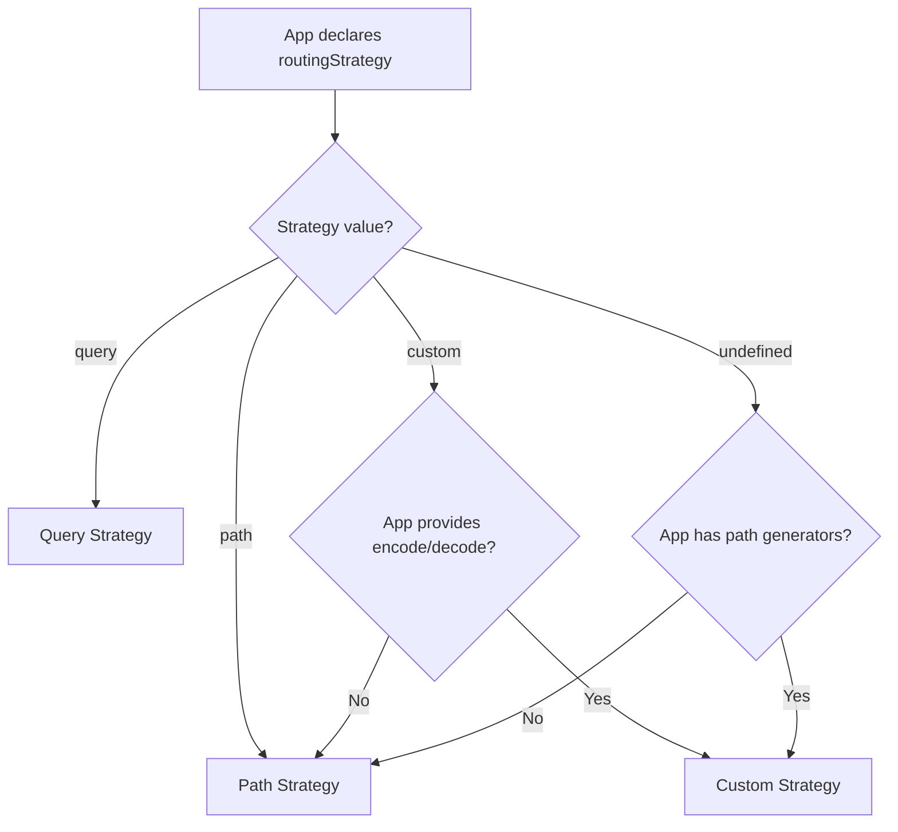

### Strategy × Scenario Matrix

How each strategy handles each scenario — who acts, what changes, and the resulting URL shape.

| Scenario | Path | Query | Custom |
|----------|------|-------|--------|
| **No context** | No action — wait | No action — wait | No action — wait |
| **Clear context** | Portal removes path segment → `/apps/{app}/` | Portal removes `$contextId` param → `/apps/{app}/page` | Portal navigates to app root → `/apps/{app}/` |
| **App-handled context** | App resolves route, context injected into path → `/apps/{app}/{id}/sub` | Not applicable — always portal-driven | App encodes context into custom path → `/apps/{app}/project/{id}/details` |
| **Portal-handled context** | Portal injects context segment → `/apps/{app}/{id}/` | Portal sets `$contextId` param → `/apps/{app}/page?$contextId={id}` | Not applicable — requires app handlers |
| **Carryover (app switch)** | URL guard re-injects path segment | URL guard re-adds query param | URL guard calls app's encode to inject context |
| **Missing handlers** | N/A (always available) | N/A (always available) | Downgrades to path strategy |

#### Who owns what

| Responsibility | Path | Query | Custom |
|---------------|------|-------|--------|
| Encode context → URL | Portal or App | Portal only | App only |
| Decode URL → context | Portal (fixed segment position) | Portal (read query param) | App (custom extractor) |
| URL Guard correction | Portal | Portal | App's encode function |
| Clear context handling | Portal | Portal | Portal (safe default: app root) |
| Fallback when missing | — | — | Path strategy |

---

## Path Strategy

Context identity is encoded in the URL path structure.

---

### 1. No Context (Initializing)

App loaded but no context has been resolved yet. System waits for a context event.

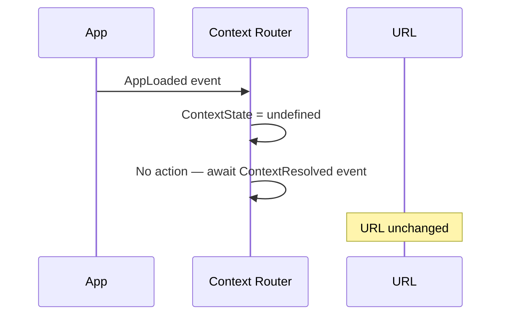

---

### 2. Clear Context

User explicitly clears the active context. URL must reflect "no context selected".

---

### 3. App-Handled Context

App owns navigation. Context changes and the app determines where the context fits in its route structure.

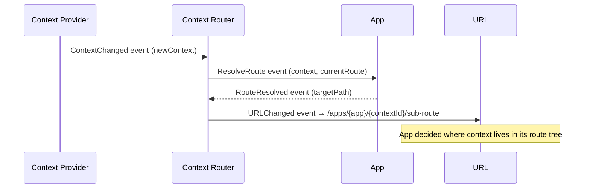

---

### 4. Portal-Handled Context

App does not own navigation. Portal resolves the URL on behalf of the app.

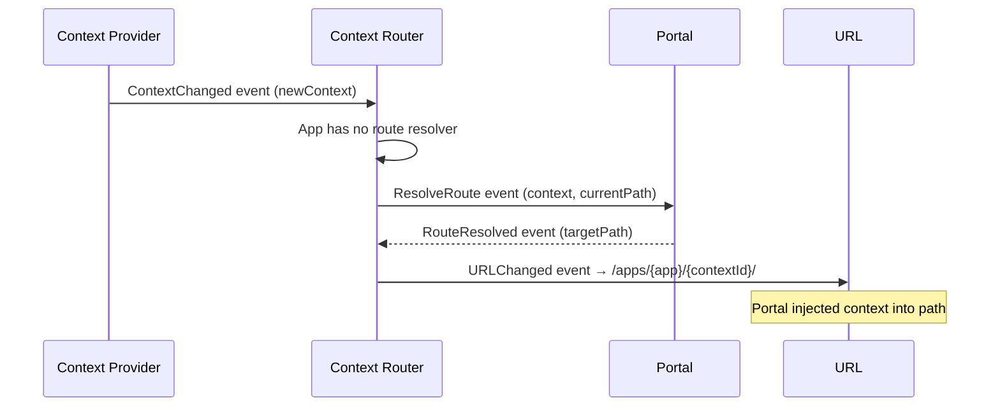

---

### 5. Context Carryover (App Switch)

User navigates to a different app. Active context should persist across the boundary.

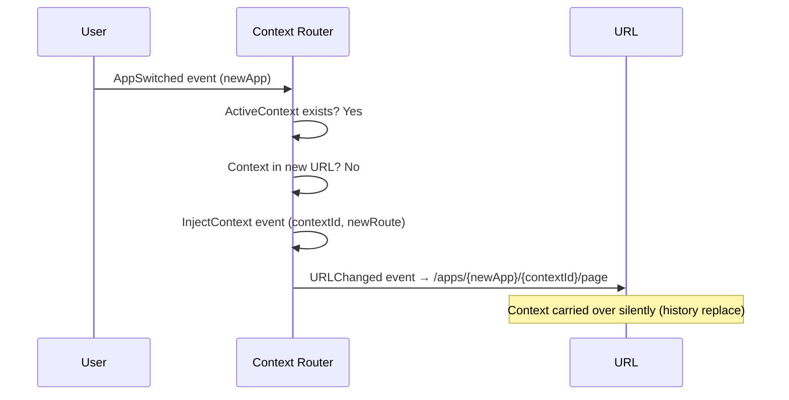

---

### 6. URL Guard — Context Already Present

URL already reflects the correct context. No correction needed.

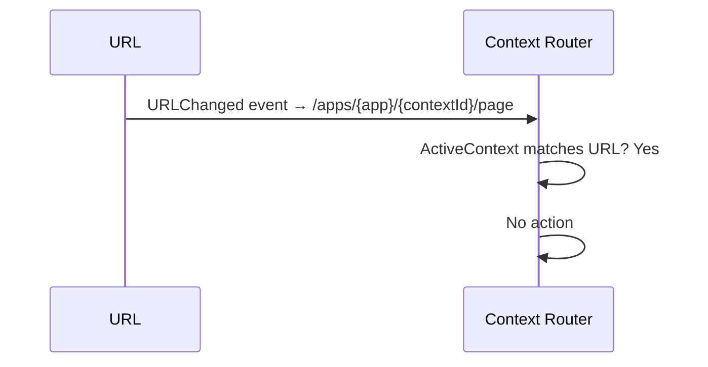

---

## Query Strategy

Context identity is encoded as a URL query parameter.

---

### 1. No Context (Initializing)

---

### 2. Clear Context

Context cleared. The query parameter is removed from the URL.

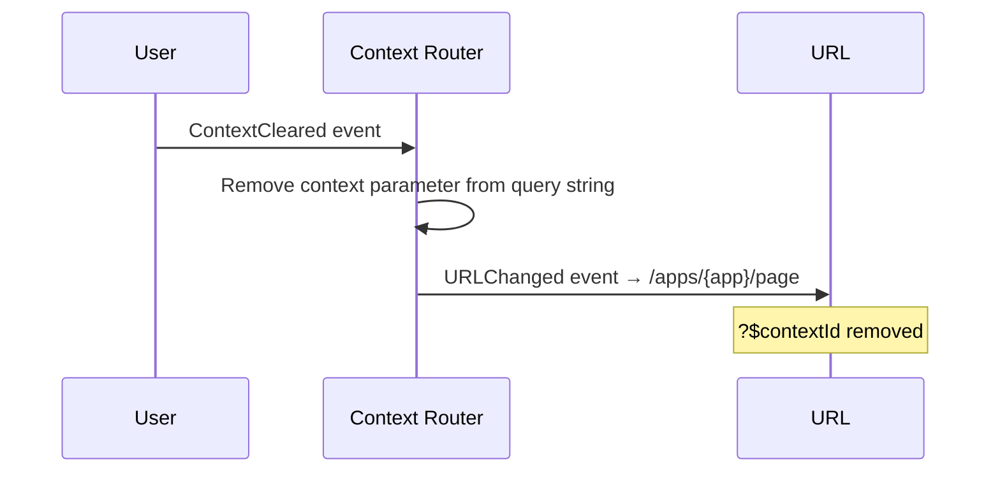

---

### 3. App-Handled Context

Query strategy is portal-driven — no app route resolution needed.

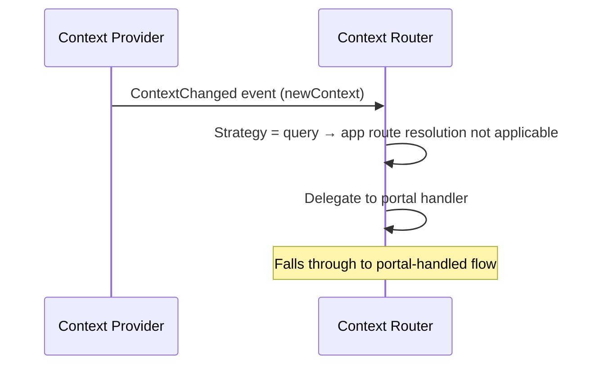

---

### 4. Portal-Handled Context

Portal appends the context parameter to the current URL.

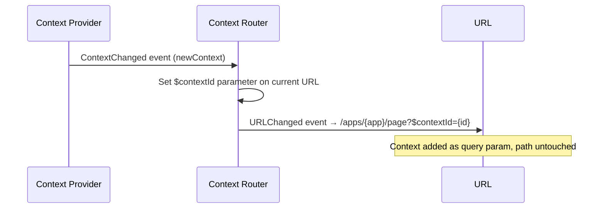

---

### 5. Context Carryover (App Switch)

User switches apps. System detects missing context param and re-applies it.

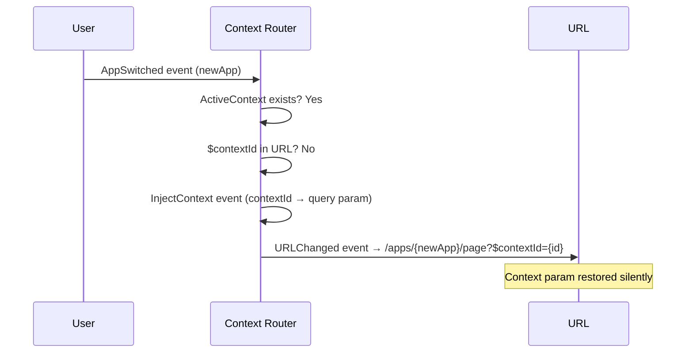

---

### 6. Clear Context with Legacy App

Older app router cannot react to query-only changes. System also resets the app's internal route.

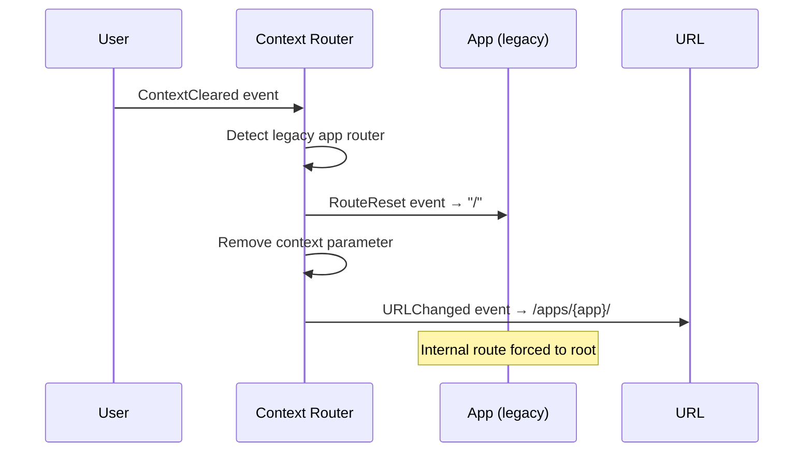

---

## Custom Strategy

App defines its own rules for encoding/decoding context in the URL.

---

### 1. No Context (Initializing)

---

### 2. Clear Context

Context cleared. System navigates to app root since it cannot know the app's "empty" route.

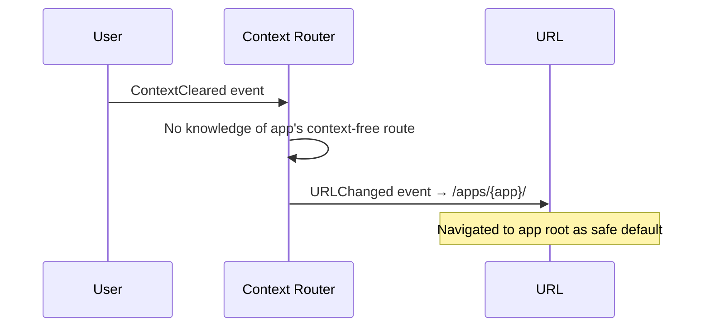

---

### 3. App-Handled Context

App provides encode/decode functions. System delegates entirely to the app's routing logic.

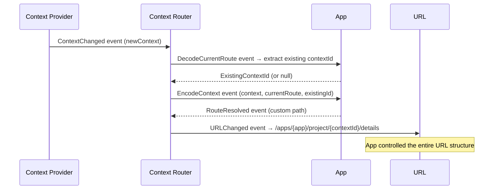

---

### 4. Portal-Handled Context (Fallback)

App declared custom strategy but didn't provide encode/decode. System cannot resolve the route.

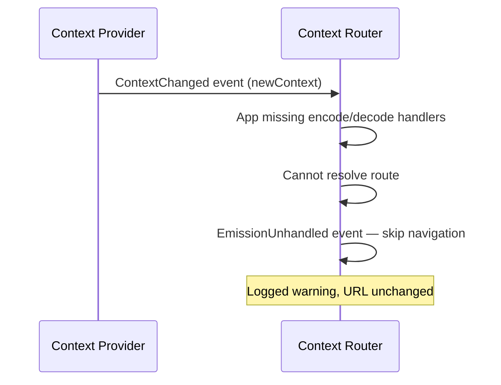

---

### 5. Context Carryover (App Switch)

URL guard uses the app's custom decode/encode to detect and fix missing context.

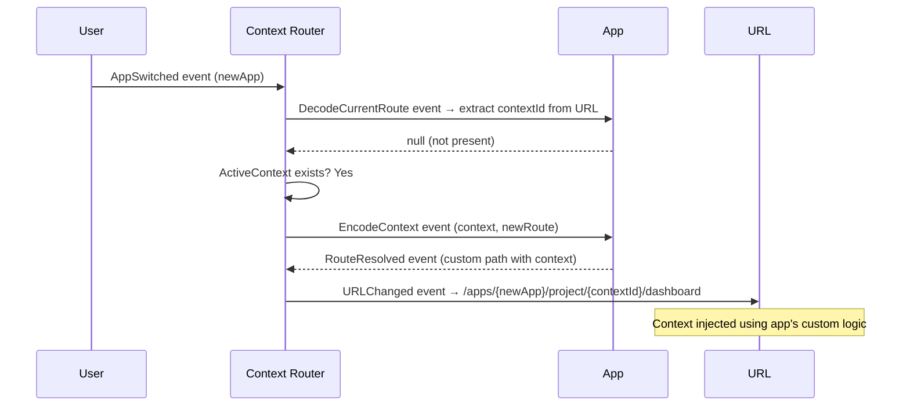

---

### 6. Custom Fallback to Path

App declares custom but provides no encode/decode handlers. System downgrades to path strategy.

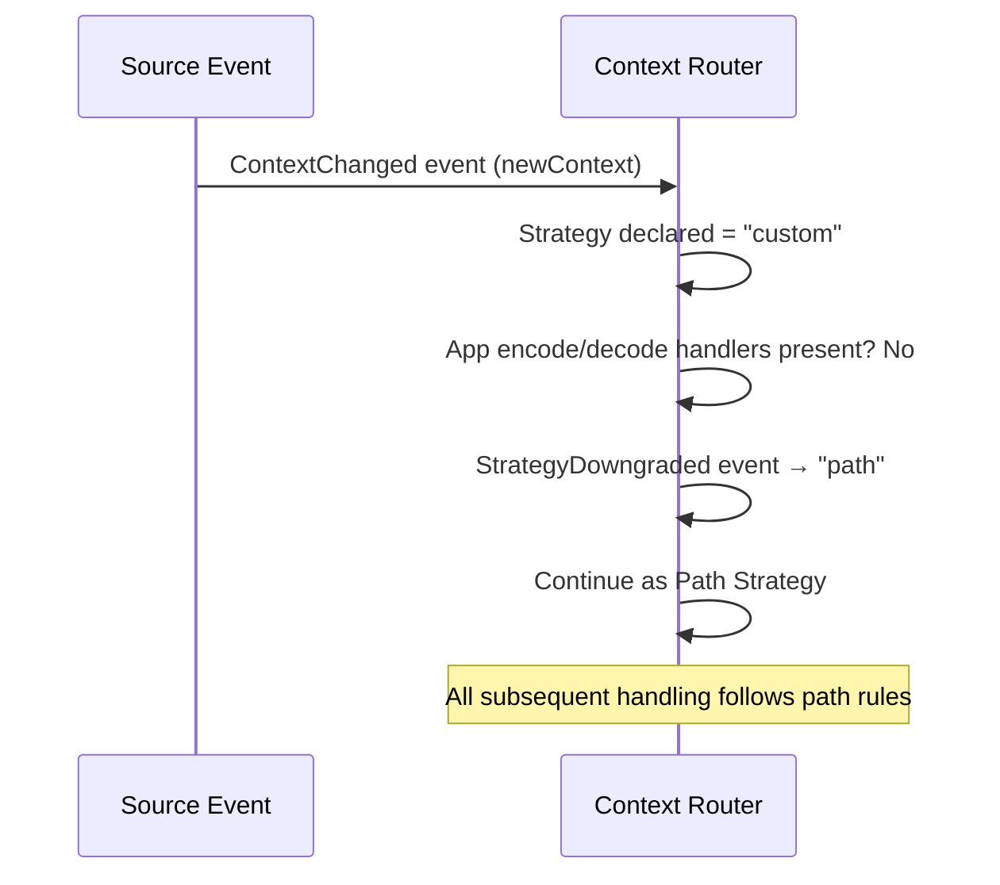

---

## Event Catalog

| Event | Emitted By | Consumed By | Meaning |
|-------|-----------|-------------|---------|
| `AppLoaded` | App Module | Context Router | New app instance is ready |
| `AppSwitched` | Portal Navigation | Context Router | User navigated to different app |
| `ContextChanged` | Context Provider | Context Router | New context selected |
| `ContextCleared` | Context Provider | Context Router | Context intentionally removed |
| `ResolveRoute` | Context Router | App / Portal | Request to compute target URL |
| `RouteResolved` | App / Portal | Context Router | Computed target URL returned |
| `URLChanged` | Context Router | Browser | Final navigation instruction |
| `InjectContext` | URL Guard | Context Router | Missing context detected, re-apply |
| `DecodeCurrentRoute` | Context Router | App (custom) | Extract context from current URL |
| `EncodeContext` | Context Router | App (custom) | Build URL with context |
| `RouteReset` | Context Router | App (legacy) | Force app internal route to root |
| `StrategyDowngraded` | Context Router | Internal | Custom → path fallback |
| `EmissionUnhandled` | Context Router | Telemetry | No handler could process the event |

---

## Summary Table

| Scenario | Path | Query | Custom |
|----------|------|-------|--------|
| No context (undefined) | Wait | Wait | Wait |
| Clear context (null) | Remove path segment | Remove query param | Navigate to app root |
| App-handled context | App resolves route | N/A (portal-only) | App encode/decode |
| Portal-handled context | Portal injects in path | Portal sets query param | N/A (no fallback) |
| Carryover (app switch) | Guard re-injects segment | Guard re-adds param | Guard uses app's encode |
| Missing handlers | N/A | N/A | Downgrade to path |
