# Context Routing — Scenario Diagrams

All possible flows for each routing strategy (`path`, `query`, `custom`).

---

## Path Strategy (`/apps/:appKey/:contextId/...`)

Context id is embedded as a URL path segment.

---

### 1. No Context (Initializing)

The app just loaded and context hasn't resolved yet. The module does nothing and waits.

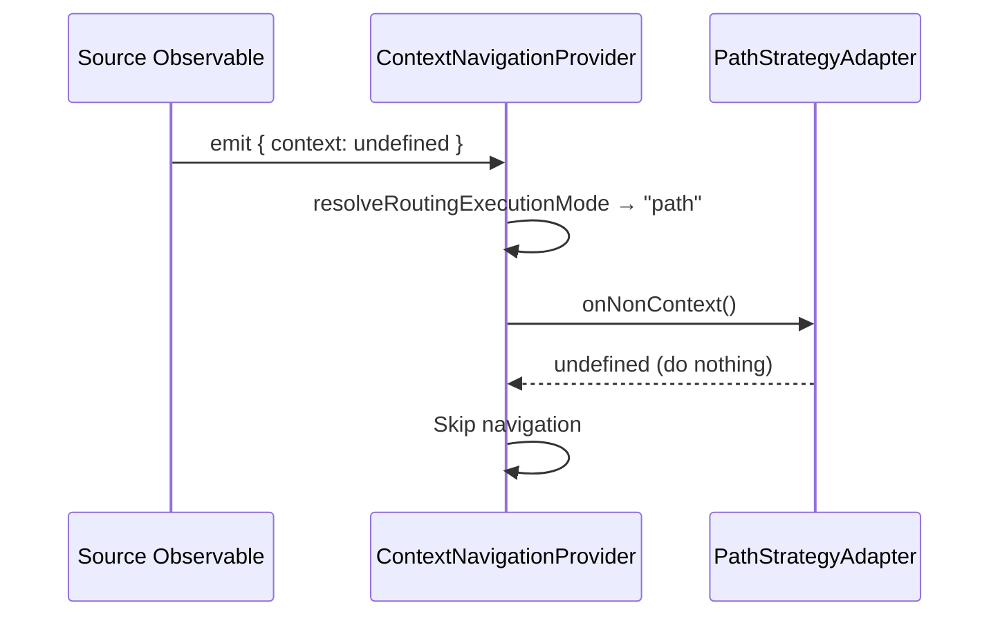

---

### 2. Clear Context

User explicitly clears context. The path segment is removed from the URL.

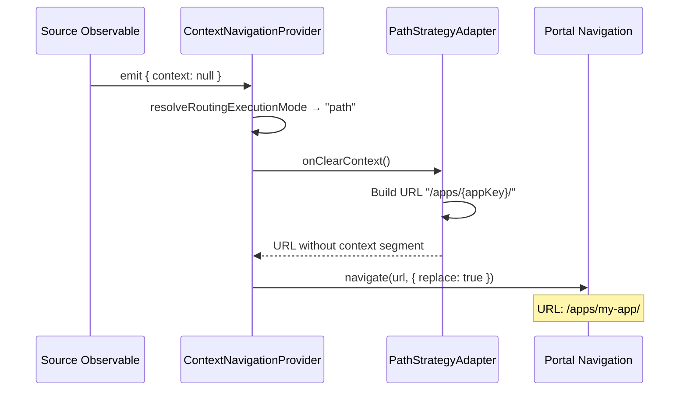

---

### 3. App-Handled Context

App has its own navigation module. The app's pathname is used to generate the new URL with context injected.

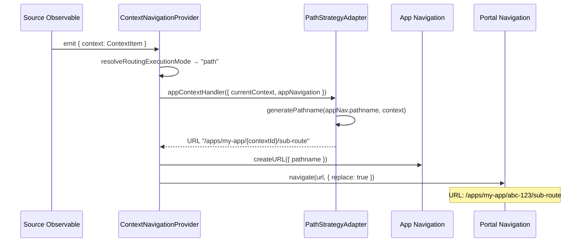

---

### 4. Portal-Handled Context

No app navigation module available. Portal builds the URL using its own pathname.

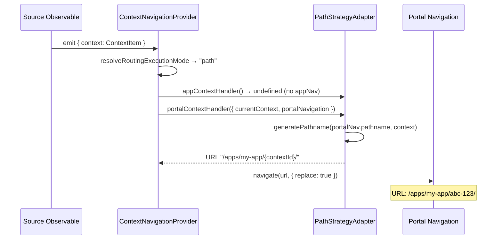

---

### 5. Context Carryover (App Switch)

User navigates from App A to App B. The URL guard detects the active context is missing from the new URL and re-applies it.

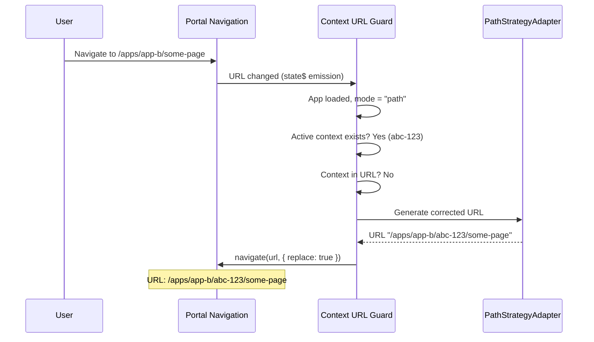

---

### 6. URL Guard — Context Already Present

URL already contains the correct context. Guard does nothing.

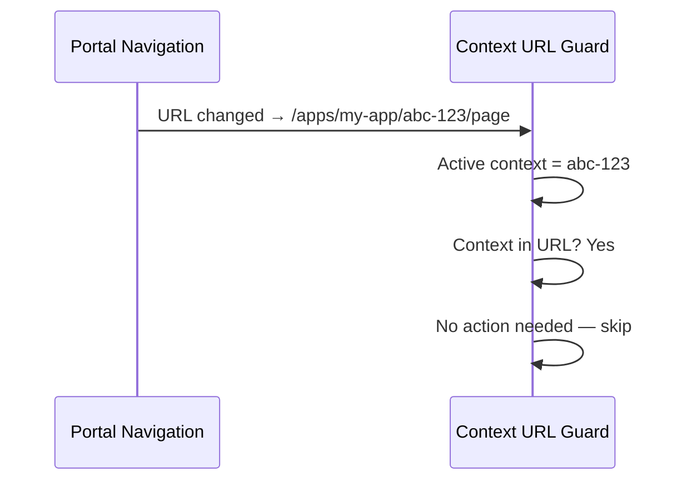

---

## Query Strategy (`?$contextId=...`)

Context id is stored as a URL query parameter.

---

### 1. No Context (Initializing)

Same as path — the module waits for context to resolve.

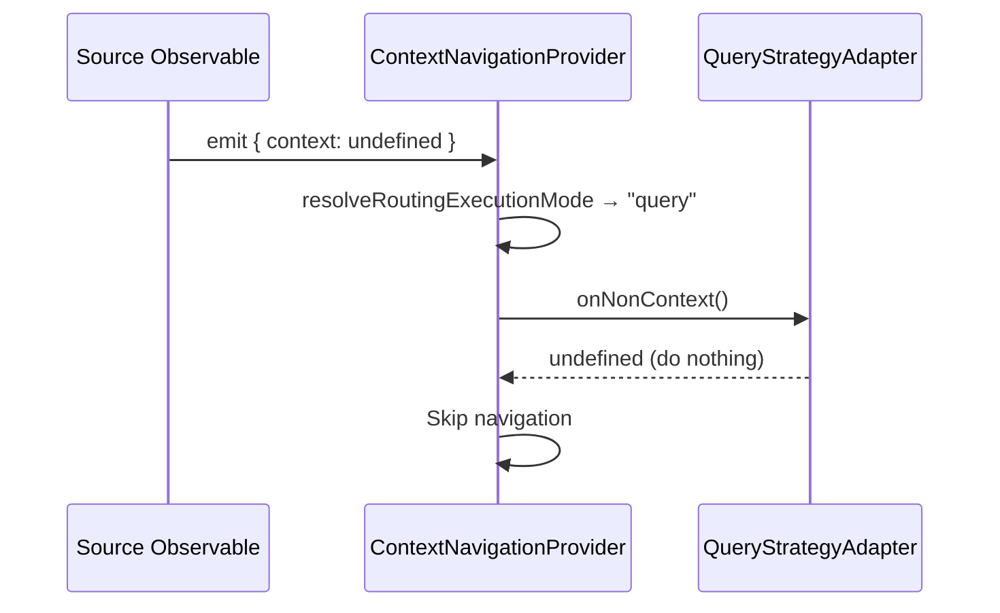

---

### 2. Clear Context

User clears context. The `$contextId` query param is removed.

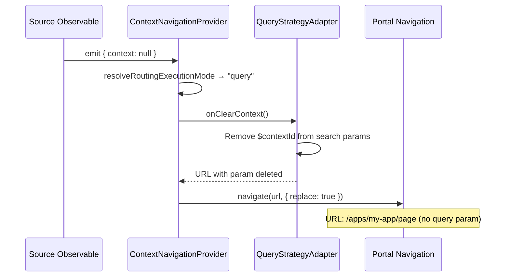

---

### 3. App-Handled Context

Query strategy has no `appContextHandler` — it skips straight to the portal handler.

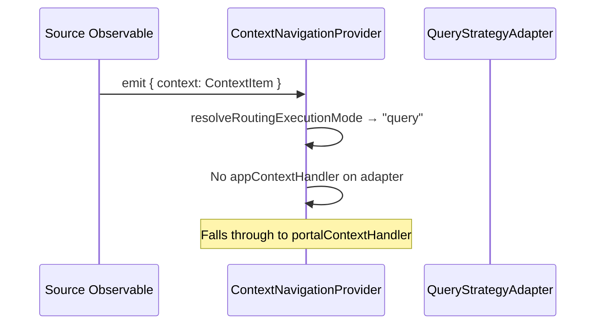

---

### 4. Portal-Handled Context

Portal sets the `$contextId` query parameter on the current URL.

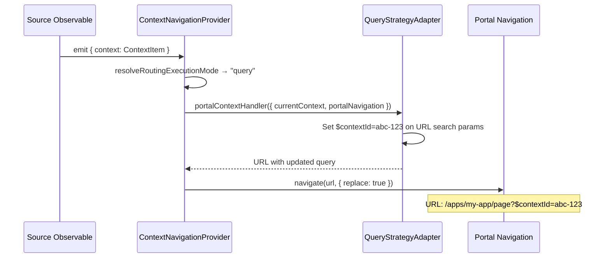

---

### 5. Context Carryover (App Switch)

User switches apps. The URL guard detects the missing `$contextId` and re-applies it.

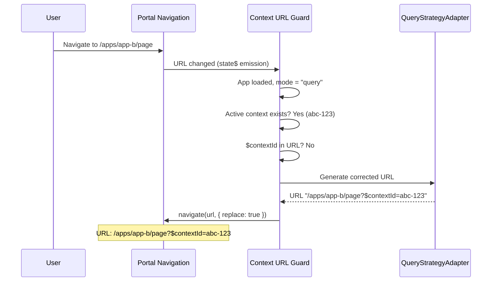

---

### 6. Clear Context with Legacy App Router

App router version < 7. Portal also resets the app's internal route.

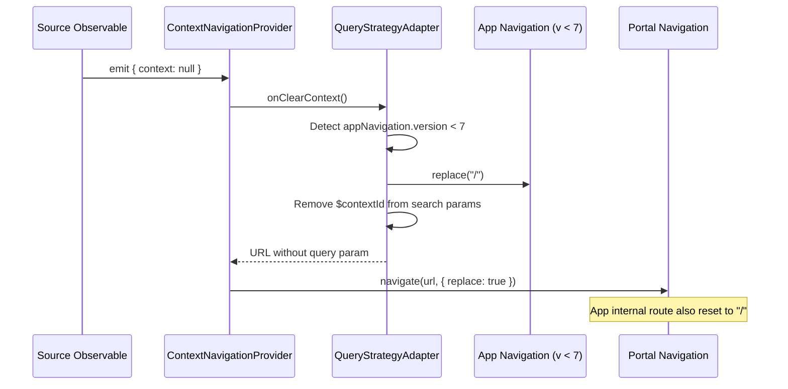

---

## Custom Strategy (App-Defined Routing)

App provides its own `generatePathFromContext` and `extractContextIdFromPath` functions.

---

### 1. No Context (Initializing)

Same behavior — module waits.

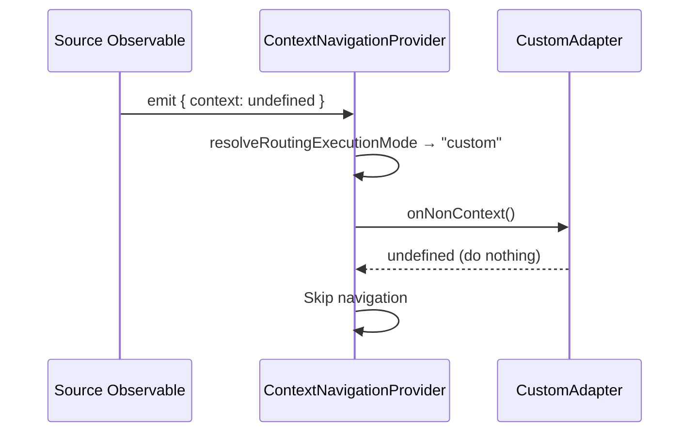

---

### 2. Clear Context

Context cleared. Navigate to the app's root URL.

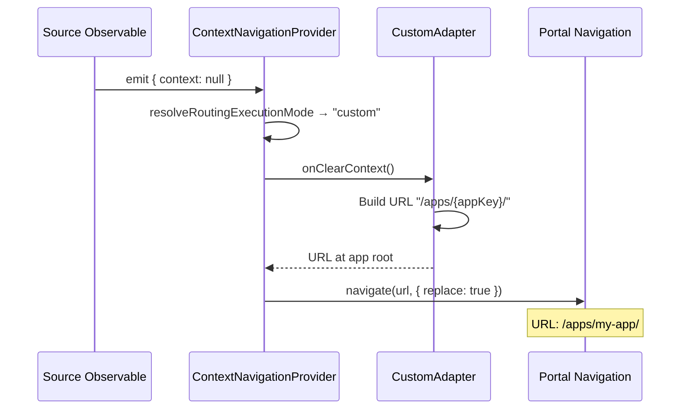

---

### 3. App-Handled Context

App provides `extractContextIdFromPath`. The adapter uses it with `generatePathname` to build the URL.

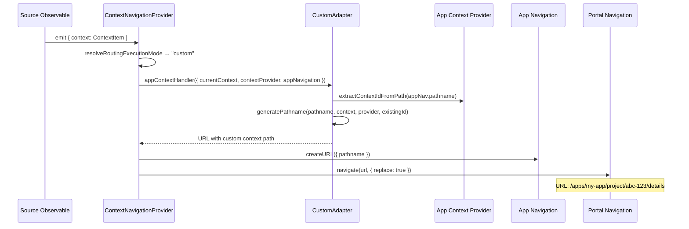

---

### 4. Portal-Handled Context (Fallback)

App lacks navigation module or `extractContextIdFromPath` — custom falls back but has no `portalContextHandler`.

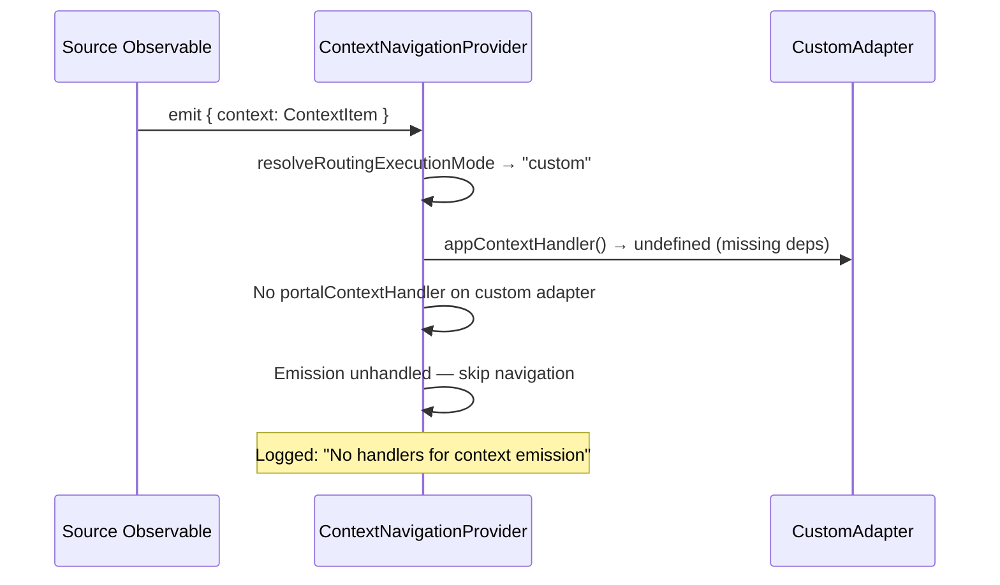

---

### 5. Context Carryover (App Switch)

URL guard re-applies context using the app's custom extraction logic.

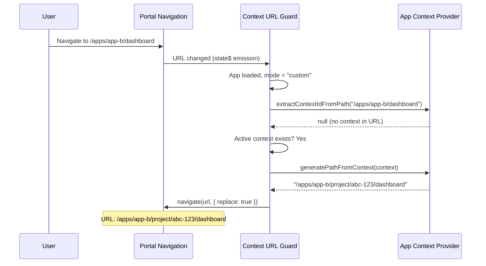

---

### 6. Custom Strategy Fallback to Path

App declares `routingStrategy: 'custom'` but doesn't provide `generatePathFromContext` / `extractContextIdFromPath`. Orchestrator falls back to `path` mode.

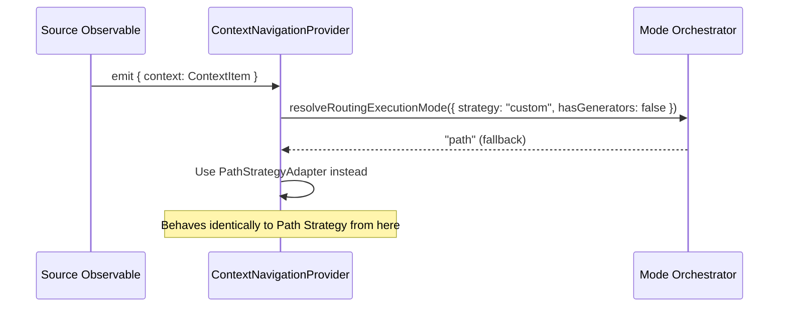

---

## Summary Table

| Scenario | Path | Query | Custom |
|----------|------|-------|--------|
| No context (undefined) | Skip | Skip | Skip |
| Clear context (null) | Remove path segment | Remove `$contextId` param | Navigate to app root |
| App-handled context | Inject in path via appNav | N/A (no handler) | App's custom extraction |
| Portal-handled context | Inject in path via portalNav | Set `$contextId` param | N/A (no handler) |
| Carryover (app switch) | URL guard re-injects segment | URL guard re-adds param | URL guard uses app generators |
| Missing generators | N/A | N/A | Falls back to path strategy |
