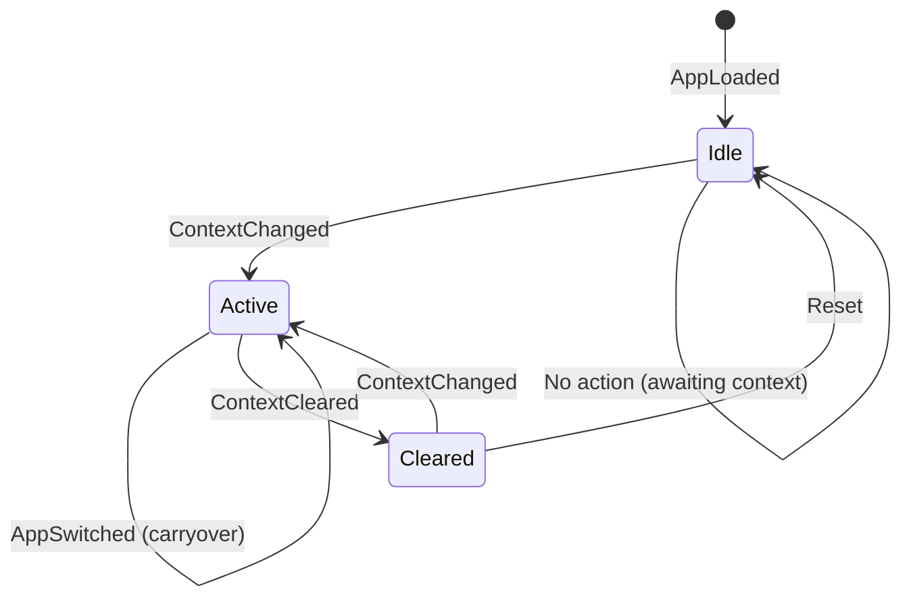
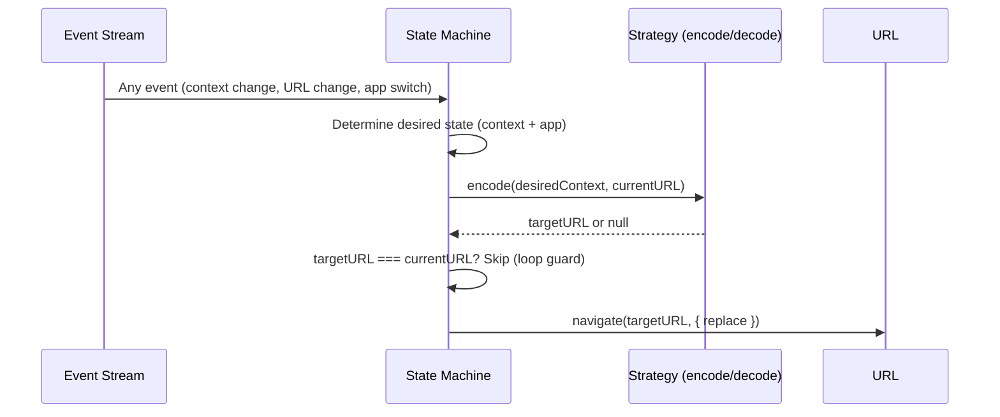
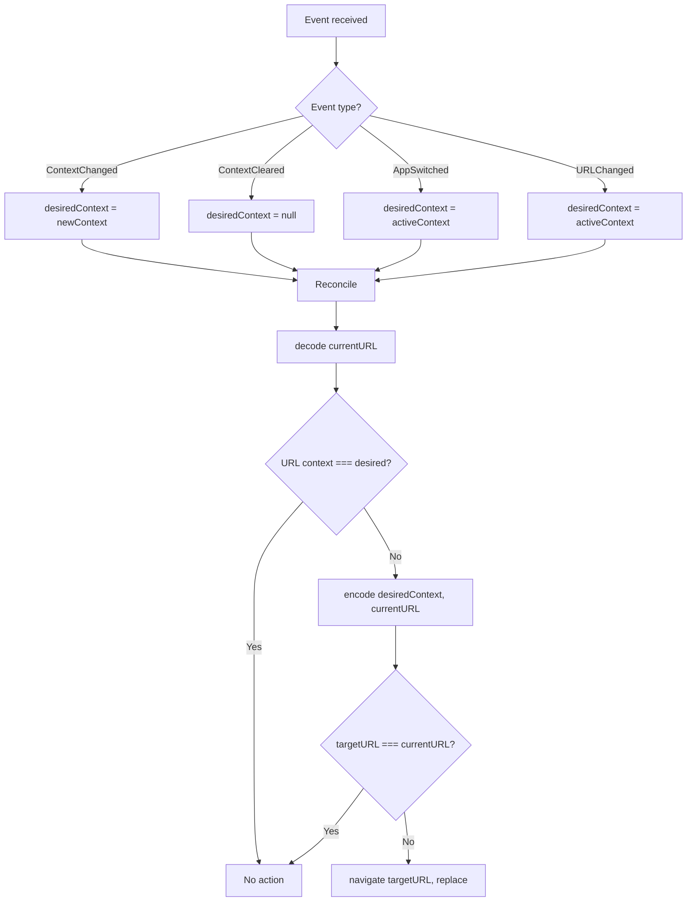

# Context Routing — Simplification Proposal

Reflection on the current implementation vs the abstract event-driven model, and a proposal for a simpler architecture.

---

## Current Implementation Complexity

The existing context navigation module has significant surface area:

| Aspect | Current |
|--------|---------|
| Adapter methods per strategy | 5+ optional (`onNonContext`, `onClearContext`, `appContextHandler`, `portalContextHandler`, `onContextChange`, `onAppSwitch`) |
| Subscriptions | 2 separate (context-change sync + URL guard) |
| Source factories | 2 variants (app-first, context-first) |
| Handler priority | Imperative `if/else` chain in provider's `tap()` |
| Concerns handled | URL encoding, decoding, guard, legacy compat, side effects — all mixed |

---

## Core Insight

The URL guard and the context-sync are **the same operation** — "make URL match context" — just triggered by different inputs.

A single reconciliation loop that compares `desiredContext` vs `decode(currentURL)` on every event handles all scenarios with one code path.

---

## Proposed Model: Encode/Decode + State Machine

### Strategy Contract

Each strategy implements two **pure functions** — nothing else:

```typescript
interface ContextRoutingStrategy {
  /** Build a URL that encodes the given context. Return null to skip navigation. */
  encode(context: ContextItem | null, currentURL: URL): URL | null;

  /** Extract context id from a URL. Return null if not present. */
  decode(url: URL): string | null;
}
```

### State Machine



### Single Reconciliation Loop

One subscription replaces both current ones:



### How Events Map to Actions



---

## What This Eliminates

| Current | Simplified |
|---------|-----------|
| 5 adapter methods | 2 pure functions (`encode`/`decode`) |
| 2 subscriptions | 1 subscription |
| Source factories (app-first, context-first) | Single merged event stream |
| App/portal handler priority chain | `encode` called on app strategy first, fallback to portal default |
| Separate `onNonContext`/`onClearContext` | `encode(null, url)` returns URL-without-context or null (skip) |
| URL guard as separate subscription | Same loop: URL event → `decode()` → mismatch → `encode()` → fix |

---

## Strategy Implementations (Sketch)

### Path Strategy

```typescript
const pathStrategy: ContextRoutingStrategy = {
  encode(context, currentURL) {
    if (!context) {
      // Clear: strip context segment
      return new URL(`/apps/${appKey}/`, currentURL.origin);
    }
    // Inject context as 3rd path segment, preserve sub-routes
    return new URL(injectSegment(currentURL.pathname, context.id), currentURL.origin);
  },
  decode(url) {
    // Extract 3rd segment from /apps/{appKey}/{contextId}/...
    return extractSegment(url.pathname, 2);
  },
};
```

### Query Strategy

```typescript
const queryStrategy: ContextRoutingStrategy = {
  encode(context, currentURL) {
    const url = new URL(currentURL.href);
    if (!context) {
      url.searchParams.delete('$contextId');
    } else {
      url.searchParams.set('$contextId', context.id);
    }
    return url;
  },
  decode(url) {
    return url.searchParams.get('$contextId');
  },
};
```

### Custom Strategy

```typescript
const customStrategy = (app: AppContextProvider): ContextRoutingStrategy => ({
  encode(context, currentURL) {
    if (!context) return new URL(`/apps/${appKey}/`, currentURL.origin);
    return app.generatePathFromContext(context, currentURL);
  },
  decode(url) {
    return app.extractContextIdFromPath(url.pathname);
  },
});
```

---

## Side Effects (Legacy Compat)

The current `appContextHandler` lets the app perform side effects (e.g. reset internal router for legacy apps < v7). A pure encode/decode model doesn't accommodate this directly.

**Solution:** A separate, optional `onTransition` hook:

```typescript
interface ContextRoutingStrategy {
  encode(context: ContextItem | null, currentURL: URL): URL | null;
  decode(url: URL): string | null;

  /** Optional side effect fired after navigation. For legacy router resets etc. */
  onTransition?(from: URL, to: URL, context: ContextItem | null): void;
}
```

This keeps the core pure while allowing escape hatches for backward compatibility.

---

## Trade-offs

| | Pro | Con |
|-|-----|-----|
| **Surface area** | Dramatically less code to maintain and test | — |
| **Testability** | Pure functions — trivial to unit test | — |
| **Event-driven** | Natural fit for event bus / state machine | Requires merging multiple event sources |
| **Migration** | — | Existing apps rely on current adapter shapes |
| **Side effects** | Cleanly separated via `onTransition` | Extra concept to explain |
| **Flexibility** | Encode/decode can express any URL shape | Less granular hooks for unusual portal needs |

---

## Required Inputs — App vs Portal

The context navigation module sits between the **portal** (host) and the **app** (guest). Here's everything it needs from each side.

### From Portal (Host)

| Input | Source Module | What It Provides | Used For |
|-------|-------------|-----------------|----------|
| `app.current$` | App Module (`AppModuleProvider`) | Observable of currently loaded app (appKey + instance) | Detecting app switches, accessing app modules |
| `app.current$.instance$` | App Module | The app's initialized module instances | Accessing app-level context & navigation |
| `navigation` | Navigation Module (`INavigationProvider`) | Portal's router — `path`, `state$`, `navigate()`, `replace()`, `createURL()`, `createHref()` | Reading current URL, performing navigation, watching URL changes |
| `navigation.path` | Navigation Module | Current `{ pathname, search, hash }` (basename-stripped) | Building URLs, detecting context in URL |
| `navigation.state$` | Navigation Module | Observable of URL changes | URL guard trigger |
| `navigation.version` | Navigation Module | SemVer of portal router | Legacy app detection (version < 7 compat) |
| `context.currentContext$` | Context Module (`IContextProvider`) | Observable of portal-level context (`ContextItem \| null \| undefined`) | Primary context source for URL sync |
| `context.currentContext` | Context Module | Synchronous snapshot of current context | URL guard comparison |
| Config: `origin` | Portal config | `window.location.origin` | Building absolute URLs |
| Config: `portalName` | Portal config | Human-readable name | Debug logging prefix |
| Config: `sourceFactory` | Portal config | Which observable drives the pipeline | App-first vs context-first ordering |
| Config: `enableContextUrlGuard` | Portal config | Boolean | Enable/disable URL guard subscription |
| Config: `nullContextHandler` | Portal config | Optional override for clear-context | Portal-level clear behavior |
| Config: `warnOnStrategies` | Portal config | Array of modes to warn on | Developer feedback |
| Config: `telemetry` | Portal config / Telemetry Module | Optional `trackEvent()` | Observability |
| Config: `contextStrategyAdapters` | Portal config | Map of mode → adapter | Strategy dispatch |

### From App (Guest)

| Input | Source | What It Provides | Used For |
|-------|--------|-----------------|----------|
| `appModules.context` | App's Context Module (`IContextProvider`) | App-level context provider | Reading app context state, validation |
| `appModules.context.routingStrategy` | App's Context Config | `'path' \| 'query' \| 'custom' \| undefined` | Determining which strategy to use |
| `appModules.context.currentContext$` | App's Context Module | App-level context stream | URL guard (checking if app has active context) |
| `appModules.context.currentContext` | App's Context Module | Synchronous snapshot | URL guard comparison |
| `appModules.context.validateContext()` | App's Context Module | Validates a context item against app's rules | Context-first source filtering |
| `appModules.context.extractContextIdFromPath()` | App's Context Config (optional) | Extracts context id from URL path | Custom strategy decode |
| `appModules.context.generatePathFromContext()` | App's Context Config (optional) | Generates URL path from context item | Custom strategy encode |
| `appModules.navigation` | App's Navigation Module (`INavigationProvider`) | App-scoped router — `path`, `createURL()`, `replace()` | App-handled context (building app-relative URLs) |
| `appModules.navigation.path` | App's Navigation Module | App's current route (basename = `/apps/{appKey}/`) | Path generation input |
| `appModules.navigation.version` | App's Navigation Module | SemVer of app router | Legacy detection (< 7 needs `replace('/')`) |

### Data Flow Diagram

```mermaid
flowchart LR
    subgraph Portal["Portal (Host)"]
        PM[App Module]
        PN[Navigation Module]
        PC[Context Module]
        CFG[Config]
    end

    subgraph App["App (Guest)"]
        AC[Context Module]
        AN[Navigation Module]
    end

    subgraph CN["Context Navigation Module"]
        SRC[Source Factory]
        SM[State Machine / Reconciler]
        STR[Strategy Adapter]
    end

    PM -->|current$, instance$| SRC
    PC -->|currentContext$| SRC
    PN -->|path, state$| SM
    CFG -->|origin, guards, adapters| SM

    SRC -->|emission: app + context| SM
    SM -->|context + currentURL| STR

    AC -->|routingStrategy, extractPath, generatePath| STR
    AN -->|path, createURL| STR

    STR -->|targetURL| SM
    SM -->|navigate()| PN
```

### What the Simplified Model Needs (Reduced Surface)

In the proposed encode/decode model, the required inputs shrink:

| Input | Still Needed? | Notes |
|-------|:---:|-------|
| `app.current$` / `instance$` | Yes | Must know which app is loaded and its strategy |
| `portal.navigation.path` | Yes | Current URL for encode/decode |
| `portal.navigation.state$` | Yes | Triggers reconciliation on URL change |
| `portal.navigation.navigate()` | Yes | Performs the actual navigation |
| `portal.context.currentContext$` | Yes | Source of truth for desired context |
| `app.context.routingStrategy` | Yes | Selects encode/decode implementation |
| `app.context.extractContextIdFromPath` | Only for custom | Becomes custom strategy's `decode()` |
| `app.context.generatePathFromContext` | Only for custom | Becomes custom strategy's `encode()` |
| `app.context.validateContext` | Only context-first | Filtering invalid contexts |
| `app.navigation.path` | Only for path/custom | Input to path-based `encode()` |
| `app.navigation.version` | **No** | Legacy compat moves to `onTransition` hook |
| `portal.navigation.version` | **No** | Same — side effect only |
| Config: `sourceFactory` | **Simplified** | Merged event stream replaces two factories |
| Config: `contextStrategyAdapters` | **Replaced** | By the `ContextRoutingStrategy` interface |
| Config: `nullContextHandler` | **Absorbed** | `encode(null, url)` handles it directly |

---

## Migration Path

1. Implement new `ContextRoutingStrategy` interface alongside existing adapters
2. Build the single reconciliation loop as an alternative provider
3. Map existing adapter methods to encode/decode (mechanical translation)
4. Deprecate old adapter interface, keep as wrapper for one major version
5. Remove old adapters in next breaking release

---

## Summary

The abstract event model reveals that all scenarios reduce to one question:

> **Does the URL currently reflect the desired context?**

If yes → do nothing. If no → `encode()` and navigate.

Everything else — guards, carryover, clear, app switch — is just a different trigger for the same reconciliation.
