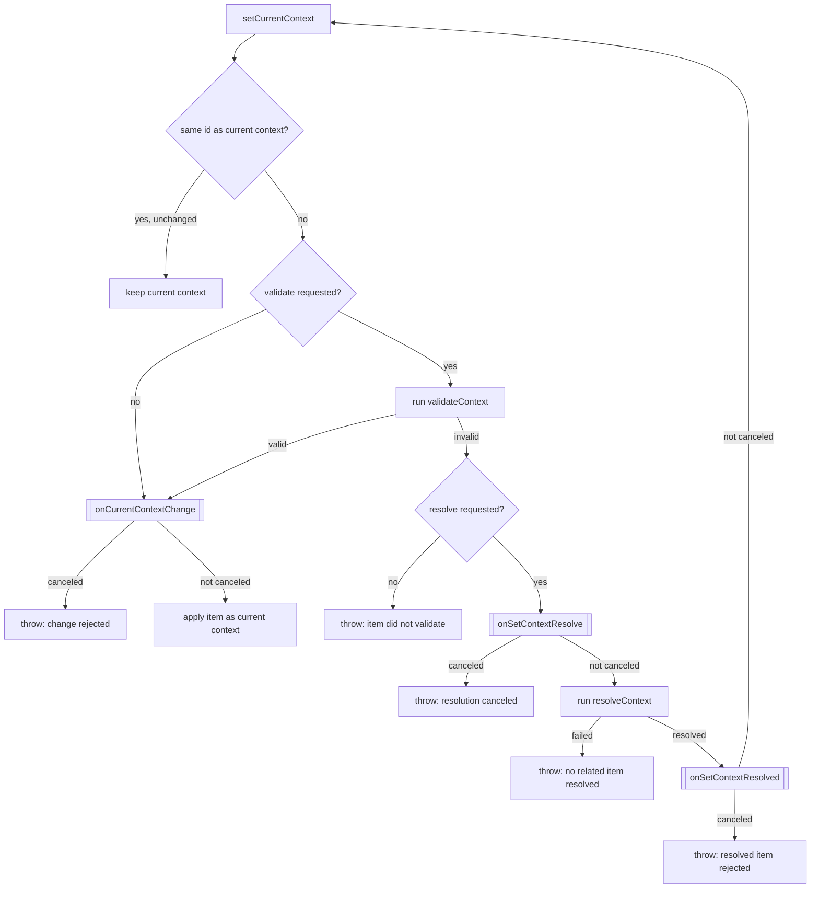
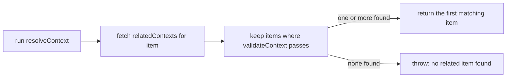
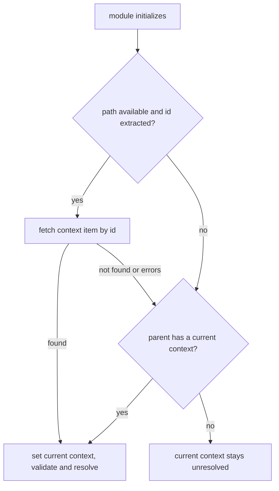
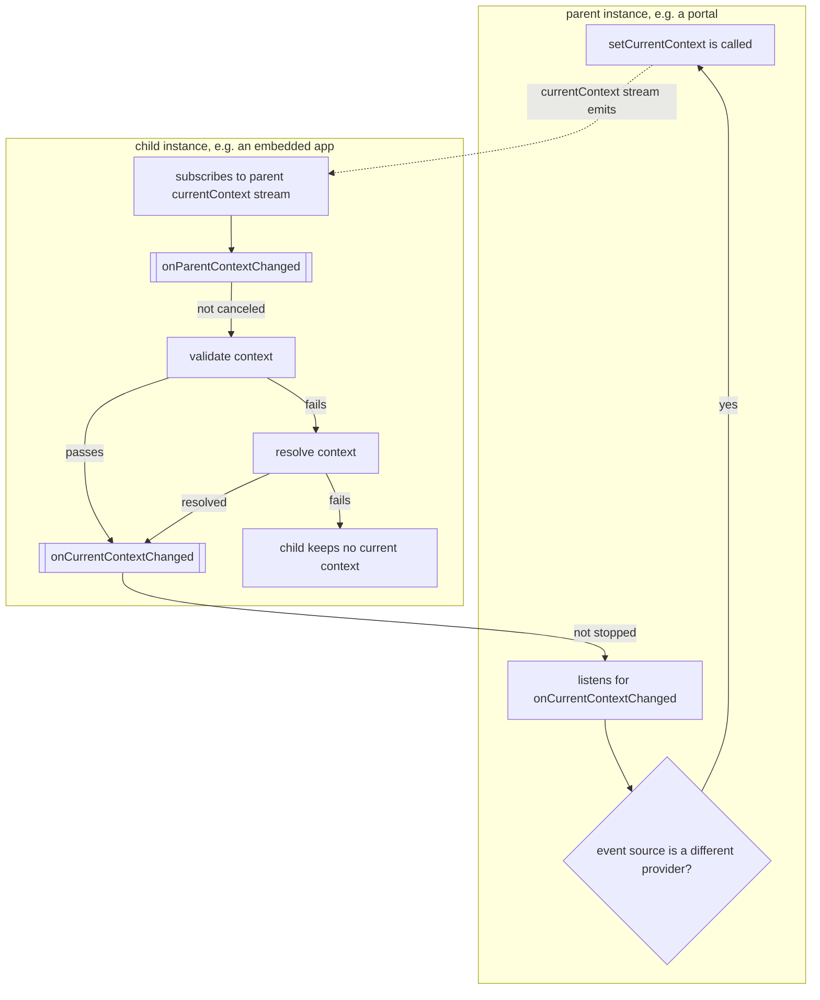

# Lifecycle

How the context module decides whether to accept a new context, how it resolves one
automatically on startup, and how a parent/child pair of instances stay in sync.

## Setting context

`setCurrentContext(item, opt)` is the entry point behind `setCurrentContextById`,
`connectParentContext`, and the initial-context resolver below. It takes two options, both
optional and both defaulting to `true`:

- **`validate`** — check `item` against `validateContext` before accepting it.
- **`resolve`** — when validation fails, try to resolve a related item instead of throwing.



A few things worth calling out that aren't obvious from the diagram alone:

- **Setting context is queued, not immediate.** Every call to `setCurrentContext` is pushed
  onto an internal queue and processed in order — even if nobody subscribes to the returned
  `Observable`. This means two rapid calls (e.g. a user clicking two picker items quickly)
  resolve one after another rather than racing.
- **Unsubscribing aborts the queued task.** If the caller unsubscribes from the returned
  observable before it completes, that in-flight context change is aborted and removed from the
  queue — it will not silently apply later.
- **`onCurrentContextChange` (no "d") fires *before* the context actually changes** and is
  cancelable — a listener calling `event.preventDefault()` makes `setCurrentContext` throw
  instead of silently no-op-ing.
- **`onCurrentContextChanged` (with "d") fires *after*** a change has been applied, and is
  *not* cancelable — it's an announcement, not a gate. This is the event `connectParentContext`
  listens for to bubble changes to a parent.

## Resolving context

When validation fails and `opt.resolve` is `true`, the provider looks for a related item of an
accepted type instead of rejecting the item outright:



> [!NOTE]
> If no `contextType` allow-list is configured (`setContextType`), every context item
> validates, so resolution never has anything left to correct — see
> [Configuration](../README.md#configuration).

The default `resolveContext` implementation can be replaced entirely with `setResolveContext`
when the "look at related items of an accepted type" strategy doesn't fit — see the
[Configuration reference](../README.md#configuration-reference) in the README.

## Resolving the initial context

When a context module instance is initialized, it tries — without any application code asking
it to — to figure out what its current context should be, in this order:

1. **From the URL.** If this instance (or its parent, when nested) has a `navigation` module,
   its current path is run through `extractContextIdFromPath` (a GUID matcher by default). If an
   ID is found, that item is fetched via the context client's `get` and used as a candidate.
2. **From the parent context.** If step 1 doesn't produce anything — no navigation module, no
   ID in the path, or no matching item — the instance falls back to its parent context module's
   *current* context, if it has one.
3. Whichever of the two resolves first is set as the current context, with both
   `validate: true` and `resolve: true` — so an ID found in the URL still has to pass
   `validateContext` (and can fall through to `resolveContext`) before it "sticks".



A portal opened directly at `/apps/my-app/7fd97952-...` resolves its context straight from that
GUID; an app embedded inside a portal with no context in its own URL instead inherits whatever
project the portal already has selected.

Replace this entire strategy with `setResolveInitialContext` when neither source fits — for
example, an application that always derives its context from a non-GUID slug, or one that must
never auto-adopt a parent's context. Failures here are caught and logged as a warning rather
than thrown, so a broken initial-context lookup doesn't block the rest of module
initialization.

## Parent/child propagation

Every context module instance observes its nearest ancestor's current context and mirrors it
locally, unless a listener opts out. This is what keeps a portal's selected project and an
embedded application's context in sync without either side polling the other — set once in the
portal, and it propagates down; a validated change from the app can bubble back up.



- A listener calls `event.stopPropagation()` on `onCurrentContextChanged` to keep a context
  change local, so it never reaches ancestors or siblings.
- A listener calls `event.preventDefault()` on `onParentContextChanged` to reject an incoming
  context change from a parent instead of mirroring it.
- A child that fails to validate *and* resolve a parent's context is left with **no current
  context** — the parent's context is never force-applied. This is deliberate: an app that only
  understands `'Facility'` context shouldn't be silently handed a `'Contract'` it can't use.
- Only the first parent-context emission after connecting can be skipped
  (`connectParentContext(provider, { skipFirst: true })`), and even without that option, a
  context that already matches the child's current context by `id` is ignored — so a child
  reconnecting to a parent it's already in sync with does not re-trigger validation.

```ts
// constrain a context change to this instance only, never bubbling to ancestors
modules.event.addEventListener('onCurrentContextChanged', (event) => {
  if (event.source === modules.context) {
    event.stopPropagation();
  }
});
```

See [Events](../README.md#events) in the README for the full list of dispatched events and
whether each is cancelable, and [Data model](data-model.md) for what a context item and its
`type` actually look like.
