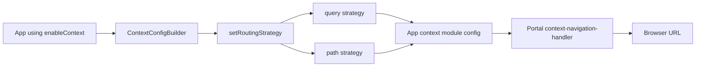
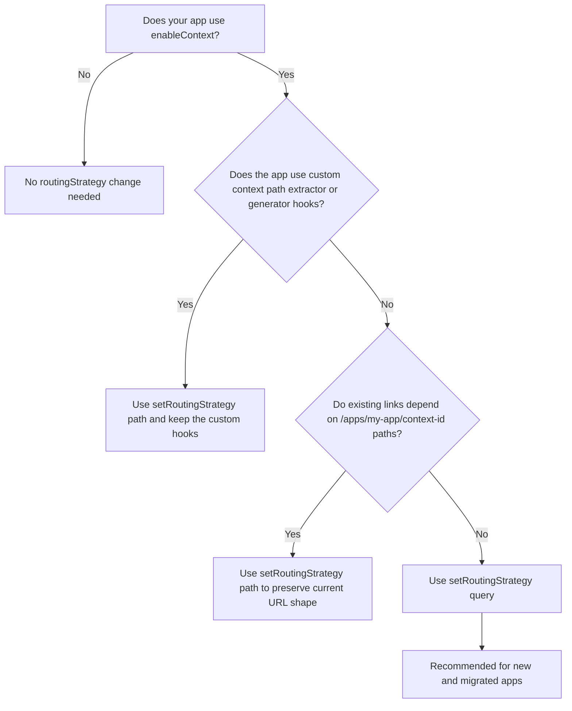

# Migration: Context Routing Strategy

This guide covers the changes introduced by the `routingStrategy` configuration in `@equinor/fusion-framework-module-context` and how to update your app.

## What changed

The context module now supports explicit URL routing strategies that control how context identifiers appear in URLs:

| Strategy | URL shape | When to use |
|---|---|---|
| `query` | `?$contextId=abc-123` | New default. Recommended for all apps. |
| `path` | `/apps/my-app/abc-123` | Legacy path-segment convention. |

When no strategy is explicitly set, the module defaults to `query` and logs a console warning prompting you to declare one.

The strategy is declared by the app, then consumed by the portal's context navigation handler when it synchronizes context and URL state:



## Who needs to migrate

**Every app that uses `enableContext`** should add an explicit `setRoutingStrategy()` call. Without it, you will see this console warning on every app load:

```
ContextModuleConfigurator.createConfig: missing routing strategy, defaulting to 'query' (recommended)
```

## How to migrate

Use this decision flow to pick the right migration path:



### Apps that currently use path-segment context URLs

If your app currently works with context IDs in the URL path (e.g. `/apps/my-app/abc-123`), add `setRoutingStrategy('path')` to preserve existing behavior:

```ts
// Before
enableContext(configurator, (builder) => {
  builder.setContextType(['projectMaster']);
});

// After
enableContext(configurator, (builder) => {
  builder.setRoutingStrategy('path');
  builder.setContextType(['projectMaster']);
});
```

This is a one-line change. Your app will continue working exactly as before, and the console warning goes away.

### Apps ready to adopt query strategy (recommended)

If you want to move to the recommended `query` strategy where context lives in `?$contextId=`:

```ts
enableContext(configurator, (builder) => {
  builder.setRoutingStrategy('query');
  builder.setContextType(['projectMaster']);
});
```

Benefits of `query`:
- App-owned path structure is preserved — the context parameter doesn't occupy a path segment
- Context parameter survives in-app navigation naturally
- Works with any router setup without special path handling

> [!NOTE]
> Switching from `path` to `query` changes the URL shape. Existing bookmarks and shared links using path-segment context IDs will still be resolved (the module tries both query and path extraction as fallbacks), but new URLs will use the query format.

### Apps with custom path extractors/generators

If your app provides custom `setContextPathExtractor` and `setContextPathGenerator` hooks, use `'path'` as the strategy and register your hooks. The portal's context-navigation-handler module detects apps with custom generators and delegates URL handling to them automatically:

```ts
enableContext(configurator, (builder) => {
  builder.setRoutingStrategy('path');
  builder.setContextType(['projectMaster']);
  builder.setContextPathExtractor(myExtractor);
  builder.setContextPathGenerator(myGenerator);
});
```

The portal's custom adapter will detect your registered hooks and use them for URL encoding/decoding instead of the default path-segment logic.

## Portal impact

Portals using `@equinor/fusion-framework-module-context-navigation` will automatically adapt to each app's declared strategy. No portal-side changes are needed — the portal reads the strategy from the app's context module and uses the appropriate URL adapter.

## Timeline

- **Now**: Add `setRoutingStrategy()` to silence the console warning and make your intent explicit.
- **Future major release**: The fallback behavior for apps without an explicit strategy may change. Declaring your strategy now ensures forward compatibility.
