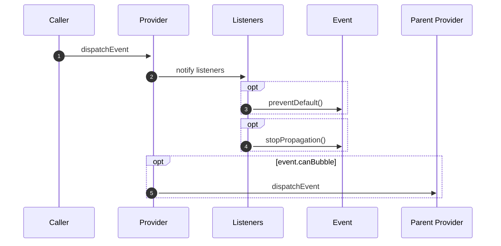
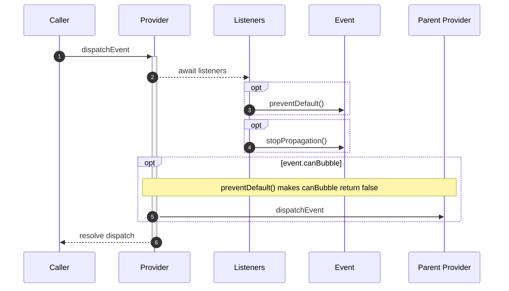

# Lifecycle

> **Async listeners:** listeners are allowed to run async, so when `cancelable: false` the
> dispatcher does not await their resolution — cancellation order across listeners is not
> guaranteed in that case.

## Dispatch sequence



1. `dispatchEvent` is called with a name + init or a `FrameworkEvent` instance.
2. The `onDispatch` hook runs (if configured). Canceling here stops all listeners.
3. Registered listeners execute sequentially. For cancelable events each listener is `await`ed; non-cancelable listeners fire without awaiting.
4. If the event still bubbles, the `onBubble` hook runs (typically forwarding to a parent provider).
5. The event is pushed to `event$` for observable subscribers.

## Cancelable events



Mark an event as `cancelable` in its init and `await` dispatch:

```ts
const event = await modules.event.dispatchEvent('myEvent', {
  detail: data,
  cancelable: true,
});

if (event.canceled) {
  // A listener called event.preventDefault()
  return;
}
```

A listener cancels the event by calling `preventDefault()`:

```ts
modules.event.addEventListener('myEvent', (event) => {
  if (shouldBlock(event.detail)) {
    event.preventDefault();
  }
});
```

> **Important:** When dispatching a `cancelable` event you **must** `await` the `dispatchEvent` call. Firing without `await` means `preventDefault()` calls from listeners will not be respected.

## Bubbling

> **Event bubbling:** when a module instance is initialized with a reference to a parent
> instance, the event module subscribes to the parent's event provider by default — a
> consumer (e.g. an App) dispatching a `canBubble` event forwards it to its parent (e.g. a
> Portal) automatically.

Events bubble to parent providers by default (`canBubble: true`). A listener can stop propagation:

```ts
modules.event.addEventListener('myEvent', (event) => {
  event.stopPropagation(); // prevents bubbling to parent
});
```

Or disable bubbling for a specific event at dispatch time:

```ts
await modules.event.dispatchEvent('myEvent', {
  detail: data,
  canBubble: false,
});
```


```
