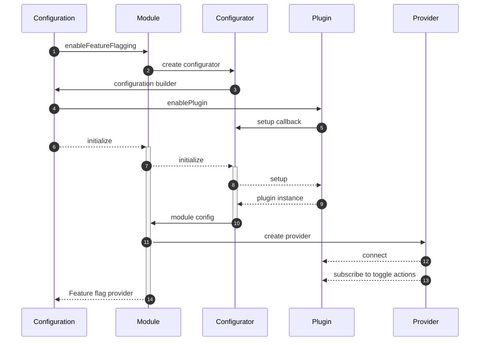

## Concept

This module enables the usage of feature flags.

```ts
interface FeatureFlag<T> {
  key: string;
  title?: string;
  description?: string;
  source?: string;
  enabled?: boolean;
  readOnly?: boolean;
  value?: T;
}
```

## Configuration

```ts
import { enableFeatureFlags } from '@equinor/fusion-framework-module-feature-flag';

import { 
  createLocalStoragePlugin,
  createUrlPlugin
} from '@equinor/fusion-framework-module-feature-flag/plugins';

export const configure: ModuleInitiator = (configurator, args) => {
  enableFeatureFlags(configurator, builder => {
    builder.addPlugin(
      /** define flags that will be stored in local storage when toggled */
      createLocalStoragePlugin([
        {
          key: MyFeatures.MyFlag,
          title: 'this is a flag',
        },
        {
          key: MyFeatures.MyUrlFlag,
          title: 'this feature can be toggled by ?my-url-flag=true',
        }
      ])
    );
    builder.addPlugin(
      /** define flags which are allowed to be toggled from url */
      createUrlPlugin([ MyFeatures.MyUrlFlag ])
    )
  });
}
```

> [!NOTE]
> In the near future, features will be as an API service

## Plugins



1. when configuring the framework, the feature flag module is enabled
2. the module creates a configuration builder (see `BaseConfigBuilder`).
3. the module returns an configuration builder callback function
4. when building the configuration, plugins are enabled to control feature flags
    - the plugin can access the provider to toggle flags
    - the plugin can set/add flags, like update/create flags from a rest call after initialization
    - the plugin can subscribe to the provider state, like storing a flag to locale state.
5. the plugin return a setup callback function which is called when the module is initialize
    - the plugin receives `ConfigBuilderCallbackArgs` for accessing other modules
    - the plugin return a callback for generating initial flags for the provider
    - the plugin returns a callback for accessing the feature flag provider
6. the framework initializes the module
7. the module initializes configuration
8. the configuration calls the registered plugins setup function
9. Plugin instance
    - the plugin creates initial flags, like read stored flags or fetch flags from a service
    - the plugin returns a callback function for connecting the plugin to the provider
10. the configurator return an instance of the config
11. the module create a provider instance
12. the provider connects the plugins
13. the provider subscribes to toggle actions and connects plugin toggle handlers
14. the module returns the feature flag module to the framework

```ts
export interface FeatureFlagPlugin {
    /**
     * connect the plugin to the provider
     */
    connect: (args: { provider: IFeatureFlagProvider }) => VoidFunction | Subscription;

    /**
     * generate initial value for the provider
     */
    initial?: () => ObservableInput<Array<IFeatureFlag>>;
}
```

### Local Storage

`import { createLocalStoragePlugin } from '@equinor/fusion-framework-module-feature-flag/plugins';`

plugin for allowing to store the toggled state of a feature flag


### Url

`import { createUrlPlugin } from '@equinor/fusion-framework-module-feature-flag/plugins';`

plugin for toggling features threw url search params

### Custom

__initial__

async callback function which returns the initial feature flags of the plugin

__connect__

async callback which allows the plugin to connect to the feature flag provider

```ts
import { 
  enableFeatureFlagging, 
  type FeatureFlagPluginConfigCallback 
} from '@equinor/fusion-framework-module-feature-flag';

const customPlugin: FeatureFlagPluginConfigCallback = async (args) => {
  const myModule = await args.requireModule('my-module');
  return {
    initial: () => fetch('/api/features')
      .then(res => res.json())
      .then(features => features.map(feature => feature.source = 'my-source')),
    connect: ({provider}) => {
      /** subscribe to changes of feature flags */
      provider.onFeatureToggle: async({flags}) => {
        await fetch(
          '/api/me/features', 
          { 
            method: 'PATCH', 
            body: flags.filter(feature => feature.source === 'my-source')
          }
        )
      }
      /** update feature flags */
      signalR.received(data => {
        provider.setFeatures(data.map(feature => feature.source = 'my-source'));
      });
    },
  }
}

// ...configuration
enableFeatureFlagging(builder => {
  builder.addPlugin(customPlugin);
})
```

## Selectors

### Filter features

Operator function for filtering out specific features 

```ts
import { filterFeatures } from '@equinor/fusion-framework-module-feature-flag/selectors';
const features$ = modules.featureFlag.feature$.pipe(
  filterFeatures(x => x.enabled = true);
);
```

### Find feature

Operator for selecting a specific feature

> [!IMPORTANT]
> The operator will not re-emit unless value or selector changes

```ts
import { findFeature } from '@equinor/fusion-framework-module-feature-flag/selectors';
const feature$ = modules.featureFlag.feature$.pipe('my-key');
```

## Events

### onFeatureFlagToggle

Event fired before a feature is toggled

### onFeatureFlagsToggled

Event fired after features are toggled _(state updated)_

## Usage


```tsx
// my-code.ts
const provider = modules.featureFlag;
const fooEnabled = provider.getFeatures('foo').enabled;
console.log('feature foo is ', fooEnabled ? 'enabled' : 'disabled');
```
