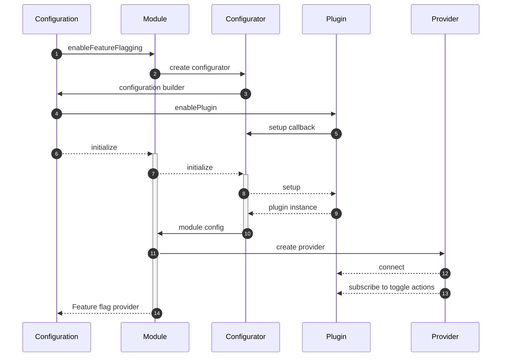

# Feature Flag Module

```ts
interface FeatureFlag<T> {
  key: string;
  title?: string;
  description?: string;
  source?: string;
  enabled?: boolean;
  readOnly?: boolean;
  value?: T;
}
```

## Configuration

### Plugins



1. when configuring the framework, the feature flag module is enabled
2. the module creates a configuration builder (see `BaseConfigBuilder`).
3. the module returns an configuration builder callback function
4. when building the configuration, plugins are enabled to control feature flags
    - the plugin can access the provider to toggle flags
    - the plugin can set/add flags, like update/create flags from a rest call after initialization
    - the plugin can subscribe to the provider state, like storing a flag to locale state.
5. the plugin return a setup callback function which is called when the module is initialize
    - the plugin receives `ConfigBuilderCallbackArgs` for accessing other modules
    - the plugin return a callback for generating initial flags for the provider
    - the plugin returns a callback for accessing the feature flag provider
6. the framework initializes the module
7. the module initializes configuration
8. the configuration calls the registered plugins setup function
9. Plugin instance
    - the plugin creates initial flags, like read stored flags or fetch flags from a service
    - the plugin returns a callback function for connecting the plugin to the provider
    - the plugin returns a callback function for subscribing to toggle changes of flags
10. the configurator return an instance of the config
11. the module create a provider instance
12. the provider connects the plugins
13. the provider subscribes to toggle actions and connects plugin toggle handlers
14. the module returns the feature flag module to the framework

```ts
export interface FeatureFlagPlugin {
    /**
     * connect the plugin to the provider
     */
    connect: (args: { provider: IFeatureFlagProvider }) => VoidFunction | Subscription;

    /**
     * generate initial value for the provider
     */
    initial?: () => ObservableInput<Array<IFeatureFlag>>;

    /**
     * callback function for handling changes in provider feature flags
     */
    onFeatureToggle?: (event: { flags: Array<IFeatureFlag> }) => void;
}

```

#### CGI

Plugin for enable/disable features by url search parameters 

```ts
import { enableCgiPlugin } from '@equinor/fusion-framework-module-feature-flag/plugins';
enableFeatureFlagging(builder => {
  /** simple */
  enableCgiPlugin('my-app', ['foo', 'bar']);

  /** with flags */
  enableCgiPlugin(
    'my-app', 
    [{ key: 'bar', enabled: true, value: 'bar' }],
  );

  /** custom */
  enableCgiPlugin(
    'my-app', 
    [
      'foo',
      { key: 'bar', enabled: true, value: 'bar' }
    ],
    {
      storage: window.sessionStorage,
      isFeatureEnabled: (args) => args.value === '1'
    }
  );
});
```

#### CUSTOM
```ts
import { enableCgiPlugin } from '@equinor/fusion-framework-module-feature-flag/plugins';


// ...configuration
enableFeatureFlagging(builder => {
  builder.addPlugin(
  /** setup callback */
  (args: ConfigBuilderCallbackArgs) => {
    const serviceDiscovery = await args.requireModule('service-discover');
    const httpClient = await serviceDiscovery.createClient('portal');
    const source = 'api-flags';
    return {
      onFeatureToggle: ({flags}) => {
          httpClient.json(
            '/api/me/features', 
            { 
              method: 'PATCH', 
              body: flags
            }
          )
      },
      initial: () => httpClient.fetch(
        '/api/me/features', 
        {
          selector: (response: HttpResponse) => {
            const flags = await response.json();
            return flags.map(flag => {
              source
              name: flag.name,
              enabled: !!flag.enabled,
              value: JSON.parse(flag.value),
            })
          }
        }
      )
    }
  });
})
```

## Usage


```tsx
// my-code.ts
const provider = modules.featureFlag;
const fooEnabled = provider.getFeatures('foo').enabled;
return <p>feature foo is { fooEnabled ? <span>enabled</span> : <span>disabled</span> }</p> 
```
> __TBA:__ @equinor/fusion-framework-react-module-feature-flag

```tsx
const myButton = () => {
  const theme = usePortalFeature('theme');
  if(theme.enabled) {
    return <ThemedButton />
  }
  return <Button />
}

// @equinor/fusion-framework-react-app/feature-flagging
const usePortalFeature =(name: string) => {
  const provider = useFrameworkModule('featureFlag');
  provider.getFeatureFlag(name);
}
const useAppFeature =(name: string) => {
  const provider = useModule('featureFlag');
  provider.getFeatureFlag(name);
}
```
