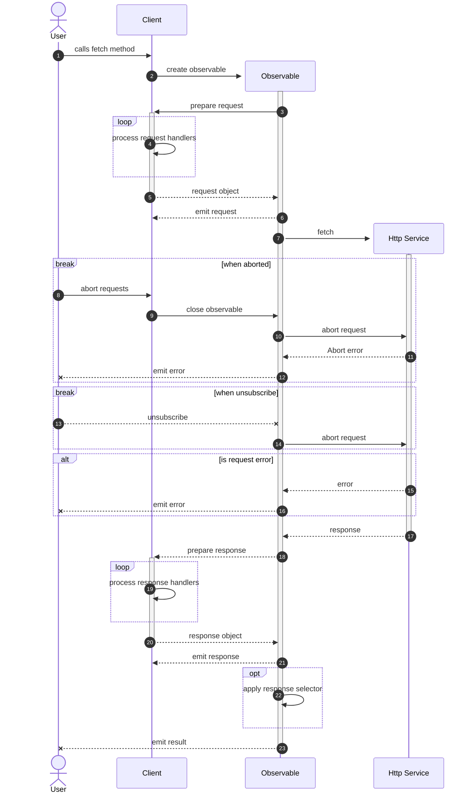

# Fusion Framework Http Module

> __The Fusion Framework HTTP Module provides a streamlined and powerful HTTP client for making requests to APIs.__
>
> The module supports both asynchronous (Promise-based) and observable (RxJS-based) execution methods, allowing you to choose the approach that best suits your use case. 
> 
> It also offers advanced features, such as **MSAL** (Microsoft Authentication Library) integration, request and response operators, and response selectors, to enhance the functionality and flexibility of HTTP communication.

Whether you're building a simple application or a complex portal, the Fusion Framework HTTP Module equips you with the essential tools to handle HTTP requests efficiently and effectively. With its rich feature set and intuitive API, the module simplifies the process of working with HTTP clients, enabling you to focus on building robust and scalable applications.

**Key Features:**
- Streamlined API for easy configuration and operation of HTTP clients
- Integrated MSAL (Microsoft Authentication Library) support for robust authentication
- Unified management system for HTTP client configurations
- Factory method for client creation, ensuring optimal state management
- Capabilities for intercepting and modifying requests and responses
- Familiar syntax inspired by the [Web's Fetch API](https://developer.mozilla.org/en-US/docs/Web/HTTP)

## Package

| Namespace                                         | Description           |
| ------------------------------------------------- | --------------------- |
| `@equinor/fusion-framework-module-http`           | http module           |
| `@equinor/fusion-framework-module-http/client`    | http clients          |
| `@equinor/fusion-framework-module-http/selectors` | http selectors        |
| `@equinor/fusion-framework-module-http/operators` | http client operators |
| `@equinor/fusion-framework-module-http/errors`    | http client errors    |

## Usage
Working with Fusion Framework, HTTP clients are defined during the configuration phase. The configuration is called by the Framework during initialization, ensuring that the HTTP clients are ready to be used. This approach allows for centralized and optimized client configuration, promoting consistency, performance, and security in HTTP communication within the Fusion Framework ecosystem.

see [Configuring HTTP Clients](#configuring-http-clients) for more information.

```ts
/**
 * Example: Configuring an HTTP client with MSAL authentication in Fusion Framework
 * This configuration is performed during the initialization phase of the app.
 */
const configure = (configurator: IModulesConfigurator) => {
  /**
   * Configure an HTTP client named 'msalClient'
   * This client is set up to communicate with 'https://api.example.com'
   * and utilizes MSAL for authentication, specifying a default scope.
   */
  configurator.http.configureClient('msalClient', {
    baseUri: 'https://api.example.com',
    defaultScopes: ['api://example-api/.default'], // MSAL scopes
  });

  // Additional configuration can be added here
}

// Note: This is a basic setup. For more advanced configurations, please refer to the documentation.
```

When the application is initialized, the configuration is called, and the HTTP client becomes ready to be used.

see [Working with HTTP clients](#working-with-http-clients) for more information.

```ts
/**
 * Example: Using an HTTP client in Fusion Framework
 * This code is executed after the app configuration has been initialized.
 */
const client = modules.http.createClient('myClient');

/** Make a request using the client */
client.json('/some-endpoint')
  .then(data => console.log(data))
  .catch(error => console.error('Error:', error));
```

## Concepts

### Pure fetch

The HTTP module extends the native `fetch` API, providing a streamlined experience for making HTTP requests. It adds features and capabilities to simplify common tasks and ensure compatibility with existing code and libraries.

### Observable

The HTTP module uses RxJS observables for handling HTTP requests and responses. Observables provide a flexible and powerful way to work with asynchronous data streams. They allow you to process and transform data in a declarative and composable manner. Unsubscribing from an observable automatically aborts the corresponding HTTP request, preventing unnecessary network traffic and ensuring efficient request management.

### Defining Clients Upfront

In the Fusion Framework, HTTP clients are configured during initialization to ensure they are ready for use. This promotes centralized configuration, optimized performance, and enhances consistency, security, and modularity in HTTP communication.

### Client factory
The HTTP module provides a client factory method for creating HTTP clients. This method allows you to specify the client's name and retrieve a configured instance. Using the client factory ensures clean and predictable client instances without any mutations from previous requests. This promotes a reliable state for each client, avoiding unexpected behavior caused by shared state.

### Process operators

Process operators are functions that can be added to the HTTP client to customize its behavior and add additional functionality to the request/response lifecycle. They allow you to intercept and modify requests and responses, add custom headers, log data, validate responses, and more. By using process operators, you can extend the functionality of the HTTP client to meet your application's specific requirements.

### Request execution

When executing HTTP requests _(1)_, the internal fetch method will create an `Observable`  _(2)_ from the provided the request options. The stream will then process the request handlers _(3 - 5)_ before emitting the request to the HttpClient request `Subject` _(6)_. 

Then a native `fetch` call is made to the HTTP service _(7)_. If the request is successful _(17)_, the response is processed by the response handlers _(18 - 20)_ before being emitted to the HttpClient response `Subject` _(21)_. The response is then processed by the response selector _(22)_ before being emitted to the user (_23_).

In case of an error _(17)_, the error is emitted to the user _(18)_.

If the user calls abort on the client _(8)_, or triggers provided `AbortSignal` in call args, the observable will abort the request _(10)_. `fetch` will throw an abort error _(11)_, which is emitted to the user _(12)_.

If the user unsubscribes from the observable _(13)_ or trigger provided `AbortSignal` in call args, the request is aborted _(14)_.


> [!NOTE]
> - When an error is emitted, the observable will complete.
> - Observables only emit errors if they are subscribed to.
> - fetch observables are cold, meaning they will close when request is completed or aborted.

> [!IMPORTANT]
> HttpClient stream functions will not execute until subscribed to.



## Configuring HTTP Clients

Configuring HTTP clients before the application renders is crucial for several reasons:

1. **Centralized Configuration**: By configuring clients upfront, we establish a single source of truth for all HTTP client settings. This centralization simplifies the management and maintenance of client configurations throughout the application.

2. **Performance Optimization**: Pre-configuring clients improves performance by ensuring they are ready to use when needed, eliminating on-the-fly configuration that can slow down API calls.

3. **Consistency**: Configuring clients before rendering ensures consistent usage of client configurations across the application, promoting uniformity in API call implementation.

4. **Environment-specific Settings**: This approach facilitates easy configuration of environment-specific settings, such as different base URLs for development, staging, and production environments.

5. **Security**: Configuring clients before rendering enables the setup of essential security measures, including authentication handlers and default scopes, ensuring secure API calls from the outset.

6. **Modularity**: This configuration approach supports a modular architecture, allowing different modules to define their own HTTP client configurations, which can then be combined before rendering the application.

By following this approach, you can enhance the efficiency, consistency, security, and modularity of your application's HTTP communication within the Fusion Framework ecosystem.

### Configuration Options

When configuring an HTTP client in the Fusion Framework, you can specify various settings to customize its behavior. The following options are available for configuring an HTTP client:

| Property          | Description                                                |
| ----------------- | ---------------------------------------------------------- |
| `baseUri`         | The base URI for the API endpoint.                         |
| `defaultScopes`   | The default scopes for MSAL authentication.                |
| `selector`        | The response selector for processing the response.         |
| `onCreate`        | A callback function to execute when the client is created. |
| `requestHandler`  | The request operators for processing outgoing requests.    |
| `responseHandler` | The response operators for processing incoming responses.  |
| `ctor`            | The constructor function for a custom client.              |


### Basic configuration

To configure a basic HTTP client in the Fusion Framework, you can use the following example. This setup is ideal for simple API consumption that does not require advanced authentication mechanisms.

```typescript
/** Example of basic configuration for an HTTP client in the Fusion Framework */
const configure = (configurator: IModulesConfigurator) => {
  /**
   * Configure an HTTP client named 'myClient'.
   * This client is set up to communicate with 'https://api.example.com'.
   */
  configurator.http.configureClient(
    'myClient',
    'https://api.example.com'
  );

  // Additional basic configuration can be added here
}
```

### Configuration with MSAL Authentication

For consuming APIs that require secure authentication, it is recommended to configure an HTTP client with MSAL (Microsoft Authentication Library). The following example demonstrates how to set up an HTTP client with MSAL authentication, specifying a default scope.

```ts
/** 
 * Example: Configuring an HTTP client with MSAL authentication in Fusion Framework
 * This configuration is performed during the initialization phase of the app.
 */
const configure = (configurator: IModulesConfigurator) => {
  /**
   * Configure an HTTP client named 'msalClient'
   * This client is set up to communicate with 'https://api.example.com'
   * and utilizes MSAL for authentication, specifying a default scope.
   */
  configurator.http.configureClient('msalClient', {
    baseUri: 'https://api.example.com',
    defaultScopes: ['api://example-api/.default'],
  });

  // Additional configuration can be added here
}
```

### Advanced Configuration

#### Configuring a http client with callback

You can configure an HTTP client using a callback function, which allows for more dynamic and flexible configuration. Here's an example:

```ts
/** 
 * Example of configuring an HTTP client with a callback in Fusion Framework.
 * This configuration is performed during the initialization phase of the app.
 * The callback function provides more flexibility in setting up the client.
 */
const configure = (configurator: IModulesConfigurator) => {
  /** Configure an HTTP client named 'callbackClient' using a callback function. */
  configurator.http.configureClient('callbackClient', (client) => {
    /** Set the base URI for API requests */
    client.uri = 'https://api.example.com';
    
   /** Add a custom request handler */
    client.requestHandler.add('logger', (request) => {
      console.log('Outgoing request:', request);
       // Perform any asynchronous operations if needed before the request is sent
    });
    
   /** Add a custom response handler */
    client.responseHandler.add('errorChecker', (response) => {
      if (!response.ok) {
        console.error('Error in response:', response.status, response.statusText);
        switch(response.status) {
          case 401:
            // Handle unauthorized error
            break;
          case 500:
            // Handle server error
            break;
          default:
            // Handle other errors
            break;
        }
      }
    });
    
    /** Set default scopes for authentication. These scopes are required for accessing the specified API. */
    client.defaultScopes = ['api://example-api/.default'];

    // Additional configuration can be added here
  });
}
```


#### Configuration with custom client

You can also configure an HTTP client with a custom client instance. This approach allows you to define a custom client with specific settings and behaviors tailored to your application's requirements.

```ts
/** example of configuring an HTTP client with a custom client instance */
class CustomHttpClient implements IHttpClient { 
  /** custom implementation */ 
}

const configure = (configurator: IModulesConfigurator) => {
  /** Configure an HTTP client named 'customClient' with a custom client instance. */
  configurator.http.configureClient('custom', {
    ctor: CustomHttpClient,
    baseUri: 'https://api.example.com',
  });
}
```


## Working with HTTP clients

To create an HTTP client, you can use the `createClient` method provided by the module. This method takes the name of the client you want to create and returns an instance of the HTTP client configured with the specified settings:

```ts
/** 
 * Example: Creating an HTTP client in Fusion Framework
 * Assume a client named 'msalClient' has been configured
 * Assume 'modules' is included in the scope
 */
const msalClient = modules.http.createClient('msalClient');
```

Once you have created a client, you can use it to make requests to APIs. The client provides several methods for executing HTTP requests, such as `fetch`, `json`, and `blob`, which return Promises, and `fetch$`, `json$`, and `blob$`, which return observables.

### Async vs Observable Execution

The Fusion Framework HTTP module offers developers the flexibility to choose between asynchronous (Promise-based) and observable (RxJS-based) methods for executing HTTP requests. This allows developers to select the approach that best suits their specific use case.

It's worth noting that both approaches utilize the same underlying RxJS-based implementation, ensuring consistent behavior regardless of the chosen execution method.

> [!TIP]
> While async methods are more familiar to many developers, observable methods offer additional flexibility and power when dealing with complex data flows or when fine-grained control over the request lifecycle is needed.

#### Async Execution

For simpler use cases, the module also exposes async methods that return Promises:

```ts
/** Example of using async execution with the HTTP client */
msalClient.json<MyDataType>('/api/data')
  .then(data => console.log('Received data:', data))
  .catch(error => console.error('An error occurred:', error))
  .finally(() => console.log('Async operation completed'));
```

Async execution is beneficial for:
- Simpler, more familiar syntax for many developers
- Easy integration with async/await patterns
- Straightforward error handling with try/catch

#### Observable Execution

The module uses RxJS observables at its core, which provides powerful stream processing capabilities. Observable methods are denoted with a `$` suffix:

```ts
/** Example of using observable execution with the HTTP client */
msalClient.json$<MyDataType>('/api/data').subscribe({
  next: (data) => console.log('Received data:', data),
  error: (error) => console.error('An error occurred:', error),
  complete: () => console.log('Observable completed'),
});
```

Observable execution is particularly useful for:
- Handling real-time data streams
- Implementing complex data transformations
- Cancelling ongoing requests

### Working with MSAL

When working with MSAL authentication, you can specify the required scopes for each request. By default, the client will use the `defaultScopes` configured for the HTTP client. However, you can also overload the scopes for individual API calls by providing an array of scopes in the request options.

> [!IMPORTANT]
> By default the module will add a request operator which will acquire a token from MSAL before the request is sent. This token is added as a bearer token in the request header.

> [!WARNING]
> The scopes provided in the request options will override the default scopes configured for the client.

```ts
/** 
 * Example: Making a request with custom MSAL scopes
 * This request will be authenticated using the specified scopes.
 */
msalClient.json('/some-endpoint', {
  scopes: ['api://example-api/.admin']
})
```

### Working with JSON

To interact with JSON APIs, you can use the `json` or `json$` methods.

- The `json$` method returns an Observable that emits the parsed JSON data.
- The `json` method returns a promise that resolves when the first value from `json$` is emitted.
- Both methods automatically parse the response as JSON.
- They also add standard headers to the request.
- The response is returned as a `JsonResponse<T>`.

> [!TIP]
> Use [typed responses](#use-typed-responses) to ensure that you're using the correct types.

> [!IMPORTANT]
> - **Request Body**: Will only use `JSON.stringify`, pre-process data if needed.
> - **Response Body**: Will only use `response.json()`, post-process data if needed.

```ts
/** Example of using the json method to patch data */
const data = {
  id: 1,
  name: 'John Doe',
}
/** executing a async request */
client.json('/some-endpoint', {  method: "PATCH", body: data });
/** executing an observable request */
client.json$('/some-endpoint', { method: "PATCH", body: data })
```

### Handling Errors

When working with async functions and observables, it's important to handle errors properly! The HTTP client provides two custom error types for handling HTTP-related errors: 

**`HttpResponseError`**: This error is thrown when there's an issue with the HTTP response. It includes the original response object, allowing you to access additional details about the error.

**`HttpJsonResponseError`**: This error is used when there's an issue parsing JSON data from the response. It includes the parsed data (if available) in addition to the response object.

When using the HTTP client, you can catch these errors and handle them appropriately:

```ts
/** Example of handling errors when using the HTTP client */
const processError = (error: unknown) => {
  /** Check the type of error and handle it accordingly */
  if (error instanceof HttpJsonResponseError) {
    /** This error will be thrown if there's an issue parsing JSON data */ 
    console.error('JSON Response Error:', error.message, error.data);
  } else if (error instanceof HttpResponseError) {
    /** This error will be thrown if there's an issue with the HTTP response */
    console.error('HTTP Response Error:', error.message, error.response);
  } else {
    /** Handle other types of errors */
    console.error('Unknown error:', error);
  }
}
// async
try { const data = await client.json('/some-endpoint'); } 
catch (error) { processError(error) }
finally { /** handle complete */ }

// observable
client.json('/some-endpoint').subscribe({
  next: (response) => { /** Handle response */ },
  error: processError,
  complete: () => { /** Handle complete */ }
});
```

> [!IMPORTANT]
> Example only logs the error, your application should handle errors appropriately based on the use case.

### Use typed responses

When coding in TypeScript and using the HTTP client, it's important to use typed responses. This helps ensure that you handle errors correctly and that you're using the correct types.

```ts
/** Example of using typed responses with the HTTP client */
interface User {
  id: number;
  name: string;
}

/**
 * Fetch a user by ID.
 * @param id - The ID of the user to fetch.
 * @returns A promise that resolves to the user data.
 */
const getUser = (id: number): Promise<User> => client.json<User>(`/users/${id}`);
```

### Using Response Selectors

A good practice when working with data returned from an API is to use reusable selectors. This helps ensure that you don't have to write the same code over and over again.

Selectors are functions that process and transform the raw HTTP response before it's returned to your application. The HTTP client provides built-in selectors for common use cases, such as JSON parsing and blob handling.

> [!TIP]
> When providing selectors, the response type is inferred based on the selector's return type.

Here is an example of a selector that checks if a resource exists and a selector that parses a CSV file:
```ts
/**
 * Response selector for processing HTTP responses, like HEAD requests.
 * This selector checks if a resource exists based on the response status.
 * @param response - The HTTP response to process.
 * @returns A boolean indicating whether the resource exists.
 */
export const resourceExistsSelector = (response: Response): boolean => {
  /** Check if the response status is OK (200-299) */
  if(response.ok) {
    return true;
  /** Check if the response status is Not Found (404) */
  } else if(response.status === 404) {
    return false;
  }
  throw Error(`Unexpected response status: ${response.status}`);
}

/** definition of the CSV data type */
export type CsvData = string[][];

/**
 * Response selector for processing CSV data.
 * This selector parses the response text as CSV data.
 * @param response - The HTTP response to process.
 * @returns The parsed CSV data as a 2D array of strings.
 */
export const csvSelector: ResponseSelector = async (response: Response): Promise<CsvData> => {
  const text = await response.text();
  return text.split('\n').map(line => line.split(','));
};
```

Here is an example of how to use the selectors in your application:

```ts
import { resourceExistsSelector, csvSelector, type CsvData } from './selectors';

/**
 * Check if a resource exists based on its ID.
 * @param client - The HTTP client to use for the request.
 * @param itemId - The ID of the resource to check.
 * @returns A promise that resolves to a boolean indicating whether the resource exists.
 */
export const hasResource = (client: HttpClient, itemId: string): Promise<boolean> => {
  return client.fetch(`/resource/${itemId}`, { 
      method: 'HEAD', 
      selector: resourceExistsSelector 
    });
}

/**
 * Get CSV data from a file.
 * @param client - The HTTP client to use for the request.
 * @param filename - The name of the CSV file to fetch.
 * @returns A promise that resolves to the parsed CSV data.
 */ 
export const getCSVData = (client: HttpClient, filename: string): Promise<CsvData> => {
  return client.fetch(filename, { selector: csvSelector });
}
```

#### Reusing Selectors

You can reuse selectors across different parts of your application. This helps ensure that you don't have to write the same code multiple times.

```ts
/** example of reusing the json selector */
import { jsonSelector } from '@equinor/fusion-framework-module-http/selectors';

/** definition of the data schema  */
import { schema, SchemaType } from './schema';

/**
 * Response selector for parsing JSON data.
 * @param response - The HTTP response to process.
 * @returns The parsed JSON data.
 */
export const dataParserSelector: ResponseSelector<SchemaType> => async(response) => {
  /** Parse the response, with the default jsonSelector */
  const rawData = await jsonSelector(response);
  /** Parse the data using the schema */
  return schema.parse(rawData);
}
```

#### Observable Selectors

The `ResponseSelector` type is a generic type that allows you to return `ObservableInput` types. This means that the selector supports Promises, Observables, AsyncIterables, and other types that implement the `ObservableInput` interface.

```ts
/** example of using an observable selector */
import { from } from 'rxjs';
import { switchMap } from 'rxjs/operators';
import { jsonSelector } from '@equinor/fusion-framework-module-http/selectors';

/** definition of the data schema  */
import { schema, SchemaType } from './schema';

export const dataParserSelector: ResponseSelector => (response): Observable<SchemaType> => {
  /** convert the response to an observable */
  return from(jsonSelector(response)).pipe(
    /** map the async data using the schema */
    switchMap(schema.parseAsync)
  );
}
```

### Use the abort functionality for cancellable requests

When using the HTTP client, it's important to use the abort functionality for cancellable requests. This helps ensure that you don't have to handle the cancellation yourself.

```ts
/** Example of using the abort functionality with the HTTP client */
useEffect(() => {
  /** Create an abort controller */
  const abortController = new AbortController();
  try {
      /** Make a request using the client with abort signal */
      client.fetch(
        '/long-running-operation', 
        { 
          signal: abortController.signal 
        }
      ).then(setData);
    } catch (error) {
      /** check if the error is an abort error */
      if ((error as Error).name === 'AbortError') {
        console.log('Request was aborted');
      } else {
        setError(error);
      }
    }
  // Cleanup function to abort the request when the component unmounts
  return () => {
    abortController.abort();
  };
}, [client]); 
```

> [!NOTE]
> Using observable streams, the request is aborted when the request is no longer observed.
> ```ts
> useEffect(() => {
>    const sub = client.json$('/api').subscribe({
>       next: setData,
>       error: setError
>     });
>    return () => sub.unsubscribe();
> }, [client]);

> [!TIP]
> `HttpClient.abort` will cancel all ongoing requests.

### Utilize request and response operators

The HTTP client provides the ability to add custom request and response operators. These operators allow you to intercept and modify requests before they are sent and responses before they are processed.

**Functionality:**

- Collection Management: Operators can add, set, get, and manage a collection of operators.
- Chaining: Operators are processed in sequence, allowing for a chain of modifications.
- Reusable: Operators can be shared across different operators.
- Extensible: Custom operators can be created for specific needs.

```ts
/** 
 * Definition of the process operator.
 * @template T - this will be either the request or response object.
 * @template R - this will be the return type of the process operator.
 */
type ProcessOperator<T, R = T> = (request: T) => R | void | Promise<R | void>;

/** 
 * interface for process operators 
 * @template T - this will be either the request or response object.
 */
interface IProcessOperators<T> {
  /** Add a process operator to the collection */
  add: (name: string, operator: ProcessOperator<T>) => void;
  /** Set a process operator in the collection */
  set: (name: string, operator: ProcessOperator<T>) => void;
  /** Get a process operator from the collection */
  get: (name: string) => ProcessOperator<T> | undefined;
  /** Remove a process operator from the collection */
  remove: (name: string) => void;
}
```

> [!CAUTION]
> Even though the process operator can return a value, it is not recommended to do so. This can cause unexpected behavior.

> [!WARNING]
> - Handlers are permanent to the client instance.
> - `add` will throw error if a handler with the same name already exists.
> - `set` will override existing handlers with the same name.

> [!IMPORTANT]
> Handlers are executed in the order they are added. This means that you should add handlers that are more specific to the end of the list.

#### Request Handlers

You can add request handlers to modify outgoing requests:

```ts
/** 
 * Example of adding a request handler to set a custom header
 * The request handler implements the `IHttpRequestHandler` which exposes the `setHeader` method.
 */
client.requestHandler.setHeader('X-Custom-Header', 'CustomValue');

/** Example of adding a request handler to log all outgoing requests */
client.requestHandler.add(
  'request-logger', 
  (request) => {
    console.debug('Outgoing request:', request.url);
  }
);
```

##### Available Request Handlers

__`capitalizeRequestMethodOperator`__

operator to ensure that the HTTP method of a given request is in uppercase.

> [!NOTE]
> by default this plugin will log a warning if the method was not in uppercase.
> This can be disabled by setting the `silent` option to `true`.

```typescript
import { capitalizeRequestMethodOperator } from '@equinor/fusion-framework-module-http/operators';
client.requestHandler.add(
  'capatalize-method', 
  capitalizeRequestMethodOperator()
);

// transforms `method` to uppercase and logs a warning.
client.get('https://example.com', { method: 'get' });
```

__`requestValidationOperator`__

operator to validate the request before it is sent.

> [!NOTE]
> By default this plugin will only log a warning if the request is invalid.
> To allow the plugin to modify `FetchRequest` set the `parse` option to `true`. 
> __NOTE__ this will also throw an error if the request is invalid.

```typescript
import { requestValidationOperator } from '@equinor/fusion-framework-module-http/operators';
client.requestHandler.add(
  'validate-request', 
  requestValidationOperator(
    {
      // use parsed schema values for request
      parse: true,
      // only allow defined defined options
      strict: false,
    }
  )
);
```

> [!WARNING]
> Validating `RequestInit` should not be necessary, but a helpful tool for development.


#### Response Handlers

> [!IMPORTANT]
> Response operators should not modify the response object directly, this might lead to unexpected behavior, like providing the wrong response to the next operator and the provided response selector.
> 2nd, there are no good way to infer the response type, so the response object should be returned as is.

intercept and modify responses before they are processed:

```ts
/** Example of adding a response handler to log all incoming responses */
client.responseHandler.add(
  'response-logger',
  (response) => {
    console.log('Incoming response:', response.url, response.status);
  }
);

/** example of adding a response handler to validate the response */
client.responseHandler.add(
  'response-validator'
  (response) => {
    if (response.status === 401) {
      throw Error('response was 401');
    }
  }
);
```

### Executing Calls

The HTTP client provides several methods to execute fetch calls. Here are some examples:

```ts
/** Example of executing fetch call with the HTTP client */
client.fetch('/users');
client.fetch$('/users');

/** Example of executing a JSON api call with the HTTP client */
client.json<Users>('/users');
client.json$<Users>('/users');

/** Example of executing a JSON api call with options */
client.json<BlogPost>('/posts', {
  method: 'POST',
  body: { title: 'New Post', content: 'Content here' },
})

/** Example of executing a blob call */
client.blob('/image.jpg').then(
  ({ filename, blob }) => {
    const url = URL.createObjectURL(blob);
    return `<a download='${filename}' href='${url}'>`
  }
);

/** example of Server Sent Events */
client.sse$('/chatbot', {
  method: 'POST',
  body: { prompt: 'Tell me a joke' }
})

/** Example of executing named function */
client.execute<Users>('json', '/users'); // same as client.json<Users>('/users');

```

### Monitoring HTTP Activity

The HTTP client provides observables that allow you to monitor all incoming requests and responses. This can be useful for logging, debugging, and tracking network activity in your application.

```ts
/** Example of monitoring all incoming requests */
client.request$.subscribe(request => {
  console.log('Incoming request:', request);
});

/** Example of monitoring all incoming responses */
client.response$.subscribe(response => {
  console.log('Incoming response:', response);
});
```

### Server-Sent Events (SSE)

The HTTP client supports Server-Sent Events (SSE) through the `sse$` method. While this feature is versatile and can be used for various real-time communication scenarios, such as notifications, dashboards, or collaborative tools, it was primarily developed to facilitate streaming responses from chatbots. 

Key benefits of SSE:
- Ideal for live updates, such as chatbot interactions, notifications, or collaborative tools.
- Provides an efficient way to handle server-driven data updates.
- Simplifies real-time communication with minimal setup.

The `sse$` method enables you to subscribe to a continuous stream of events sent by the server, making it particularly useful for applications requiring dynamic, real-time interactions, such as conversational AI or chatbot systems. This functionality ensures seamless and efficient communication between the client and server, enhancing the user experience in scenarios where immediate feedback or updates are critical.

#### Usage

The `sse$` method returns an observable that emits events as they are received from the server. It uses `client.fetch$` under the hood, abstracting common boilerplate code such as setting headers, configuring the request, and handling the response stream.

```typescript
/** Example of using the sse$ method to subscribe to server-sent events */
const eventStream$ = client.sse$<{ message: string }>('/events');

const subscription = eventStream$.subscribe({
  next: (event) => console.log('Received event:', event),
  error: (error) => console.error('An error occurred:', error),
  complete: () => console.log('Event stream completed'),
});

// To stop listening to events, unsubscribe from the observable
subscription.unsubscribe();
```

#### Options

| Option           | Description                                                                          |
| ---------------- | ------------------------------------------------------------------------------------ |
| `dataParser`     | A function to parse the raw event data into a desired format.                        |
| `skipHeartbeats` | A boolean indicating whether to skip heartbeat events (default: `false`).            |
| `eventFilter`    | An array of event types to filter. Only events matching these types will be emitted. |

#### Customizing SSE Behavior

You can customize the behavior of the SSE stream by providing options to the `sse$` method. For example, you can specify a custom data parser or handle reconnection logic.

```typescript
/** Example of customizing SSE behavior with options */
const customEventStream$ = client.sse$<MyEventData & { timestamp: Date }>(
  '/custom-events', 
  null, 
  {
    dataParser: (data) => {
      const parsedData = JSON.parse(data) as MyEventData;
      return { ...parsedData, timestamp: new Date() };
    },
  }
);

customEventStream$.subscribe({
  next: (event) => console.log('Custom event received:', event),
  error: (error) => console.error('An error occurred:', error),
  complete: () => console.log('Custom event stream completed'),
});
```

#### Aborting SSE Requests

You can abort an SSE request by using the `abort` method of the HTTP client or by unsubscribing from the observable.

```typescript
/** Example of aborting an SSE request */
const abortController = new AbortController();

const abortableEventStream$ = client.sse$<{ message: string }>('/abortable-events', {
  signal: abortController.signal,
});

const subscription = abortableEventStream$.subscribe({
  next: (event) => console.log('Received event:', event),
  error: (error) => console.error('An error occurred:', error),
  complete: () => console.log('Event stream completed'),
});

// Abort the request
abortController.abort();
```

> [!NOTE]
> Unsubscribing from the observable will also abort the SSE request automatically.

#### Using `sseSelector` with `httpClient.fetch`

If you need to create an SSE call from scratch without using the `sse$` method, you can use the `sseSelector` directly with the `httpClient.fetch` method. Here's an example:

```typescript
import { createSseSelector } from '@equinor/fusion-framework-module-http/selectors';

/** Example of using sseSelector with httpClient.fetch */
const sseSelector = createSseSelector<{ message: string }>({
  dataParser: (data) => JSON.parse(data),
  skipHeartbeats: true,
  eventFilter: ['message', 'update'],
});

const headers = new Headers({
  'Accept': 'text/event-stream',
  'Cache-Control': 'no-cache',
  'Connection': 'keep-alive',
});

const sseStream$ = client.fetch('/events', {
  selector: sseSelector,
  headers,
  method: 'GET', // SSE calls typically use GET
});

const subscription = sseStream$.subscribe({
  next: (event) => console.log('Received event:', event),
  error: (error) => console.error('An error occurred:', error),
  complete: () => console.log('Event stream completed'),
});

// To stop listening to events, unsubscribe from the observable
subscription.unsubscribe();
```

#### Using `sseMap` with `client.fetch$`

The `sseMap` operator can be used with `client.fetch$` to process Server-Sent Events (SSE) in a declarative manner. This approach allows you to handle SSE streams while leveraging the flexibility of RxJS.

```typescript
import { sseMap } from '@equinor/fusion-framework-module-http/operators';

/** Example of using sseMap with client.fetch$ */
const sseStream$ = client.fetch$('/events', {
  method: 'GET',
  headers: {
    'Accept': 'text/event-stream',
    'Cache-Control': 'no-cache',
    'Connection': 'keep-alive',
  },
}).pipe(
  sseMap<{ message: string }>({
    dataParser: (data) => JSON.parse(data),
    skipHeartbeats: true,
    eventFilter: ['message', 'update'],
  }),
);

const subscription = sseStream$.subscribe({
  next: (event) => console.log('Received event:', event),
  error: (error) => console.error('An error occurred:', error),
  complete: () => console.log('SSE stream completed'),
});

// To stop listening to events, unsubscribe from the observable
subscription.unsubscribe();
```

This example demonstrates how to use `sseMap` with `client.fetch$` to process SSE data efficiently.

This approach provides more flexibility for customizing the SSE behavior while still leveraging the `httpClient.fetch` method. However, for most use cases, `client.sse$` is recommended as it simplifies the process by abstracting common boilerplate code.