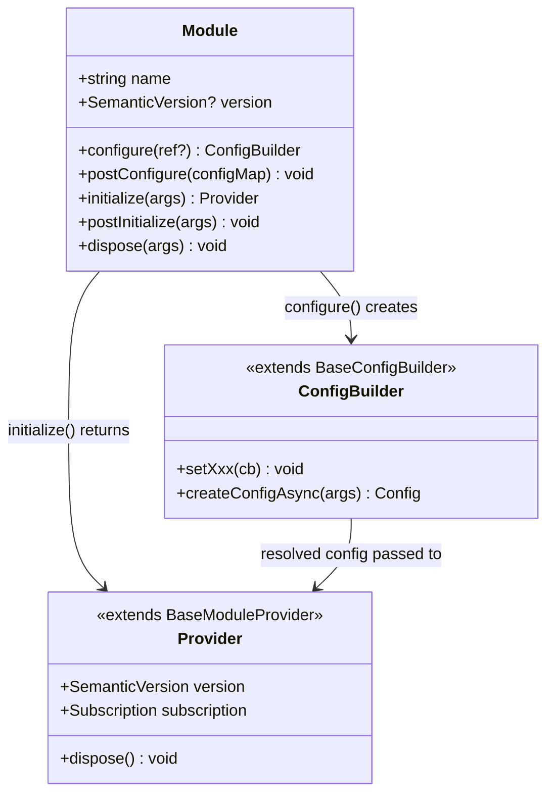
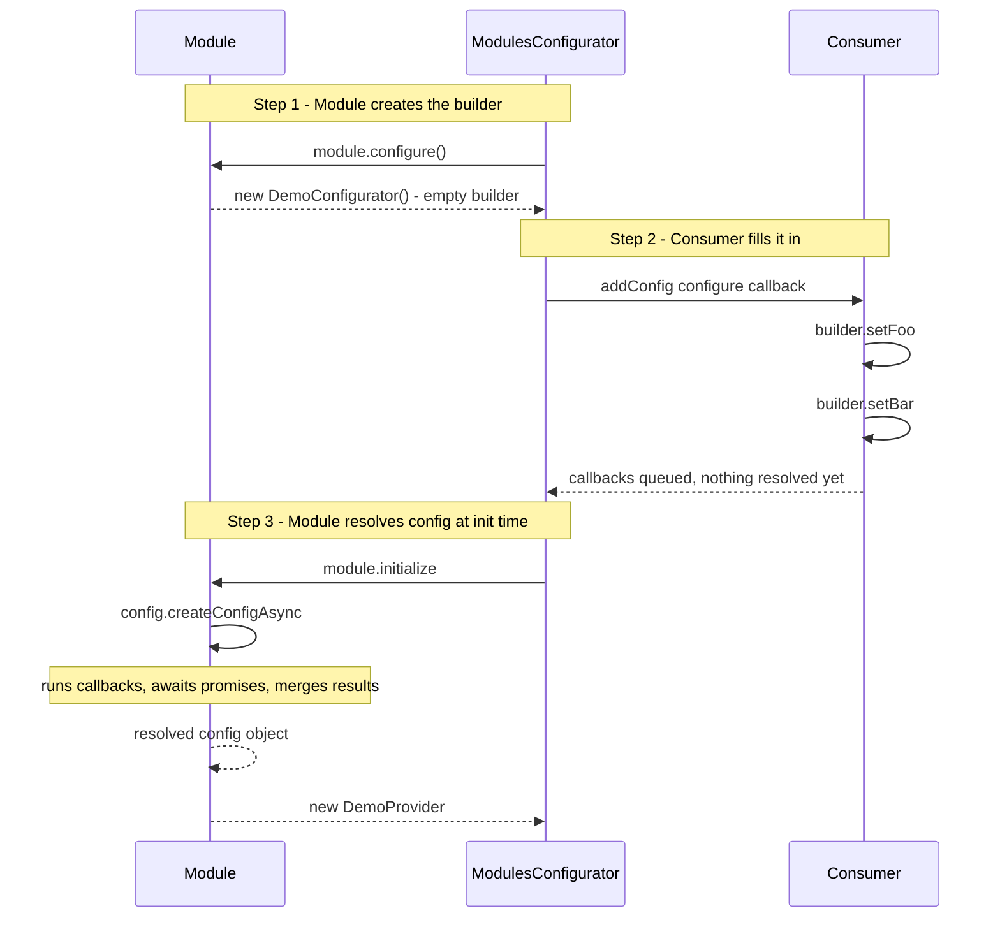

# Concepts — @equinor/fusion-framework-module

This document explains the core mental model behind the Fusion Framework module system: what a module is, how the pieces relate to each other, and how the type system connects everything.

## What Is a Module?

A **module** is a plain TypeScript object that owns one capability at runtime. It could be an HTTP client, an authentication provider, a context selector, a feature-flag store — any single responsibility that other parts of an application need. Modules are the building blocks of a Fusion application.

Modules are intentionally plain objects, not classes. This keeps them lightweight, easy to tree-shake, and straightforward to test. The framework drives the lifecycle; the module just declares what to do at each step.

## What Is a Provider?

When `initialize()` runs, each module produces a **provider** — the live runtime object that the rest of the application interacts with. Providers are typically class instances (often extending `BaseModuleProvider`) that expose the module's public API: methods, observables, event streams, and so on.

After initialization, providers are collected into a `ModulesInstance` object. The keys are the module names; the values are the provider instances. If you registered an `http` module and an `auth` module, you get back `{ http: HttpClient, auth: AuthProvider }`.

## What Is the Configurator?

`ModulesConfigurator` (implementing `IModulesConfigurator`) is the host that drives the module lifecycle. It:

- Collects module registrations via `addConfig`.
- Runs the configure → initialize → dispose pipeline.
- Resolves cross-module dependencies through `requireInstance`.
- Registers host-level plugins via `registerPlugin` after modules are initialized.
- Emits structured lifecycle events on `event$`.

You create one configurator, register your modules, and call `initialize()`. From that point on the configurator and the resulting `ModulesInstance` are the only things you need to keep a reference to.

## How the Pieces Fit Together



The three pieces of a module are deliberately separate:

- **Module definition** — declares the lifecycle hooks. Exported as a constant, usually named after the capability (`httpModule`, `authModule`).
- **Config builder** — receives consumer configuration during the configure phase. Subclass of `BaseConfigBuilder`. Exposes typed setter methods. Consumers call these inside their `addConfig({ configure })` callback.
- **Provider** — the live runtime object. Returned by `initialize`. Subclass of `BaseModuleProvider` for automatic subscription tracking and dispose support.

Keeping these three separate means you can unit-test the config builder without an HTTP server, and unit-test the provider without a real configurator.

## The Configuration Flow

This is the part that trips up most developers. Configuration involves three different actors doing three different jobs, in sequence. Understanding who does what is key.



### Step 1 — The module creates a fresh config builder

When `initialize()` is called, the framework first calls `module.configure()` on every registered module. Each module returns a fresh instance of its config builder — a blank slate that knows *what* can be configured but holds no values yet.

```typescript
// Inside the module definition:
configure() {
  return new DemoConfigurator(); // empty — no values yet
},
```

### Step 2 — The consumer fills in the builder

The framework then calls the consumer's `configure` callback (the one passed to `addConfig`), handing it the builder. This is the only moment where the consumer interacts with module configuration. The consumer calls setter methods on the builder to register callbacks — but the callbacks are **not called yet**. They are queued.

```typescript
// Consumer code — called by the framework with the builder from step 1:
configurator.addConfig({
  module: demoModule,
  configure(builder) {
    // These register callbacks — they do NOT run yet.
    builder.setFoo(async () => 'https://api.example.com');
    builder.setBar(() => 42);
  },
});
```

### Step 3 — The module resolves config during initialize

During `module.initialize`, the module calls `config.createConfigAsync(args)`. This is when all the queued callbacks are finally executed. Each callback receives `args` (which includes `hasModule`, `requireInstance`, and `ref`) so that async callbacks can access peer providers. The results are merged into a single typed config object, which the module uses to construct the provider.

```typescript
// Inside the module definition:
initialize: async (args) => {
  // This runs all registered callbacks and merges the results.
  const config = await args.config.createConfigAsync(args, {
    foo: 'default-value', // optional defaults
  });

  // config is now fully typed: { foo: string, bar: number }
  return new DemoProvider(config);
},
```

The module author controls the defaults (set in `configure()` or passed as the second argument to `createConfigAsync`). The consumer's callbacks override those defaults. If no consumer callback was registered for a key, the default stands.

### Why callbacks instead of direct values?

Consumer configuration uses callbacks — `builder.setFoo(() => value)` rather than `builder.setFoo(value)` — for two reasons:

1. **Async support**: callbacks can be `async`, which lets you fetch a value or `await requireInstance` inside the callback. The resolution happens at initialize time when async operations are safe.
2. **Last-write-wins**: the framework queues all callbacks for a given key and runs the last one. This means a higher-level configurator can override a lower-level default simply by calling the same setter after the module was registered.

```typescript
// Callback that fetches config at initialize time:
builder.setFoo(async ({ requireInstance }) => {
  const discovery = await requireInstance('serviceDiscovery');
  return discovery.resolveUrl('my-api');
});
```

## The Generic Parameters

Every module is typed as `Module<TKey, TType, TConfig, TDeps>`. Getting the generics right once means the entire call chain — `addConfig`, `requireInstance`, `ModulesInstance` — flows without any casting.

| Parameter | What it represents | Example |
|---|---|---|
| `TKey` | String literal — the module's name, and the key on `ModulesInstance` | `'http'` |
| `TType` | The provider type returned by `initialize` | `HttpClient` |
| `TConfig` | The config builder type created by `configure` | `HttpConfigurator` |
| `TDeps` | Tuple of peer module types this module declares as dependencies | `[AuthModule]` |

`TDeps` is only needed when you call `requireInstance` on a peer. Declaring the dependency in the type narrows the `requireInstance` return type automatically so you do not need to cast.

## Utility Types

Two utility types let you extract the parts of a module type without re-declaring them:

```typescript
import type { ModuleConfigType, ModuleType } from '@equinor/fusion-framework-module';

// Extract the config builder type from a module
type HttpConfig = ModuleConfigType<typeof httpModule>; // → HttpConfigurator

// Extract the provider type from a module
type HttpProvider = ModuleType<typeof httpModule>; // → HttpClient
```

These are particularly useful when writing helper functions that accept a module as a generic parameter and need to reference its associated types.

## What `IModulesConfigurator` Is For

`IModulesConfigurator` is the public interface contract for the configurator. Framework packages that accept a configurator as an argument type against this interface rather than the concrete `ModulesConfigurator` class. This keeps them decoupled from the implementation.

If you are writing a module that needs to receive a configurator — for example, an enable function that registers sibling modules — accept `IModulesConfigurator<any, any>` rather than `ModulesConfigurator`.

```typescript
import type { IModulesConfigurator } from '@equinor/fusion-framework-module';

export function enableHttpModule(
  configurator: IModulesConfigurator<any, any>,
  configure?: (builder: HttpConfigurator) => void,
): void {
  configurator.addConfig({ module: httpModule, configure });
}
```

## Next Steps

- [Lifecycle](./lifecycle.md) — the full configure → initialize → dispose pipeline
- [Plugins](./plugins.md) — application-level side effects that run after modules initialize
- [Authoring Modules](./authoring-modules.md) — step-by-step guide to creating a module
- [Configuration](./configuration.md) — how `BaseConfigBuilder` and config callbacks work
