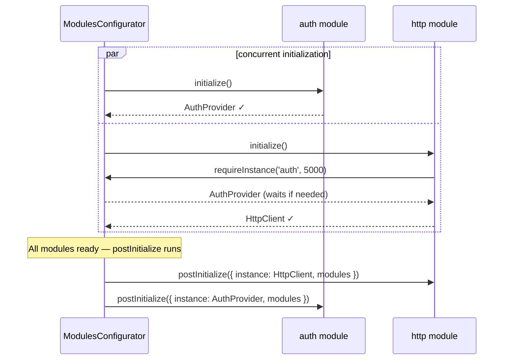

# Cross-Module Dependencies — @equinor/fusion-framework-module

This document explains how modules depend on each other at runtime: how `requireInstance` works, when to use `postInitialize` instead, and how to avoid common dependency pitfalls.

## The Core Problem

All modules initialize concurrently. There is no predefined order. If module A needs something from module B, it cannot simply call `modules.b` inside `initialize` — `modules.b` does not exist yet.

The framework solves this with two complementary mechanisms:

- **`requireInstance(name, timeout?)`** — await a single peer's provider during `initialize`.
- **`postInitialize({ instance, modules })`** — receive the full `modules` map after everyone has finished.



---

## `requireInstance`

Use `requireInstance(name, timeout?)` inside `initialize` when you need a peer's provider to **construct your own provider**. The promise resolves as soon as that peer's `initialize` call resolves — without waiting for everything else.

```typescript
import { type Module } from '@equinor/fusion-framework-module';
import type { AuthModule } from '@equinor/fusion-framework-module-auth';

export const httpModule: Module<'http', HttpClient, HttpConfigurator, [AuthModule]> = {
  name: 'http',
  initialize: async ({ config, requireInstance, hasModule }) => {
    const resolved = await config.createConfigAsync({ config: {}, hasModule, requireInstance });

    // Wait for the auth provider — resolves immediately if auth is already done.
    const auth = await requireInstance('auth', 5_000);

    return new HttpClient(resolved, auth);
  },
};
```

### Timeout

The second argument is a timeout in milliseconds. If the peer does not finish initializing within that window, `requireInstance` rejects. **Always set a timeout.** Without one, a slow or missing peer silently hangs your application forever.

### Optional dependencies

If the dependency is optional — you can work without it — check `hasModule(name)` before calling `requireInstance`:

```typescript
initialize: async ({ config, requireInstance, hasModule }) => {
  const resolved = await config.createConfigAsync({ config: {}, hasModule, requireInstance });

  let auth: AuthProvider | undefined;
  if (hasModule('auth')) {
    auth = await requireInstance('auth', 5_000);
  }

  return new HttpClient(resolved, auth);
},
```

### Circular dependencies

`requireInstance` does not detect circular dependencies. If module A waits for B and B waits for A, both promises hang forever. Design your dependency graph as a DAG — directed, acyclic.

If you find yourself needing a circular reference, move the wiring to `postInitialize` instead. By that point both providers exist; no waiting required.

---

## `postInitialize`

`postInitialize` runs after **all** modules have finished initializing. Use it for:

- Subscribing to another module's event stream.
- Injecting a reference to a peer provider into your own provider.
- Any wiring that needs the complete `modules` map.

`postInitialize` is the right place for cross-module wiring. `initialize` is for constructing your own provider. `requireInstance` bridges the gap only when construction genuinely depends on a peer.

```typescript
export const analyticsModule: Module<'analytics', AnalyticsProvider, AnalyticsConfigurator> = {
  name: 'analytics',
  initialize: async ({ config }) => {
    const resolved = await config.createConfigAsync({ config: {}, hasModule: () => false, requireInstance: async () => { throw new Error('no modules'); } });
    return new AnalyticsProvider(resolved);
  },

  postInitialize: async ({ instance, modules }) => {
    // All modules are available at this point — safe to access any provider.

    // Track context changes
    const sub = modules.context.changed$.subscribe((ctx) => {
      instance.trackContextChange(ctx.id);
    });

    // Track navigation
    const navSub = modules.navigation.currentPath$.subscribe((path) => {
      instance.trackPageView(path);
    });

    // Add to the provider's subscription so they are cancelled on dispose.
    instance.subscription.add(sub);
    instance.subscription.add(navSub);
  },
};
```

---

## Declaring Dependencies in the Type

The fourth generic parameter on `Module<TKey, TType, TConfig, TDeps>` declares this module's peers as a tuple:

```typescript
import type { AuthModule } from '@equinor/fusion-framework-module-auth';
import type { EventModule } from '@equinor/fusion-framework-module-event';

export type HttpModule = Module<'http', HttpClient, HttpConfigurator, [AuthModule, EventModule]>;
```

Declaring deps in `TDeps` narrows the return type of `requireInstance` automatically — `requireInstance('auth')` returns `AuthProvider` without casting. It also enables the `modules` parameter in `postInitialize` to be typed correctly.

---

## Patterns

### Inject peer lazily

If you need a peer reference in your provider but it is not strictly needed for construction, inject it lazily via a setter instead of blocking `initialize`:

```typescript
class HttpClient extends BaseModuleProvider {
  #auth: AuthProvider | undefined;

  setAuth(auth: AuthProvider): void {
    this.#auth = auth;
  }

  async fetch(url: string): Promise<Response> {
    const headers: Record<string, string> = {};
    if (this.#auth) {
      headers['Authorization'] = await this.#auth.getToken();
    }
    return fetch(url, { headers });
  }
}

// In the module:
postInitialize: async ({ instance, modules }) => {
  if ('auth' in modules) {
    instance.setAuth(modules.auth);
  }
},
```

This pattern avoids blocking `HttpClient`'s initialization on auth being ready, which can improve startup time.

### React to peer events in postInitialize

```typescript
postInitialize: async ({ instance, modules }) => {
  instance.subscription.add(
    modules.auth.tokenExpired$.subscribe(() => {
      instance.clearCache();
    }),
  );
},
```

Adding the subscription to `instance.subscription` ensures it is cancelled when the framework calls `dispose()`.

---

## Decision Guide

| Situation | Use |
|---|---|
| You need a peer's provider **to construct your own provider** | `requireInstance` inside `initialize` |
| You need to **react to a peer's events** or **wire providers together** | `postInitialize` |
| The peer dependency is **optional** | `hasModule` check + conditional `requireInstance` or `postInitialize` |
| You need to **read a peer's config** (not its provider) | `module.postConfigure(configMap)` |
| Two modules need references to each other | Inject one lazily in `postInitialize` — avoid circular `requireInstance` |

---

## Next Steps

- [Lifecycle](./lifecycle.md) — full phase ordering and what is available when
- [Common Mistakes](./common-mistakes.md) — pitfalls with `requireInstance` and circular deps
