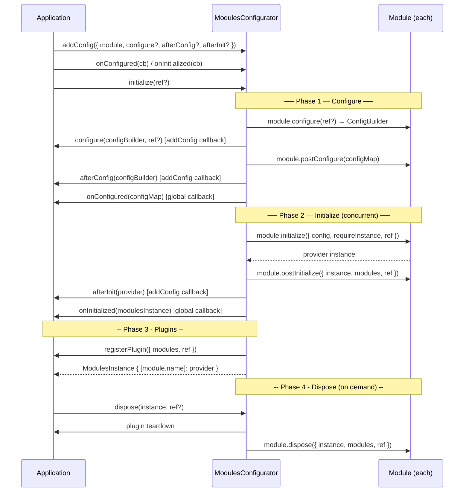

# Lifecycle — @equinor/fusion-framework-module

This document describes the full module lifecycle: what phases exist, what runs in each phase, what order things happen, and how to hook into each phase as a module author or as a consumer.

## Overview

Calling `ModulesConfigurator.initialize()` runs a deterministic lifecycle pipeline. The key ordering guarantee is:

> **Every module's configure phase completes before any module's initialize phase begins.**

This means it is always safe to inspect another module's config inside `postConfigure`, and always safe to access another module's provider inside `postInitialize`. The framework enforces these boundaries so you do not have to reason about timing.



---

## Phase 1 — Configure

The configure phase builds config for every module before anything initializes. The framework calls `module.configure(ref?)` to create a fresh `ConfigBuilder` for each module, then invites consumers to mutate it.

### What runs and in what order

1. **`module.configure(ref?)`** — The module creates and returns a new config builder instance. This is a synchronous factory call. The `ref` parameter carries whatever was passed to `initialize(ref)` — typically a parent framework instance.

2. **`addConfig({ configure })` callback** — The consumer's callback receives the config builder and can call typed setter methods on it (`builder.setBaseUrl(...)`, `builder.setCredentials(...)`, etc.). This is where application-level configuration lives.

3. **`module.postConfigure(configMap)`** — Runs after all consumer `configure` callbacks have settled. Receives the full map of all modules' resolved configs. Use this to apply defaults that depend on what other modules configured, or to validate your own config.

4. **`addConfig({ afterConfig })` callback** — Consumer hook that runs after `postConfigure`. Rarely needed; most configuration belongs in step 2.

5. **`onConfigured(cb)` callback** — Global hook that runs once all per-module configure phases are done. Use it to inspect the full config map, log configuration, or run cross-module config validation.

### When to put configuration here

Put **everything the module needs to know before it can create a provider** in the configure phase. URLs, credentials, feature flags, timeouts — all of these belong in config builder setters called inside the `configure` callback.

Do not put async work that depends on the network or on other providers here. That belongs in `initialize`.

---

## Phase 2 — Initialize

Once all modules are configured, the framework initializes them **concurrently**. Every module's `initialize` starts at roughly the same time. This maximises startup speed, but it requires care when modules depend on each other.

### What runs

1. **`module.initialize({ config, requireInstance, hasModule, ref })`** — The module receives its resolved config and creates the provider. Use `requireInstance(name, timeout?)` to await a peer module's provider. See [Cross-Module Dependencies](./cross-module-deps.md).

2. **`module.postInitialize({ instance, modules, ref })`** — Runs after the module's own `initialize` resolves AND after all other modules have initialized. The full `modules` map is available here. Use this for cross-module wiring — subscribing to event streams, injecting references, setting up reactive pipelines between providers.

3. **`addConfig({ afterInit })` callback** — Consumer hook that runs after `postInitialize`. Useful for one-shot wiring that the framework does not know about.

4. **`onInitialized(cb)` callback** — Global hook that runs once all modules have fully initialized. The `ModulesInstance` is complete at this point.

5. **Plugin phase begins** — The configurator runs `registerPlugin` callbacks before resolving `initialize()`.

### The `ref` parameter

`initialize(ref?)` accepts an optional `ref` object that the framework threads through every lifecycle hook. In Fusion Framework, `ref` is typically the parent framework instance — it gives modules a back-reference to the environment they are running inside. Module authors should type `ref` as `unknown` or a narrow interface and treat it as optional.

---

## Phase 3 - Plugins

The plugin phase runs after `postInitialize`, `afterInit`, and `onInitialized` callbacks have settled, but before `initialize()` resolves. Plugins are registered with `IModulesConfigurator.registerPlugin` and receive the sealed module instance map plus the optional `ref` object.

Use plugins for host-level side effects that need multiple initialized providers, such as telemetry bridges, global listeners, feature instrumentation, or subscriptions owned by the application shell.

```typescript
import { createPlugin } from '@equinor/fusion-framework-module/plugins';

const telemetryPlugin = createPlugin<[typeof eventModule, typeof telemetryModule]>(
  'contextTelemetry',
  (modules) => modules.event.addEventListener('context:changed', (event) => {
    modules.telemetry.track('context.changed', event.detail);
  }),
);

configurator.registerPlugin(telemetryPlugin);
```

Plugins can return a teardown function or an object with a `dispose()` method. Those teardowns run during `configurator.dispose()` before module `dispose` hooks. Plugin registration and teardown failures are isolated and reported as warning events, so one failing plugin does not prevent the remaining lifecycle work from running.

After plugins have settled, the promise returned by `configurator.initialize()` resolves with the sealed `ModulesInstance`.

---

## Phase 4 — Dispose

Dispose is **not** called automatically. It is your responsibility to call `configurator.dispose(instance, ref?)` when the application tears down — for example, when a React application unmounts, or when a service worker is replaced.

The framework first runs plugin teardowns returned by `registerPlugin` callbacks. It then calls `module.dispose({ instance, modules, ref })` for each registered module. This is the right place to cancel subscriptions, close WebSocket connections, clear caches, and release any other resources the provider holds.

`BaseModuleProvider` exposes a `subscription: Subscription` property (RxJS `Subscription`) that collects disposables. Adding to `this.subscription` inside `initialize` means they are automatically cleaned up when the provider's `dispose()` method is called — you do not need to track them separately.

```typescript
class MyProvider extends BaseModuleProvider {
  constructor(args: BaseModuleProviderCtorArgs) {
    super(args);
    // Any RxJS subscription added here is automatically cancelled on dispose.
    this.subscription.add(
      someObservable$.subscribe((value) => this.#handleValue(value)),
    );
  }
}
```

---

## Hook Reference

| Hook | Where it lives | Called by | When |
|---|---|---|---|
| `module.configure(ref?)` | Module definition | Framework | Start of configure phase, once per module |
| `addConfig({ configure })` | Consumer | Framework | After `module.configure()`, before `postConfigure` |
| `module.postConfigure(configMap)` | Module definition | Framework | After all consumer configure callbacks settle |
| `addConfig({ afterConfig })` | Consumer | Framework | After `module.postConfigure()` |
| `onConfigured(cb)` | Consumer | Framework | After all modules' configure phases complete |
| `module.initialize(args)` | Module definition | Framework | Start of initialize phase, concurrently |
| `module.postInitialize(args)` | Module definition | Framework | After all modules have initialized |
| `addConfig({ afterInit })` | Consumer | Framework | After `module.postInitialize()` |
| `onInitialized(cb)` | Consumer | Framework | After all modules' initialize phases complete |
| `registerPlugin(cb)` | Consumer | Framework | After post-initialize callbacks, before `initialize()` resolves |
| plugin teardown | Consumer | Framework | During `configurator.dispose(instance)`, before module dispose hooks |
| `module.dispose(args)` | Module definition | Framework | On `configurator.dispose(instance)` |

## Next Steps

- [Authoring Modules](./authoring-modules.md) — implement each hook step by step
- [Cross-Module Dependencies](./cross-module-deps.md) — how `requireInstance` and `postInitialize` work together
- [Plugins](./plugins.md) — register host-level side effects after modules are initialized
- [Events](./events.md) — observe the lifecycle with `event$`
