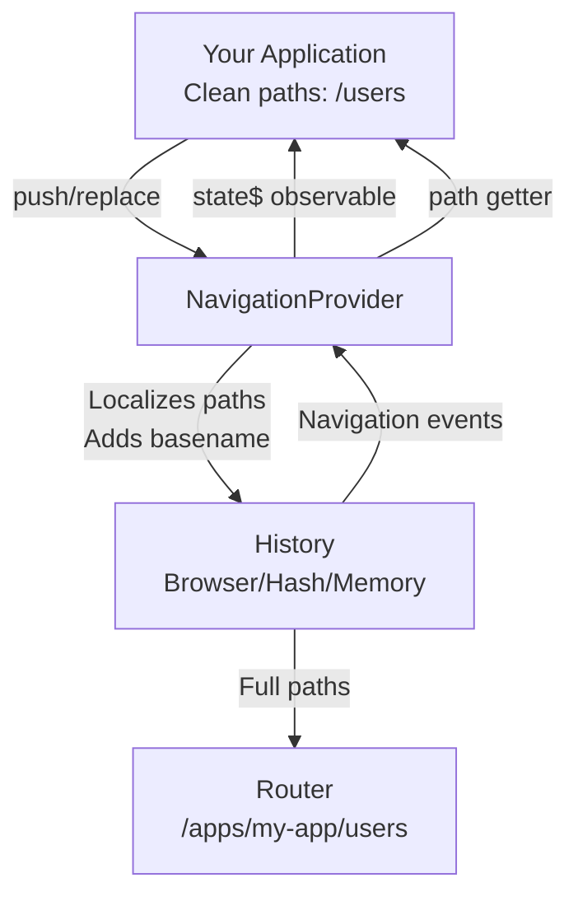

# Fusion Framework Navigation Module

> __The Fusion Framework Navigation Module provides routing and navigation capabilities with observable state management.__

The Navigation Module provides a reactive API based on RxJS observables while handling the complexities of path localization and basename management. It ensures that your application works seamlessly whether served from a root path or a subdirectory, and provides consistent navigation state across your entire application.

## Concept

The Navigation Module abstracts the complexity of managing navigation state in a Fusion Framework application. It provides:

1. **Path Localization**: Automatically handles basename prefixes, so consumers work with clean paths like `/users` while the underlying history receives full paths like `/apps/my-app/users`

2. **Observable State**: Exposes navigation state as an RxJS observable, enabling reactive programming patterns throughout your application

3. **History Abstraction**: Supports multiple history types (browser, hash, memory) with a unified API, making it easy to switch between deployment scenarios

4. **Router Compatibility**: Provides a `createRouter()` method that creates router instances compatible with industry-standard routers (Remix/React Router)

### How It Works




## Quick Start

```ts
import { enableNavigation, createHistory } from '@equinor/fusion-framework-module-navigation';
import { ModulesConfigurator } from '@equinor/fusion-framework-module';

const configurator = new ModulesConfigurator();

// Simple usage - just provide basename
enableNavigation(configurator, '/apps/my-app');

// Advanced usage - full configuration
enableNavigation(configurator, {
  configure: (config) => {
    config.setBasename('/apps/my-app');
    config.setHistory(createHistory('browser'));
  }
});
```

## Configuration

### Basic Configuration

The simplest way to enable navigation is by providing a basename string:

```ts
enableNavigation(configurator, '/apps/my-app');
```

This will:
- Use browser history (default)
- Configure basename for path localization
- Set up the navigation module with sensible defaults

### Advanced Configuration

For more control, use the configuration callback:

```ts
import { enableNavigation, createHistory } from '@equinor/fusion-framework-module-navigation';

enableNavigation(configurator, {
  configure: (config) => {
    // Set the basename (required when app is served from subdirectory)
    config.setBasename('/apps/my-app');

    // Set custom history type
    config.setHistory(createHistory('browser')); // or 'hash', 'memory'
  }
});
```

### Configuration Options

#### basename

The base pathname for your application. This is **required** when your app is served from a subdirectory.

**Why basename matters:**
- The URL pathname must start with the basename when your app is served from a subdirectory
- The navigation module automatically handles adding/removing the basename prefix
- Consumers receive localized paths (basename removed), while the underlying history receives full paths

**Example:**
```ts
// If your app is served at: https://example.com/apps/my-app
config.setBasename('/apps/my-app');

// When you navigate to '/users':
// - Consumer sees: '/users'
// - History receives: '/apps/my-app/users'
// - Browser URL: 'https://example.com/apps/my-app/users'
```

**When to set basename:**
- ✅ App is served from a subdirectory (e.g., `/apps/my-app`)
- ✅ App is part of a larger portal or micro-frontend architecture
- ❌ App is served from root (e.g., `https://example.com/`) - leave basename undefined

#### history

The history instance to use for navigation. The module provides three history types:

| Type | Description | Use Case |
|------|-------------|----------|
| `'browser'` | Uses browser History API with normal URLs | **Default** - Most web applications |
| `'hash'` | Uses hash-based routing (e.g., `#/path`) | Legacy browser support, static hosting without server config |
| `'memory'` | Uses in-memory history (no URL changes) | **Widget applications**, testing, SSR, or when URL shouldn't change |

If not provided, defaults to browser history.

**Example:**
```ts
// Browser history (default)
config.setHistory(createHistory('browser'));

// Hash history
config.setHistory(createHistory('hash'));

// Memory history (for testing)
config.setHistory(createHistory('memory'));
```

## History Types Explained

### Browser History

Uses the browser's native History API with clean URLs. This is the default and recommended option for most applications.

**Characteristics:**
- Clean URLs: `https://example.com/apps/my-app/users`
- Requires server configuration for client-side routing
- Full browser history support (back/forward buttons work)
- Best SEO and user experience

**When to use:**
- ✅ Modern web applications
- ✅ Server can be configured for client-side routing
- ✅ You want clean, SEO-friendly URLs

**Example:**
```ts
config.setHistory(createHistory('browser'));
// Navigates to: https://example.com/apps/my-app/users
```

**Server Configuration:**
For browser history to work, your server must serve `index.html` for all routes. Example nginx config:

```nginx
location / {
  try_files $uri $uri/ /index.html;
}
```

### Hash History

Uses hash-based routing where the path is stored in the URL hash fragment.

**Characteristics:**
- URLs include hash: `https://example.com/#/apps/my-app/users`
- No server configuration needed
- Works with static hosting
- Slightly less clean URLs

**When to use:**
- ✅ Static hosting without server configuration
- ✅ Legacy browser support required
- ✅ You can't configure server routing rules
- ❌ SEO is important (hash fragments are not crawled)

**Example:**
```ts
config.setHistory(createHistory('hash'));
// Navigates to: https://example.com/#/apps/my-app/users
```

### Memory History

Uses in-memory history storage without modifying the browser URL.

**Characteristics:**
- No URL changes (URL stays the same)
- History stored in memory only
- Perfect for testing
- Ideal for widget/embedded applications

**When to use:**
- ✅ **Widget applications** - When serving an application as a widget embedded in another page
- ✅ Testing (unit tests, integration tests)
- ✅ SSR scenarios where URL shouldn't change
- ✅ Embedded applications where URL changes are not desired
- ❌ Production web applications (use browser or hash instead)

**Example:**
```ts
// Widget application - history in memory, no URL changes
config.setHistory(createHistory('memory'));
// No URL changes, history managed in memory
```

## Usage

### Accessing Navigation Provider

Once configured, access the navigation provider through the framework:

```ts
import { useFramework } from '@equinor/fusion-framework-react';

function MyComponent() {
  const framework = useFramework();
  const navigation = framework.navigation;

  // Get current path (localized, basename removed)
  const currentPath = navigation.path;
  console.log(currentPath.pathname); // '/users' (not '/apps/my-app/users')

  // Navigate programmatically
  navigation.push('/users');
  navigation.replace('/dashboard');
}
```

### Navigation Methods

#### push(to, state?)

Pushes a new navigation entry onto the history stack. Adds a new entry to the browser history, so the back button will return to the previous location.

```ts
// Navigate to a new path
navigation.push('/users');

// Navigate with state data
navigation.push('/users', { userId: 123 });

// Navigate with Path object (includes search/hash)
navigation.push({
  pathname: '/users',
  search: '?sort=name',
  hash: '#section'
});

// Use current path (no argument)
navigation.push(); // Pushes current path again
```

#### replace(to, state?)

Replaces the current history entry. Unlike `push`, this doesn't add a new entry to history, so the back button won't return to the previous location.

```ts
// Replace current location
navigation.replace('/login');

// Replace with state
navigation.replace('/login', { from: '/dashboard' });

// Replace with Path object
navigation.replace({
  pathname: '/login',
  search: '?redirect=/dashboard'
});
```

**When to use `replace` vs `push`:**
- Use `push` when you want to add to history (normal navigation)
- Use `replace` when you don't want to add to history (redirects, auth flows)

#### createHref(to?)

Creates a localized href string with basename included. Useful for creating links that work with the navigation system.

```ts
// Create href for a path
const href = navigation.createHref('/users');
console.log(href); // '/apps/my-app/users'

// Create href for current path
const currentHref = navigation.createHref();
console.log(currentHref); // '/apps/my-app/users' (current path)

// Create href with Path object
const hrefWithSearch = navigation.createHref({
  pathname: '/users',
  search: '?id=1',
  hash: '#section'
});
console.log(hrefWithSearch); // '/apps/my-app/users?id=1#section'
```

#### createURL(to?)

Creates a full URL object with basename included. Similar to `createHref` but returns a URL object.

```ts
const url = navigation.createURL('/users');
console.log(url.pathname); // '/apps/my-app/users'
console.log(url.href); // Full URL string

// Create URL for current path
const currentUrl = navigation.createURL();
```

#### createRouter(routes)

Creates a router instance from route configuration that is compatible with industry-standard routers (Remix/React Router). This is the recommended way to create routers in Fusion Framework applications.

```ts
import { type AgnosticRouteObject } from '@remix-run/router';

const routes: AgnosticRouteObject[] = [
  { path: '/', element: <Home /> },
  { path: '/users', element: <Users /> },
  { path: '/users/:id', element: <UserDetail /> }
];

const router = navigation.createRouter(routes);

// Use the router with your routing library
router.subscribe((state) => {
  // Handle route state
});
```

> [!CAUTION]
> **Important**: Always use `navigation.createRouter()` instead of creating router instances directly. Creating routers directly will create their own history wrapper that is **NOT** connected to the framework, causing unpredictable behavior and broken links.

## Path Localization

Path localization is a core feature of the Navigation Module. It ensures that:

1. **Consumers work with clean paths**: Your application code uses paths like `/users` without worrying about basename
2. **History receives full paths**: The underlying history gets paths like `/apps/my-app/users` with basename included
3. **Automatic translation**: The module automatically adds/removes basename as needed

### How Path Localization Works

```ts
// Configuration
config.setBasename('/apps/my-app');

// Consumer code (your application)
navigation.push('/users');
// → NavigationProvider adds basename
// → History receives: '/apps/my-app/users'
// → Browser URL: 'https://example.com/apps/my-app/users'

// Reading path (consumer receives localized version)
console.log(navigation.path.pathname); // '/users' (basename removed)
console.log(history.location.pathname); // '/apps/my-app/users' (full path)

// Observable state (localized paths)
navigation.state$.subscribe(({ location }) => {
  console.log(location.pathname); // '/users' (basename removed)
});
```

### Path Localization Rules

1. **When pushing/replacing**: Paths are automatically prefixed with basename
2. **When reading paths**: The `path` getter returns localized paths (basename removed)
3. **In state$ observable**: All emitted paths are localized
4. **In createHref/createURL**: Basename is automatically included

### Path Localization Examples

```ts
// Example: Basename is '/apps/my-app'

// Push navigation
navigation.push('/users');
// → History: '/apps/my-app/users'
// → navigation.path: '/users'

// Push with search and hash
navigation.push('/users?id=1#section');
// → History: '/apps/my-app/users?id=1#section'
// → navigation.path: '/users?id=1#section'

// Push root path
navigation.push('/');
// → History: '/apps/my-app'
// → navigation.path: '/' or ''

// Create href
const href = navigation.createHref('/users');
// → Returns: '/apps/my-app/users'
```

## Observable Navigation State

The navigation module provides an observable stream of navigation updates using RxJS:

```ts
import { map, filter } from 'rxjs';

// Subscribe to all navigation changes
navigation.state$.subscribe(({ action, location }) => {
  console.log('Action:', action); // 'PUSH', 'REPLACE', or 'POP'
  console.log('Location:', location.pathname); // Localized path
});

// Filter for specific actions
navigation.state$.pipe(
  filter(({ action }) => action === 'POP')
).subscribe(({ location }) => {
  console.log('User navigated back to:', location.pathname);
});

// Map to pathname only
navigation.state$.pipe(
  map(({ location }) => location.pathname)
).subscribe(pathname => {
  console.log('Current path:', pathname);
});
```

### Observable Characteristics

- **Shareable**: Multiple subscribers share the same observable (uses `shareReplay`)
- **Replays last value**: Late subscribers immediately receive the last navigation state
- **Localized paths**: All emitted paths have basename removed
- **Filtered by basename**: Only paths within the basename scope are emitted

## TypeScript Support

The module is fully typed and provides comprehensive TypeScript definitions:

```ts
import type {
  INavigationProvider,
  INavigationConfigurator,
  NavigationModule,
  History,
  Path,
  To
} from '@equinor/fusion-framework-module-navigation';

// Type-safe navigation usage
function navigateToUsers(navigation: INavigationProvider) {
  navigation.push('/users'); // ✅ Type-safe
  // navigation.push(123); // ❌ Type error
}
```

## Examples

### Complete Application Setup

```ts
import { enableNavigation, createHistory } from '@equinor/fusion-framework-module-navigation';
import { ModulesConfigurator } from '@equinor/fusion-framework-module';

export const configure = async (configurator: ModulesConfigurator) => {
  enableNavigation(configurator, {
    configure: (config) => {
      // Set basename if app is served from subdirectory
      config.setBasename('/apps/my-app');
      
      // Use browser history (default)
      config.setHistory(createHistory('browser'));
    }
  });
};
```

### React Component Usage

```tsx
import { useFramework } from '@equinor/fusion-framework-react';
import { useEffect, useState } from 'react';

function NavigationExample() {
  const navigation = useModule('navigation')
  const [currentPath, setCurrentPath] = useState(navigation.path.pathname);

  useEffect(() => {
    const subscription = navigation.state$.subscribe(({ location }) => {
      setCurrentPath(location.pathname);
    });

    return () => subscription.unsubscribe();
  }, [navigation]);

  return (
    <div>
      <p>Current path: {currentPath}</p>
      <button onClick={() => navigation.push('/users')}>
        Go to Users
      </button>
      <button onClick={() => navigation.replace('/dashboard')}>
        Go to Dashboard
      </button>
    </div>
  );
}
```

### Router Integration

```tsx
import { useFramework } from '@equinor/fusion-framework-react';
import { RouterProvider } from '@remix-run/react';

function App() {
  const framework = useFramework();
  const navigation = framework.navigation;

  const routes = [
    { path: '/', element: <Home /> },
    { path: '/users', element: <Users /> },
    { path: '/users/:id', element: <UserDetail /> }
  ];

  const router = navigation.createRouter(routes);

  return <RouterProvider router={router} />;
}
```

### Testing with Memory History

```ts
import { createHistory } from '@equinor/fusion-framework-module-navigation';
import { enableNavigation } from '@equinor/fusion-framework-module-navigation';

// In tests, use memory history
const configurator = new ModulesConfigurator();
enableNavigation(configurator, {
  configure: (config) => {
    config.setHistory(createHistory('memory'));
  }
});
```

## Important Notes

### ⚠️ Router Integration

> [!CAUTION]
> **Never create router instances directly** in Fusion Framework applications. Always use `navigation.createRouter()` to ensure proper integration with the framework's navigation system.

**Why?**
- Creating routers directly creates their own history wrapper
- This breaks the connection to the framework's navigation provider
- Links and navigation will behave unpredictably
- State synchronization issues will occur

**✅ Correct:**
```ts
const router = navigation.createRouter(routes);
```

**❌ Incorrect:**
```ts
import { createBrowserRouter } from '@remix-run/router';
const router = createBrowserRouter(routes); // Don't do this!
```

### Navigation Blocking

The `history.block()` method is available for intercepting navigation attempts. It uses a callback-based approach where the blocker receives a transition object with a `retry()` method.

**Example:**
```ts
const framework = useFramework();
const history = framework.navigation.history;

const unblock = history.block((transition) => {
  if (shouldPreventNavigation(transition)) {
    // Show confirmation dialog
    showConfirmationDialog(() => {
      transition.retry(); // Allow navigation to proceed
    });
  } else {
    transition.retry(); // Allow navigation immediately
  }
});

// Clean up when done
unblock();
```

### Path Localization Best Practices

1. **Always use the provider's methods**: Use `navigation.push()` instead of directly calling `history.push()`
2. **Read paths from the provider**: Use `navigation.path` instead of `history.location` for consumer-facing code
3. **Subscribe to state$**: Use `navigation.state$` instead of listening to history events directly
4. **Create routers properly**: Always use `navigation.createRouter()` for router integration

### Basename Configuration

- **Required when**: App is served from a subdirectory
- **Not required when**: App is served from root (`/`)
- **Must match**: The URL path prefix where your app is served
- **Example**: If app is at `https://example.com/apps/my-app`, basename should be `/apps/my-app`

## API Reference

### enableNavigation

Helper function to enable the navigation module.

```ts
enableNavigation(
  configurator: IModulesConfigurator,
  basenameOrOptions?: string | {
    configure: (config: NavigationConfigurator, ref?: unknown) => void
  }
): void
```

**Parameters:**
- `configurator`: The modules configurator to add navigation to
- `basenameOrOptions`: Either a basename string or configuration object with `configure` callback

**Examples:**
```ts
// Simple usage
enableNavigation(configurator, '/apps/my-app');

// Advanced usage
enableNavigation(configurator, {
  configure: (config) => {
    config.setBasename('/apps/my-app');
    config.setHistory(createHistory('browser'));
  }
});
```

### createHistory

Creates a history instance based on the specified type.

```ts
createHistory(type?: 'browser' | 'hash' | 'memory'): History
```

**Parameters:**
- `type`: The type of history to create (defaults to `'browser'`)

**Returns:**
- A `History` instance for navigation management

**Examples:**
```ts
const browserHistory = createHistory('browser');
const hashHistory = createHistory('hash');
const memoryHistory = createHistory('memory');
```

### NavigationProvider

The main provider class that manages navigation state and provides navigation methods.

**Properties:**
- `state$`: Observable stream of navigation updates
- `path`: Current localized path (basename removed)
- `history`: The underlying history instance
- `navigator`: (deprecated) Alias for `history`

**Methods:**
- `push(to, state?)`: Push new navigation entry
- `replace(to, state?)`: Replace current navigation entry
- `createHref(to?)`: Create href string with basename
- `createURL(to?)`: Create URL object with basename
- `createRouter(routes)`: Create router instance compatible with industry-standard routers
- `dispose()`: Clean up resources

## See Also

- [Fusion Framework Documentation](https://github.com/equinor/fusion-framework)
- [Navigation Module Cookbook](https://github.com/equinor/fusion-framework/tree/main/cookbooks/app-react-router)
- [RxJS Documentation](https://rxjs.dev/) (for observable patterns)
