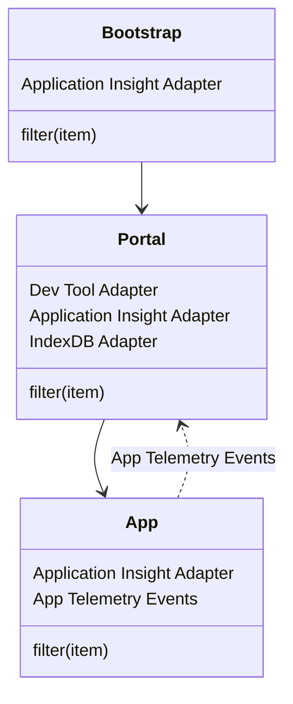

## Installation
```bash
pnpm add @equinor/fusion-framework-module-telemetry
```

## Configuration

To configure the telemetry module, you need to provide a configuration object that specifies the telemetry adapters you want to use. The configuration can be done in your application's main entry file or wherever you initialize the Fusion Framework.

```typescript
import { enableTelemetry } from '@equinor/fusion-framework-module-telemetry';

const configure = (configurator: IModulesConfigurator<any, any>) => {
  enableTelemetry(configurator, (builder) => {
    // configure the telemetry module here
  });
};
```

## Usage

You can use the telemetry module to track events, measurements, and other telemetry data in your application. The module provides a unified interface for sending telemetry data to various adapters.
You can track events and measurements using the `modules.telemetry` instance:

```typescript
// Import the telemetry module
const provider = modules.telemetry;

// Generic tracking
provider.track({
  name: 'MyEvent',
  type: TelemetryType.Event,
  level: TelemetryLevel.Information,
  properties: { /** ... additional properties ... */ },
  scope: [/* optional scopes */]
});

// Track an event
provider.trackEvent({
  name: 'MyEvent',
});

// Track a measurement
provider.trackMeasurement({
  name: 'MyMeasurement',
  value: 123
});

// Track exceptions
provider.trackException({
  name: 'MyException',
  error: new Error('This is an error'),
});

// Track a custom event
provider.trackCustomEvent({
  name: 'MyCustomEvent',
});
```

### Measurements
You can also use the `Measurement` class to create measurements that can be tracked over time.

```typescript
const measurement = modules.telemetry.measure({ name: 'MyMeasurement' });
// Perform some operation
measurement.measure(); // Measure the operation
```

#### Resolving Measurements
You can resolve measurements with promises to track asynchronous operations:
```typescript
const measurement = modules.telemetry.measure({ name: 'AsyncOperation' });
const result = await measurement.resolve(
  new Promise((resolve) => {
    setTimeout(() => resolve('result'), 1000);
  }),
  {
    // Additional data to include in the measurement
    data: (result) => ({ properties: { result } })
  }
);
```

#### Executing Measurements
You can execute a function and measure its execution time:
```typescript
const measurement = modules.telemetry.measure({ name: 'FunctionExecution' });
const result = await measurement.exec(() => {
  // Simulate some work
  return new Promise((resolve) => setTimeout(() => resolve('result'), 1000));
});
```

#### Cloning Measurements
You can clone measurements to create new instances with the same initial state:
```typescript
const measurement = modules.telemetry.measure({ name: 'CloneExample' });
for (let i = 0; i < 5; i++) {
  const clonedMeasurement = measurement.clone({ preserveStartTime: true });
  await clonedMeasurement.resolve(
    new Promise((resolve) => setTimeout(() => resolve('result'), 1000))
  );
}
measurement.measure(); // Measure the total time taken by all cloned measurements
```

#### `using` Statement
You can use the `using` statement to automatically dispose of measurements when they go out of scope:
```typescript
const job = async() => {
  using measurement = modules.telemetry.measure({ name: 'UsingExample' });
  // Perform some operation
}
// measurement will be automatically tracked when job function completes
```
> [!CAUTION]
> The `using` statement is a TypeScript feature is in proposal stage and may not be available in all environments. Ensure your TypeScript configuration supports it.

## Adapters

### Application Insights Telemetry

The Application Insights telemetry adapter allows you to send telemetry data to Microsoft Application Insights. This module provides an easy way to integrate Application Insights into your Fusion Framework application.

#### Installation

To use the Application Insights telemetry adapter, you need to install the `@microsoft/applicationinsights-web` package. You can do this using the following command:

```bash
pnpm add @microsoft/applicationinsights-web
```

#### Configuration

##### Example

```ts
import { enableTelemetry } from '@equinor/fusion-framework-module-telemetry';
import { ApplicationInsightsAdapter } from '@equinor/fusion-framework-module-telemetry/application-insights';

// bootstrap - initialization on server which loads the portal
const configure = (configurator: IModulesConfigurator<any, any>) => {
  enableTelemetry(configurator, async (args) => {
    const adapter = new ApplicationInsightsAdapter({
      snippet: {
        instrumentationKey: 'portal-instrumentation-key'
      },
      // filter log level by FUSION_TELEMETRY_LEVEL environment variable
      filter: (item) => item.level <= {{ FUSION_TELEMETRY_LEVEL }},
    });

    args.config.addAdapter(adapter);
    args.requireInstance('auth').then((auth) => {
      if (auth.account?.localAccountId) {
        adapter.setAuthenticatedUserContext(auth.account.localAccountId);
      }
    });
  });
};

// portal - framework
const configure = (configurator: IModulesConfigurator<any, any>) => {
  enableTelemetry(configurator, async (args) => {
    // reuse the Application Insights adapter from bootstrap
    const aiAdapter = args.ref.modules.telemetry.getAdapter(ApplicationInsightsAdapter.Identifier);
    if (aiAdapter) {
      args.config.addAdapter(aiAdapter);
    }
    args.config.setMetadata({
      portal: {
        name: 'Fusion Portal',
        version: '1.0.0',
      }
    });
    args.config.setDefaultScope(['portal']);
    args.config.setFilter((item) => item.scope.includes('portal'));
  });
};

// app - application
const configure = (configurator: IModulesConfigurator<any, any>) => {
  enableTelemetry(configurator, async (args) => {
    args.config.setMetadata({
      app: {
        name: 'My App',
        version: '1.0.0',
      }
    });
    args.config.setDefaultScope(['app']);
    args.config.setParent(args.ref.modules.telemetry);
    const appAppInsightsAdapter = new ApplicationInsightsAdapter({
      snippet: {
        instrumentationKey: 'app-instrumentation-key'
      },
      // only log warnings and critical
      filter: (item) => item.scope.includes('custom-event'),
    });
    args.config.addAdapter(appAppInsightsAdapter);
  });
};

// app - custom event
modules.telemetry.trackEvent({
  name: 'CustomEvent',
  type: TelemetryType.Event,
  level: TelemetryLevel.Information,
  properties: {
    customProperty: 'value'
  },
  scope: ['custom-event', 'ag-grid']
});

```

