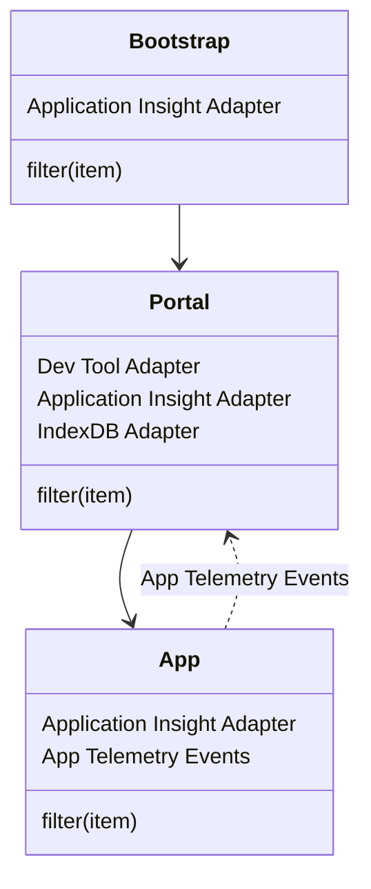

The Fusion Framework Telemetry Module provides a unified way to track events, metrics, exceptions, and custom telemetry data in your application. It offers a consistent API for logging telemetry data while supporting multiple adapters for different telemetry backends.

Telemetry helps you:
- Monitor application usage and performance
- Track user interactions and behavior
- Identify errors and exceptions in production
- Measure performance metrics across your application

## Configuration

To configure the telemetry module, you need to provide a configuration object that specifies the telemetry adapters you want to use. The configuration can be done in your application's main entry file or wherever you initialize the Fusion Framework.

```typescript
import { enableTelemetry } from '@equinor/fusion-framework-module-telemetry';

const configure = (configurator: IModulesConfigurator<any, any>) => {
  enableTelemetry(configurator, (builder) => {
    // configure the telemetry module here
  });
};
```

## Usage

### Tracking Events and Data

You can use the telemetry module to track events, metrics, and other telemetry data in your application. The module provides a unified interface for sending telemetry data to various adapters.

```typescript
// Import types
import { TelemetryType, TelemetryLevel } from '@equinor/fusion-framework-module-telemetry';

// Get the telemetry provider from modules
const provider = modules.telemetry;

// Generic tracking
provider.track({
  name: 'MyEvent',
  type: TelemetryType.Event,
  level: TelemetryLevel.Information,
  properties: { /** ... additional properties ... */ },
  scope: [/* optional scopes */]
});

// Track an event
provider.trackEvent({
  name: 'MyEvent',
});

// Track a metric
provider.trackMetric({
  name: 'MyMetric',
  value: 123
});

// Track exceptions
provider.trackException({
  name: 'MyException',
  exception: new Error('This is an error'),
});

// Track a custom event
provider.trackCustom({
  name: 'MyCustomEvent',
});
```

### Telemetry Types

The telemetry module supports several types of telemetry data:

- **Event**: General events that occur in your application
- **Exception**: Error or exception information
- **Metric**: Numerical measurements or metrics
- **Custom**: Custom telemetry data that doesn't fit the other categories

### Telemetry Levels

Telemetry items can have different severity levels:

- **Verbose** (0): Detailed information, typically for debugging
- **Debug** (1): Debugging information
- **Information** (2): General information about the system's operation
- **Warning** (3): Indicates a potential issue that is not critical
- **Error** (4): Represents an error that has occurred, but the system can continue running
- **Critical** (5): A severe error that may cause the system to stop functioning

By default, if no level is specified, the `Information` level is used.

## Measurements

The telemetry module provides a `Measurement` class that helps you track the duration of operations in your code.

### Basic Measurement

```typescript
// Create a measurement
const measurement = modules.telemetry.measure({ name: 'MyMeasurement' });

// Perform some operation
// ...

// Record the measurement
measurement.measure(); // Tracks the time since the measurement was created
```

### Resolving Measurements

You can resolve measurements with promises to track asynchronous operations:

```typescript
const measurement = modules.telemetry.measure({ name: 'AsyncOperation' });

// Track the time it takes to resolve the promise
const result = await measurement.resolve(
  new Promise<string>((resolve) => {
    setTimeout(() => resolve('result'), 1000);
  }),
  {
    // Additional data to include in the measurement
    data: (result) => ({ properties: { result } })
  }
);
```

### Executing Measurements

You can execute a function and measure its execution time:

```typescript
const measurement = modules.telemetry.measure({ name: 'FunctionExecution' });

// Execute and measure the function
const result = await measurement.exec(() => {
  // Simulate some work
  return new Promise<string>((resolve) => setTimeout(() => resolve('result'), 1000));
});
```

### Cloning Measurements

You can clone measurements to create new instances with the same initial state:

```typescript
const measurement = modules.telemetry.measure({ name: 'CloneExample' });

for (let i = 0; i < 5; i++) {
  const clonedMeasurement = measurement.clone({ preserveStartTime: true });
  await clonedMeasurement.resolve(
    new Promise((resolve) => setTimeout(() => resolve('result'), 1000))
  );
}

// Measure the total time taken by all cloned measurements
measurement.measure(); 
```

### Using Statement

You can use the `using` statement to automatically dispose of measurements when they go out of scope:

```typescript
const job = async() => {
  using measurement = modules.telemetry.measure({ name: 'UsingExample' });
  // Perform some operation
  // The measurement will be automatically tracked when the function completes
}
```

> [!CAUTION]
> The `using` statement is a TypeScript feature that is still in proposal stage and may not be available in all environments. To use this feature, you need to enable it in your TypeScript configuration:
>
> ```json
> {
>   "compilerOptions": {
>     "target": "es2022",
>     "module": "NodeNext",
>     "useDefineForClassFields": true
>   }
> }
> ```

## Adapters

Adapters are responsible for processing and sending telemetry data to their respective destinations.

### Application Insights Adapter

The Application Insights adapter allows you to send telemetry data to Microsoft Application Insights.

#### Installation

To use the Application Insights adapter, you need to install the `@microsoft/applicationinsights-web` package:

```bash
pnpm add @microsoft/applicationinsights-web
```

#### Configuration

The Application Insights adapter supports the following configuration options:

- `snippet`: The Application Insights configuration object (required)
- `plugins`: Optional array of plugins to extend Application Insights functionality
- `identifier`: Optional unique identifier for the client instance (defaults to 'application-insights')
- `filter`: Optional filter function to determine if a telemetry item should be processed
- `prefix`: Optional prefix to prepend to telemetry item names

#### Example

```typescript
import { enableTelemetry } from '@equinor/fusion-framework-module-telemetry';
import { ApplicationInsightsAdapter } from '@equinor/fusion-framework-module-telemetry/application-insights-adapter';

// bootstrap - initialization on server which loads the portal
const configure = (configurator: IModulesConfigurator<any, any>) => {
  enableTelemetry(configurator, async (args) => {
    const adapter = new ApplicationInsightsAdapter({
      snippet: {
        instrumentationKey: 'portal-instrumentation-key'
      },
      // filter log level by FUSION_TELEMETRY_LEVEL environment variable
      filter: (item) => item.level <= process.env.FUSION_TELEMETRY_LEVEL || TelemetryLevel.Information,
    });

    args.config.addAdapter(adapter);
    args.requireInstance('auth').then((auth) => {
      if (auth.account?.localAccountId) {
        adapter.setAuthenticatedUserContext(auth.account.localAccountId);
      }
    });
  });
};

// portal - framework
const configure = (configurator: IModulesConfigurator<any, any>) => {
  enableTelemetry(configurator, async (args) => {
    // reuse the Application Insights adapter from bootstrap
    const aiAdapter = args.ref.modules.telemetry.getAdapter(ApplicationInsightsAdapter.Identifier);
    if (aiAdapter) {
      args.config.addAdapter(aiAdapter);
    }
    args.config.setMetadata({
      portal: {
        name: 'Fusion Portal',
        version: '1.0.0',
      }
    });
    args.config.setDefaultScope(['portal']);
    args.config.setFilter((item) => item.scope.includes('portal'));
  });
};

// app - application
const configure = (configurator: IModulesConfigurator<any, any>) => {
  enableTelemetry(configurator, async (args) => {
    args.config.setMetadata({
      app: {
        name: 'My App',
        version: '1.0.0',
      }
    });
    args.config.setDefaultScope(['app']);
    args.config.setParent(args.ref.modules.telemetry);
    const appAppInsightsAdapter = new ApplicationInsightsAdapter({
      snippet: {
        instrumentationKey: 'app-instrumentation-key'
      },
      // only log events with a specific scope
      filter: (item) => item.scope.includes('custom-event'),
    });
    args.config.addAdapter(appAppInsightsAdapter);
  });
};

// app - custom event
modules.telemetry.trackEvent({
  name: 'CustomEvent',
  type: TelemetryType.Event,
  level: TelemetryLevel.Information,
  properties: {
    customProperty: 'value'
  },
  scope: ['custom-event', 'ag-grid']
});
```

### Console Adapter

The Console adapter provides a simple way to log telemetry data to the console, useful for development and debugging.

#### Installation

The Console adapter is included with the telemetry module and doesn't require additional installation.

#### Configuration

The Console adapter supports the following configuration options:

- `identifier`: Optional unique identifier for the adapter (defaults to 'console-adapter')
- `filter`: Optional filter function to determine if a telemetry item should be processed
- `title`: Optional title to display in the console output (defaults to 'Fusion')

#### Example

```typescript
import { enableTelemetry } from '@equinor/fusion-framework-module-telemetry';
import { ConsoleAdapter } from '@equinor/fusion-framework-module-telemetry/console-adapter';
import { TelemetryLevel } from '@equinor/fusion-framework-module-telemetry';

const configure = (configurator: IModulesConfigurator<any, any>) => {
  enableTelemetry(configurator, (builder) => {
    // Create a console adapter for development
    const consoleAdapter = new ConsoleAdapter({
      title: 'MyApp',
      // Only log information and above
      filter: (item) => item.level >= TelemetryLevel.Information
    });
    
    builder.addAdapter(consoleAdapter);
  });
};
```

## Advanced Features

### Metadata Extractors

Metadata extractors allow you to dynamically add metadata to telemetry items before they are processed. This can be useful for adding context information to all telemetry items.

```typescript
import { enableTelemetry } from '@equinor/fusion-framework-module-telemetry';

const configure = (configurator: IModulesConfigurator<any, any>) => {
  enableTelemetry(configurator, (builder) => {
    // Add metadata to all telemetry items
    builder.setMetadata(({ modules, item }) => {
      return {
        ...item,
        properties: {
          ...item.properties,
          // Add user information if available
          user: modules?.auth?.account?.username,
          // Add application version
          version: '1.0.0',
        }
      };
    });
  });
};
```

### Filter Functions

Filter functions allow you to control which telemetry items are processed by an adapter. This can be useful for filtering out unwanted telemetry or directing different types of telemetry to different adapters.

```typescript
import { enableTelemetry, TelemetryLevel } from '@equinor/fusion-framework-module-telemetry';
import { ApplicationInsightsAdapter } from '@equinor/fusion-framework-module-telemetry/application-insights-adapter';

const configure = (configurator: IModulesConfigurator<any, any>) => {
  enableTelemetry(configurator, (builder) => {
    // Only process errors and critical events in production
    const isProd = process.env.NODE_ENV === 'production';
    
    const appInsightsAdapter = new ApplicationInsightsAdapter({
      snippet: { /* ... */ },
      // In production, only send errors and critical events
      // In development, send all events
      filter: (item) => isProd 
        ? item.level >= TelemetryLevel.Error 
        : true
    });
    
    builder.addAdapter(appInsightsAdapter);
  });
};
```

### Environment Variable Configuration

You can use environment variables to control telemetry behavior. For example, you can use the `FUSION_TELEMETRY_LEVEL` environment variable to control the minimum level of telemetry that should be processed:

```typescript
import { enableTelemetry, TelemetryLevel } from '@equinor/fusion-framework-module-telemetry';

// Map string level names to numeric levels
const levelMap = {
  'verbose': TelemetryLevel.Verbose,
  'debug': TelemetryLevel.Debug,
  'information': TelemetryLevel.Information,
  'warning': TelemetryLevel.Warning,
  'error': TelemetryLevel.Error,
  'critical': TelemetryLevel.Critical,
};

// Get the level from the environment variable, defaulting to Information
const envLevel = process.env.FUSION_TELEMETRY_LEVEL?.toLowerCase();
const minLevel = envLevel && levelMap[envLevel] !== undefined 
  ? levelMap[envLevel] 
  : TelemetryLevel.Information;

const configure = (configurator: IModulesConfigurator<any, any>) => {
  enableTelemetry(configurator, (builder) => {
    // Only process events at or above the minimum level
    builder.setFilter((item) => item.level >= minLevel);
  });
};
```

## Architecture

The telemetry module follows a hierarchical architecture that allows for flexible configuration and data flow. The diagram below shows how different components interact:



## Performance Considerations

When implementing telemetry, consider the following performance best practices:

1. **Filter Early**: Apply filters as early as possible to avoid processing unnecessary telemetry data.
2. **Batch Operations**: Use measurements to track operations in batches rather than tracking individual events.
3. **Sampling**: In high-volume scenarios, consider implementing sampling to reduce the amount of telemetry data.
4. **Async Processing**: Use the telemetry module's asynchronous methods to avoid blocking the main thread.
5. **Selective Telemetry**: Be selective about what you track in production to avoid overwhelming your telemetry backend.

## Troubleshooting

Common issues and their solutions:

1. **No Telemetry Data**:
   - Check that adapters are properly configured and added to the telemetry configurator
   - Verify that filter functions aren't excluding all telemetry items
   - Ensure network connectivity to the telemetry backend

2. **Missing Context Information**:
   - Check that metadata extractors are configured correctly
   - Verify that required modules are available when extracting metadata

3. **Performance Issues**:
   - Check for excessive telemetry events being generated
   - Consider implementing sampling or more selective filtering
   - Review adapter processing times

