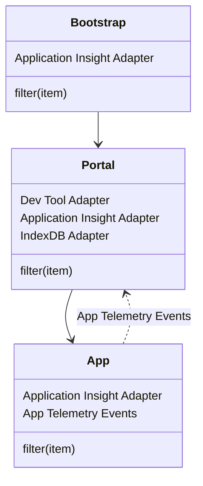

# @equinor/fusion-framework-module-telemetry

Unified telemetry module for the Fusion Framework. Provides a consistent API for tracking events, exceptions, metrics, and custom telemetry data while supporting pluggable adapters for different backends.

## Features

- **Adapter-based architecture** — ship with Console and Application Insights adapters, or build your own by extending `BaseTelemetryAdapter`.
- **Hierarchical providers** — child providers relay telemetry to a parent, with automatic metadata merging.
- **Zod-validated schemas** — every telemetry item is parsed and validated at runtime.
- **Performance measurements** — `Measurement` utility tracks elapsed time with `using` / `Symbol.dispose` support.
- **Framework event integration** — emits `onTelemetry` and `onTelemetryError` events via the Fusion event system.
- **Configurable filtering** — per-adapter and per-relay filter functions control which items are processed.
- **Metadata extractors** — attach dynamic metadata (sync, async, or observable) to every telemetry item.

## Installation

```sh
pnpm add @equinor/fusion-framework-module-telemetry
```

## Usage

### Enabling telemetry in a Fusion app

```typescript
import { enableTelemetry } from '@equinor/fusion-framework-module-telemetry';
import { ConsoleAdapter } from '@equinor/fusion-framework-module-telemetry/console-adapter';

const configure = (configurator) => {
  enableTelemetry(configurator, {
    attachConfiguratorEvents: true,
    configure: (builder) => {
      builder.setAdapter(ConsoleAdapter.Identifier, new ConsoleAdapter({ title: 'MyApp' }));
      builder.setMetadata(() => ({ appVersion: '2.0.0' }));
      builder.setDefaultScope(['application']);
    },
  });
};
```

### Tracking events, exceptions, and metrics

```typescript
import { TelemetryType, TelemetryLevel } from '@equinor/fusion-framework-module-telemetry';

const provider = modules.telemetry;

// Track a generic item
provider.track({
  type: TelemetryType.Event,
  name: 'page_view',
  level: TelemetryLevel.Information,
  properties: { page: '/dashboard' },
});

// Shorthand helpers
provider.trackEvent({ name: 'button_click', properties: { id: 'save' } });
provider.trackException({ name: 'api_error', exception: new Error('Not found') });
provider.trackMetric({ name: 'response_time', value: 230 });
provider.trackCustom({ name: 'feature_flag', properties: { flag: 'dark-mode' } });
```

### Measuring performance

```typescript
// Manual measurement
const measurement = provider.measure({ name: 'data_load' });
await fetchData();
measurement.measure({ properties: { rows: 100 } }, { markAsMeasured: true });

// Automatic measurement with `using` (explicit resource management)
{
  using m = provider.measure({ name: 'render_time' });
  renderComponent();
} // duration tracked automatically on scope exit

// Promise-based measurement
const result = await provider.measure({ name: 'api_call' }).resolve(fetch('/api/data'));
```

### Application Insights adapter

```typescript
import { ApplicationInsightsAdapter } from '@equinor/fusion-framework-module-telemetry/application-insights-adapter';

enableTelemetry(configurator, {
  configure: (builder) => {
    builder.setAdapter(
      ApplicationInsightsAdapter.Identifier,
      new ApplicationInsightsAdapter({
        snippet: { config: { connectionString: '...' } },
        prefix: 'myApp',
      }),
    );
  },
});
```

## API Reference

### Core exports (`@equinor/fusion-framework-module-telemetry`)

| Export | Kind | Description |
| --- | --- | --- |
| `enableTelemetry` | Function | Registers the telemetry module on a configurator. |
| `TelemetryModule` / `telemetryModule` | Type / Object | Module definition for the framework module system. |
| `ITelemetryProvider` | Interface | Provider for tracking events, exceptions, metrics, and measurements. |
| `ITelemetryConfigurator` | Interface | Configurator for adapters, metadata, scopes, and parent providers. |
| `Measurement` / `IMeasurement` | Class / Interface | Utility for tracking elapsed time with dispose support. |
| `TelemetryType` | Enum | `Event`, `Exception`, `Metric`, `Custom`. |
| `TelemetryLevel` | Enum | `Debug`, `Information`, `Warning`, `Error`, `Critical`. |
| `TelemetryScope` | Enum | `Framework`, `Application`. |
| `TelemetryItem` | Type | Zod-inferred base telemetry item shape. |
| `TelemetryEvent` / `TelemetryException` / `TelemetryMetric` / `TelemetryCustomEvent` | Types | Specialised item types inferred from Zod schemas. |

### Sub-path exports

| Path | Key export | Description |
| --- | --- | --- |
| `/adapter` | `BaseTelemetryAdapter`, `ITelemetryAdapter` | Base class and interface for building custom adapters. |
| `/console-adapter` | `ConsoleAdapter` | Console-based adapter with colour-coded output. |
| `/application-insights-adapter` | `ApplicationInsightsAdapter` | Microsoft Application Insights adapter. |
| `/schemas` | `parseTelemetryItem`, schema objects | Zod schemas and a parser for telemetry items. |
| `/utils` | `mapConfiguratorEvents`, `mergeTelemetryItem`, `applyMetadata` | Internal helpers for metadata merging and event mapping. |

## Configuration

The telemetry module is configured through `ITelemetryConfigurator`, which provides a fluent builder API:

| Method | Description |
| --- | --- |
| `setAdapter(id, adapter)` | Register a telemetry adapter. |
| `configureAdapter(id, fn)` | Register an adapter via async factory. |
| `setMetadata(extractor)` | Attach a metadata extractor (value, function, or observable). |
| `setDefaultScope(scope)` | Set the default scope array applied to all items. |
| `setParent(provider)` | Set a parent provider for hierarchical relay. |
| `attachItems(items$)` | Pipe an observable stream of items into the provider. |
| `setFilter(filter)` | Set adapter and/or relay filter functions. |

### Telemetry Levels

Telemetry items can have different severity levels:

- **Verbose** (0): Detailed information, typically for debugging
- **Debug** (1): Debugging information
- **Information** (2): General information about the system's operation
- **Warning** (3): Indicates a potential issue that is not critical
- **Error** (4): Represents an error that has occurred, but the system can continue running
- **Critical** (5): A severe error that may cause the system to stop functioning

By default, if no level is specified, the `Information` level is used.

## Measurements

The telemetry module provides a `Measurement` class that helps you track the duration of operations in your code.

### Basic Measurement

```typescript
// Create a measurement
const measurement = modules.telemetry.measure({ name: 'MyMeasurement' });

// Perform some operation
// ...

// Record the measurement
measurement.measure(); // Tracks the time since the measurement was created
```

### Resolving Measurements

You can resolve measurements with promises to track asynchronous operations:

```typescript
const measurement = modules.telemetry.measure({ name: 'AsyncOperation' });

// Track the time it takes to resolve the promise
const result = await measurement.resolve(
  new Promise<string>((resolve) => {
    setTimeout(() => resolve('result'), 1000);
  }),
  {
    // Additional data to include in the measurement
    data: (result) => ({ properties: { result } })
  }
);
```

### Executing Measurements

You can execute a function and measure its execution time:

```typescript
const measurement = modules.telemetry.measure({ name: 'FunctionExecution' });

// Execute and measure the function
const result = await measurement.exec(() => {
  // Simulate some work
  return new Promise<string>((resolve) => setTimeout(() => resolve('result'), 1000));
});
```

### Cloning Measurements

You can clone measurements to create new instances with the same initial state:

```typescript
const measurement = modules.telemetry.measure({ name: 'CloneExample' });

for (let i = 0; i < 5; i++) {
  const clonedMeasurement = measurement.clone({ preserveStartTime: true });
  await clonedMeasurement.resolve(
    new Promise((resolve) => setTimeout(() => resolve('result'), 1000))
  );
}

// Measure the total time taken by all cloned measurements
measurement.measure(); 
```

### Using Statement

You can use the `using` statement to automatically dispose of measurements when they go out of scope:

```typescript
const job = async() => {
  using measurement = modules.telemetry.measure({ name: 'UsingExample' });
  // Perform some operation
  // The measurement will be automatically tracked when the function completes
}
```

> [!CAUTION]
> The `using` statement is a TypeScript feature that is still in proposal stage and may not be available in all environments. To use this feature, you need to enable it in your TypeScript configuration:
>
> ```json
> {
>   "compilerOptions": {
>     "target": "es2022",
>     "module": "NodeNext",
>     "useDefineForClassFields": true
>   }
> }
> ```

## Adapters

Adapters are responsible for processing and sending telemetry data to their respective destinations. All adapters support asynchronous initialization and will be automatically initialized when the telemetry provider initializes.

### Using setAdapter and configureAdapter

The `TelemetryConfigurator` provides two methods for adding adapters: `setAdapter` for pre-instantiated adapters and `configureAdapter` for dynamic creation using initialization arguments.

#### Simple setAdapter Example

```typescript
import { enableTelemetry } from '@equinor/fusion-framework-module-telemetry';
import { ConsoleAdapter } from '@equinor/fusion-framework-module-telemetry/console-adapter';

const configure = (configurator: IModulesConfigurator<any, any>) => {
  enableTelemetry(configurator, {
    configure: (builder) => {
      const consoleAdapter = new ConsoleAdapter({ title: 'MyApp' });
      builder.setAdapter('console', consoleAdapter);
    }
  });
};
```

#### Multiple Adapters with Different Identifiers

You can configure multiple adapters with different identifiers to handle different types of telemetry data. This allows for flexible routing and filtering of telemetry items.

```typescript
import { enableTelemetry, TelemetryLevel } from '@equinor/fusion-framework-module-telemetry';
import { ConsoleAdapter } from '@equinor/fusion-framework-module-telemetry/console-adapter';
import { ApplicationInsightsAdapter } from '@equinor/fusion-framework-module-telemetry/application-insights-adapter';

const configure = (configurator: IModulesConfigurator<any, any>) => {
  enableTelemetry(configurator, {
    configure: (builder) => {
      // Standard console logger for general information
      const standardConsole = new ConsoleAdapter({
        title: 'Standard',
        filter: (item) =>
          item.level >= TelemetryLevel.Information && item.level < TelemetryLevel.Error
      });
      builder.setAdapter('console-standard', standardConsole);

      // Error console logger for errors and critical issues
      const errorConsole = new ConsoleAdapter({
        title: 'Errors',
        filter: (item) => item.level >= TelemetryLevel.Error
      });
      builder.setAdapter('console-error', errorConsole);

      // Application Insights for production telemetry
      const appInsights = new ApplicationInsightsAdapter({
        snippet: {
          config: {
            instrumentationKey: 'production-instrumentation-key'
          }
        },
        filter: (item) => item.level >= TelemetryLevel.Warning
      });
      builder.setAdapter('app-insights-prod', appInsights);
    }
  });
};
```

This setup allows you to:
- Route general information to the standard console logger
- Send errors to a dedicated error console logger
- Forward warnings and above to Application Insights for production monitoring

#### configureAdapter with requireInstance Example

```typescript
import { enableTelemetry, TelemetryLevel } from '@equinor/fusion-framework-module-telemetry';
import { ApplicationInsightsAdapter } from '@equinor/fusion-framework-module-telemetry/application-insights-adapter';

const configure = (configurator: IModulesConfigurator<any, any>) => {
  enableTelemetry(configurator, {
    configure: async (builder, ref) => {
      builder.configureAdapter('application-insights', async ({ requireInstance }) => {
        const auth = await requireInstance('auth');
        const adapter = new ApplicationInsightsAdapter({
          snippet: {
            config: {
              instrumentationKey: 'app-instrumentation-key'
            }
          },
          filter: (item) => item.level >= TelemetryLevel.Information,
        });
        if (auth.account?.localAccountId) {
          adapter.setAuthenticatedUserContext(auth.account.localAccountId);
        }
        return adapter;
      });
    }
  });
};
```

### Application Insights Adapter

The Application Insights adapter allows you to send telemetry data to Microsoft Application Insights. It supports asynchronous initialization for setting up the Application Insights client and plugins.

#### Installation

To use the Application Insights adapter, you need to install the `@microsoft/applicationinsights-web` package:

```bash
pnpm add @microsoft/applicationinsights-web
```

#### Configuration

The Application Insights adapter supports the following configuration options:

- `snippet`: The Application Insights configuration object (required)
- `plugins`: Optional array of plugins to extend Application Insights functionality
- `identifier`: Optional unique identifier for the client instance (defaults to 'application-insights')
- `filter`: Optional filter function to determine if a telemetry item should be processed
- `prefix`: Optional prefix to prepend to telemetry item names

#### Example

```typescript
import { enableTelemetry } from '@equinor/fusion-framework-module-telemetry';
import { ApplicationInsightsAdapter } from '@equinor/fusion-framework-module-telemetry/application-insights-adapter';

// bootstrap - initialization on server which loads the portal
const configure = (configurator: IModulesConfigurator<any, any>) => {
  enableTelemetry(configurator, {
    attachConfiguratorEvents: true, // Track module configurator events
    configure: async (builder, ref) => {
      const adapter = new ApplicationInsightsAdapter({
        snippet: {
          config: {
            instrumentationKey: 'portal-instrumentation-key'
          }
        },
        // filter log level by FUSION_TELEMETRY_LEVEL environment variable
        filter: (item) =>
          item.level >= (process.env.FUSION_TELEMETRY_LEVEL
            ? parseInt(process.env.FUSION_TELEMETRY_LEVEL)
            : TelemetryLevel.Information),
      });

      builder.setAdapter('application-insights', adapter);
      ref.requireInstance('auth').then((auth) => {
        if (auth.account?.localAccountId) {
          adapter.setAuthenticatedUserContext(auth.account.localAccountId);
        }
      });
    }
  });
};

// portal - framework
const configure = (configurator: IModulesConfigurator<any, any>) => {
  enableTelemetry(configurator, {
    attachConfiguratorEvents: true,
    configure: async (args) => {
    // reuse the Application Insights adapter from bootstrap
    const aiAdapter = args.ref.modules.telemetry.getAdapter(ApplicationInsightsAdapter.Identifier);
    if (aiAdapter) {
      args.config.setAdapter('application-insights', aiAdapter);
    }
    args.config.setMetadata({
      portal: {
        name: 'Fusion Portal',
        version: '1.0.0',
      }
    });
    args.config.setDefaultScope(['portal']);
    }
  });
};

// app - application
const configure = (configurator: IModulesConfigurator<any, any>) => {
  enableTelemetry(configurator, {
    attachConfiguratorEvents: true,
    configure: async (args) => {
    args.config.setMetadata({
      app: {
        name: 'My App',
        version: '1.0.0',
      }
    });
    args.config.setDefaultScope(['app']);
    args.config.setParent(args.ref.modules.telemetry);
    const appAppInsightsAdapter = new ApplicationInsightsAdapter({
      snippet: {
        config: {
          instrumentationKey: 'app-instrumentation-key'
        }
      },
      // only log events with a specific scope
      filter: (item) => item.scope.includes('custom-event'),
    });
    args.config.setAdapter('application-insights-app', appAppInsightsAdapter);
    }
  });
};

// app - custom event
modules.telemetry.trackEvent({
  name: 'CustomEvent',
  type: TelemetryType.Event,
  level: TelemetryLevel.Information,
  properties: {
    customProperty: 'value'
  },
  scope: ['custom-event', 'ag-grid']
});
```

### Console Adapter

The Console adapter provides a simple way to log telemetry data to the console, useful for development and debugging.

#### Installation

The Console adapter is included with the telemetry module and doesn't require additional installation.

#### Configuration

The Console adapter supports the following configuration options:

- `identifier`: Optional unique identifier for the adapter (defaults to 'console-adapter')
- `filter`: Optional filter function to determine if a telemetry item should be processed
- `title`: Optional title to display in the console output (defaults to 'Fusion')

#### Example

```typescript
import { enableTelemetry } from '@equinor/fusion-framework-module-telemetry';
import { ConsoleAdapter } from '@equinor/fusion-framework-module-telemetry/console-adapter';
import { TelemetryLevel } from '@equinor/fusion-framework-module-telemetry';

const configure = (configurator: IModulesConfigurator<any, any>) => {
  enableTelemetry(configurator, (builder) => {
    // Create a console adapter for development
    const consoleAdapter = new ConsoleAdapter({
      title: 'MyApp',
      // Only log information and above
      filter: (item) => item.level >= TelemetryLevel.Information
    });
    
    builder.setAdapter('console', consoleAdapter);
  });
};
```

### Creating Custom Adapters

You can create custom telemetry adapters by extending the `BaseTelemetryAdapter` class. Adapters can optionally implement asynchronous initialization:

```typescript
import type { TelemetryItem } from '@equinor/fusion-framework-module-telemetry';
import { BaseTelemetryAdapter } from '@equinor/fusion-framework-module-telemetry/adapter';

class CustomAdapter extends BaseTelemetryAdapter {
  constructor() {
    super('custom-adapter');
  }

  protected async _initialize(): Promise<void> {
    // Perform async setup here (e.g., establish connections, load configurations)
    await this.setupConnection();
  }

  protected _processItem(item: TelemetryItem): void {
    // Process and send telemetry items
    this.sendToCustomBackend(item);
  }

  private async setupConnection(): Promise<void> {
    // Implementation for setting up the connection
  }

  private sendToCustomBackend(item: TelemetryItem): void {
    // Implementation for sending data to your backend
  }
}
```

To use your custom adapter:

```typescript
import { enableTelemetry } from '@equinor/fusion-framework-module-telemetry';

const configure = (configurator: IModulesConfigurator<any, any>) => {
  enableTelemetry(configurator, (builder) => {
    const customAdapter = new CustomAdapter();
    builder.setAdapter('custom', customAdapter);
  });
};
```

## Advanced Features

### Metadata Extractors

Metadata extractors allow you to dynamically add metadata to telemetry items before they are processed. This can be useful for adding context information to all telemetry items.

```typescript
import { enableTelemetry } from '@equinor/fusion-framework-module-telemetry';

const configure = (configurator: IModulesConfigurator<any, any>) => {
  enableTelemetry(configurator, (builder) => {
    // Add metadata to all telemetry items
    builder.setMetadata(({ modules, item }) => {
      return {
        ...item,
        properties: {
          ...item.properties,
          // Add user information if available
          user: modules?.auth?.account?.username,
          // Add application version
          version: '1.0.0',
        }
      };
    });
  });
};
```

### Filter Functions

Filter functions allow you to control which telemetry items are processed by an adapter. This can be useful for filtering out unwanted telemetry or directing different types of telemetry to different adapters.

```typescript
import { enableTelemetry, TelemetryLevel } from '@equinor/fusion-framework-module-telemetry';
import { ApplicationInsightsAdapter } from '@equinor/fusion-framework-module-telemetry/application-insights-adapter';

const configure = (configurator: IModulesConfigurator<any, any>) => {
  enableTelemetry(configurator, (builder) => {
    // Only process errors and critical events in production
    const isProd = process.env.NODE_ENV === 'production';
    
    const appInsightsAdapter = new ApplicationInsightsAdapter({
      snippet: { /* ... */ },
      // In production, only send errors and critical events
      // In development, send all events
      filter: (item) => isProd 
        ? item.level >= TelemetryLevel.Error 
        : true
    });
    
    builder.setAdapter('application-insights', appInsightsAdapter);
  });
};
```

## Architecture

The telemetry module follows a hierarchical architecture that allows for flexible configuration and data flow. The diagram below shows how different components interact:


```mermaid
classDiagram
  class Bootstrap {
      Application Insight Adapter
      filter(item)
  }
  class Portal {
      Dev Tool Adapter
      Application Insight Adapter
      IndexDB Adapter
      filter(item)
  }
  class App {
      Application Insight Adapter
      App Telemetry Events
      filter(item)
  }

  Bootstrap --> Portal
  Portal --> App
  App ..> Portal : App Telemetry Events
```

## Performance Considerations

When implementing telemetry, consider the following performance best practices:

1. **Filter Early**: Apply filters as early as possible to avoid processing unnecessary telemetry data.
2. **Batch Operations**: Use measurements to track operations in batches rather than tracking individual events.
3. **Sampling**: In high-volume scenarios, consider implementing sampling to reduce the amount of telemetry data.
4. **Async Processing**: Use the telemetry module's asynchronous methods to avoid blocking the main thread.
5. **Selective Telemetry**: Be selective about what you track in production to avoid overwhelming your telemetry backend.

## Troubleshooting

Common issues and their solutions:

1. **No Telemetry Data**:
   - Check that adapters are properly configured and added to the telemetry configurator
   - Verify that filter functions aren't excluding all telemetry items
   - Ensure network connectivity to the telemetry backend

2. **Missing Context Information**:
   - Check that metadata extractors are configured correctly
   - Verify that required modules are available when extracting metadata

3. **Performance Issues**:
   - Check for excessive telemetry events being generated
   - Consider implementing sampling or more selective filtering
   - Review adapter processing times

