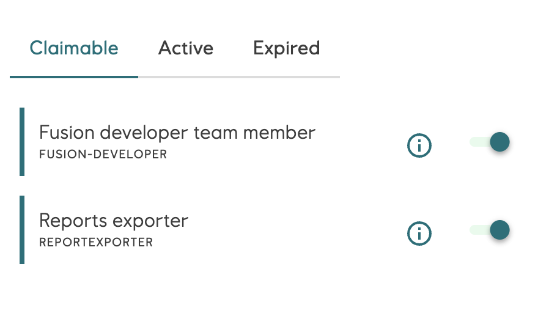
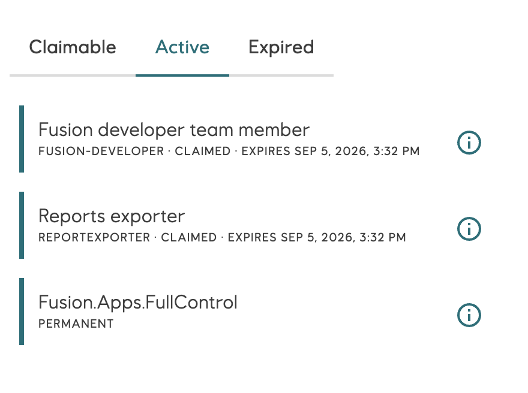
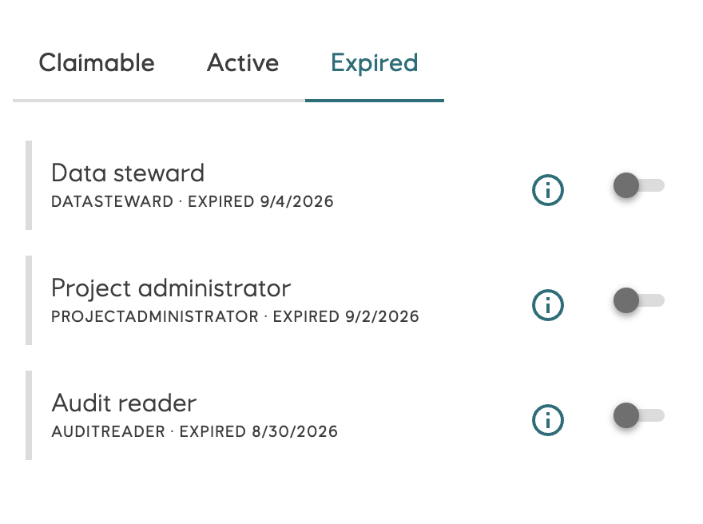
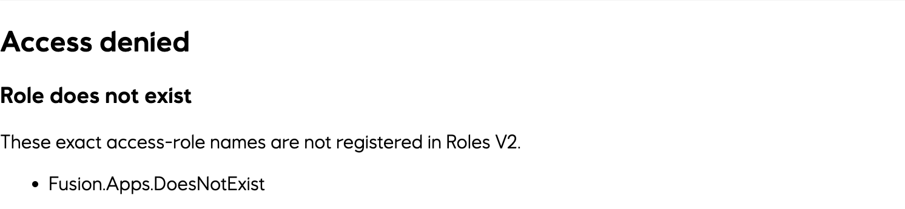
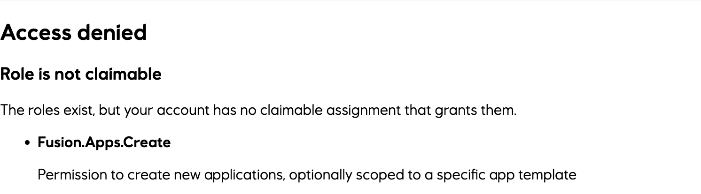
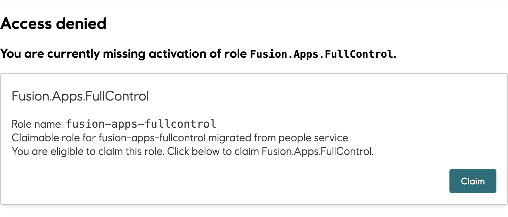
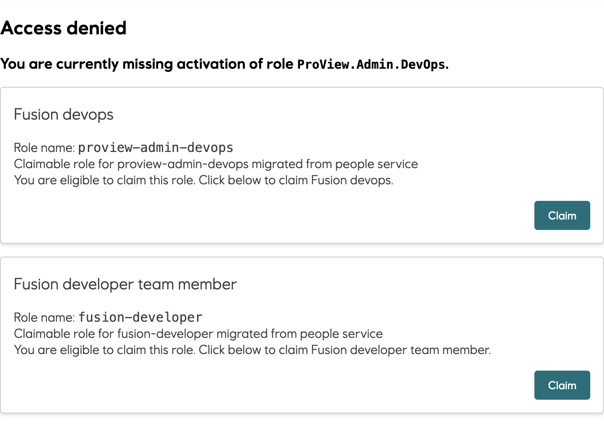
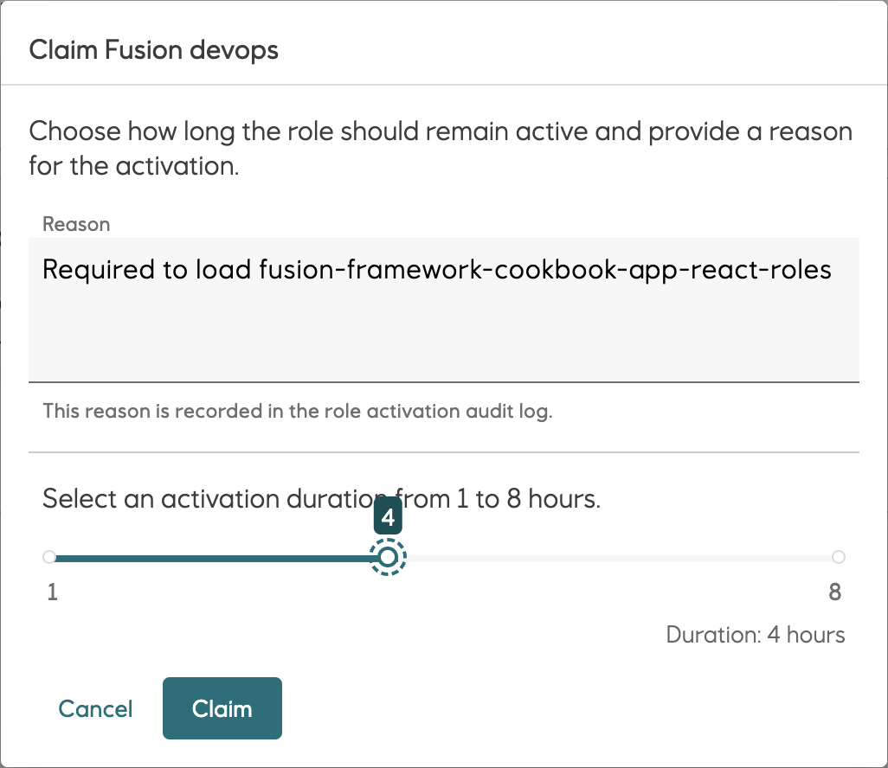

# Roles V2 React components

`@equinor/fusion-framework-react-components-roles` provides the application-facing React APIs for
Fusion Roles V2. Use it to:

- read effective active-access assignments with `useActiveAccessRoleAssignments`;
- read and activate claimable role assignments with `useClaimableRoleAssignments`;
- read role assignments with `useRoleAssignments`;
- share role state and actions with `RolesProvider`;
- render a ready-made active and claimable role overview with `RolesView`;
- render compact flyout controls with `<RolesView compact />`;
- protect React content and recover missing access with `AccessRoleBoundary`.

This is a new package awaiting its initial release, not an upgrade to a previously published React
roles package. For portal integrations, see [Migrate a portal roles flyout](./docs/migration.md).

## Setup and peer dependencies

Once the initial release is available, add the components and module to your application:

```sh
pnpm add @equinor/fusion-framework-react-components-roles @equinor/fusion-framework-module-roles
```

Before publication, repository consumers use workspace dependencies. The application must enable
`@equinor/fusion-framework-module-roles` and expose that module through its Fusion React module context.
The default client needs authentication with an active account and service discovery for `rolesv2`
(local or inherited from the host). A configured `IRolesClient` can replace the default transport;
see the [Roles module guide](../../../modules/roles/README.md).

Provide compatible versions of these peers in the consuming React application:

| Peer | Supported range |
| --- | --- |
| `react`, `react-dom` | `^18.0.0` or `^19.0.0` |
| `@types/react` | `^18.0.0` or `^19.0.0` (optional, for TypeScript) |
| `@equinor/eds-core-react` | `^2.0.0` |
| `@equinor/eds-icons` | `^1.0.0` |
| `@equinor/fusion-react-errorboundary` | `^2.0.0` |
| `styled-components` | `^6.0.0` |

### Providers and role identifiers

- React `RolesProvider` from this package shares UI state with hooks and includes an
  `AccessRoleBoundary`.
- The module's `RolesProvider` class implements `IRolesProvider` and is exposed as
  `framework.modules.roles`. It is not a React component; use `enableRoles`, not manual construction,
  for ordinary application setup.
- `requiredAccessRoles` and `builder.requireAccessRoles` take **access-role names**, such as
  `Reports.Read`.
  Matching is case-sensitive. Claimable-role display names are not access-role requirements.
- Mutation input `assignmentId` is a **claimable assignment ID** from `assignment.id`, not an
  access-role name, claimable-role name, or role-definition ID. Service metadata, including
  assignment IDs, can be absent; guard IDs before creating mutation controls.
- Components do not accept an account ID or application key. The module resolves the current account.

## Quick start

Enable the Roles module in the application configuration:

```ts
import { enableRoles, type RolesModule } from '@equinor/fusion-framework-module-roles';
import type { AppModuleInitiator } from '@equinor/fusion-framework-react-app';

/** Enables Roles V2 in the application's module context. */
export const configure: AppModuleInitiator<[RolesModule]> = (configurator): void => {
  enableRoles(configurator);
};
```

Mount `RolesProvider` inside the configured Fusion React module context, in the same React tree as
its consumers. A provider in a separate host or application root does not supply this React context:

```tsx
import type { ReactElement } from 'react';
import {
  RolesProvider,
  RolesView,
} from '@equinor/fusion-framework-react-components-roles';

/** Displays the signed-in account's Roles V2 assignments. */
export const MyRoles = (): ReactElement => (
  <RolesProvider>
    <RolesView />
  </RolesProvider>
);
```

`RolesView` renders active and claimable tabs with loading, retry, empty, and activation states. For
custom interfaces, components below `RolesProvider` can use the focused hooks without accessing the
Roles module provider directly.

Use `<RolesView compact />` in narrow side sheets and menus. It uses compact Claimable, Active, and
Expired tabs, activation switches, and separate information dialogs instead of application view
cards. Expired shows up to three eligible roles whose previous activation ended in the last seven
days, making frequently used roles quick to re-activate. Role information includes the description,
assignment reasons, entitlement validity, scope, and current activation status.

Claimed assignments remain in Claimable with a checked switch for deactivation. Active repeats
their effective access as a read-only row alongside assigned roles, sourced authoritatively
from `useRoleAssignments` rather than inferred from active-access `assignmentType`.

### Compact sidebar tabs

The following screenshots use the mocked Roles V2 assignments from the React Roles cookbook.

#### Claimable

Claimable keeps temporary assignments available in one place. An unchecked switch opens the
activation dialog. A checked switch identifies an active claim and deactivates it.



#### Active

Active is a read-only overview of effective access from `useActiveAccessRoleAssignments`, claimed
access from `useClaimableRoleAssignments`, and assigned access from
`useRoleAssignments`, including activation expiry and role information.



#### Expired

Expired provides shortcuts for up to three eligible assignments that expired during the previous
seven days, newest first. Additional recently expired assignments remain available in Claimable.
Selecting a switch opens the standard audited activation dialog.



## Show active roles

`useActiveAccessRoleAssignments` returns effective active-access assignments and the loading,
error, and reload state for that collection. It does not identify whether access originated from a
claimed or assigned assignment; use `useClaimableRoleAssignments` and
`useRoleAssignments` for those sources:

```tsx
import { useState, type ReactElement } from 'react';
import { useActiveAccessRoleAssignments } from '@equinor/fusion-framework-react-components-roles';

/** Shows effective access and reports read and lifecycle failures separately. */
export const ActiveAccessRoleAssignmentList = (): ReactElement => {
  const { assignments, isLoading, error, reload } = useActiveAccessRoleAssignments();
  const [reloadError, setReloadError] = useState<string>();

  // Retain the last snapshot during refresh; a load error does not mean access was removed.
  return (
    <section aria-busy={isLoading}>
      {isLoading && <p>Loading effective access...</p>}
      {error != null && <p role="alert">Could not load effective access. The list may be stale.</p>}
      {reloadError && <p role="alert">{reloadError}</p>}
      <button
        type="button"
        disabled={isLoading}
        onClick={() => {
          setReloadError(undefined);
          void reload().catch((cause: unknown) => {
            setReloadError(cause instanceof Error ? cause.message : 'Reload could not complete.');
          });
        }}
      >
        Reload effective access
      </button>
      {!isLoading && error == null && assignments.length === 0 && <p>No effective access.</p>}
      <ul>
        {assignments.map((assignment, index) => (
          <li key={`${assignment.systemName}:${assignment.accessRoleName}:${index}`}>
            {assignment.accessRoleName ?? 'Unknown access role'}
          </li>
        ))}
      </ul>
    </section>
  );
};
```

## Show assigned roles

`useRoleAssignments` returns role assignments from the consolidated
`/consolidated-role-assignments` and the loading, error, and reload state for that collection. This
is the authoritative source for that standing, non-claimable assignment state: active assignments'
`assignmentType` cannot reliably distinguish this standing grant from an activated claim, so
consuming UI must read this hook rather than infer provenance from `useActiveAccessRoleAssignments`.
Roles V2 never calls these assignments permanent — they may still be validity-bounded. They carry no
`isActive` flag; compute current effectiveness from `validFrom`/`validTo` when a caller needs it.

```tsx
import { type ReactElement } from 'react';
import { useRoleAssignments } from '@equinor/fusion-framework-react-components-roles';

/** Shows assigned role assignments and reports read failures. */
export const AssignedRoleList = (): ReactElement => {
  const { assignments, isLoading, error } = useRoleAssignments();

  return (
    <section aria-busy={isLoading}>
      {isLoading && <p>Loading assigned roles...</p>}
      {error != null && <p role="alert">Could not load assigned roles. The list may be stale.</p>}
      {!isLoading && error == null && assignments.length === 0 && <p>No assigned roles.</p>}
      <ul>
        {assignments.map((assignment, index) => (
          <li key={assignment.id ?? index}>{assignment.role?.displayName ?? 'Unknown role'}</li>
        ))}
      </ul>
    </section>
  );
};
```

## Show and claim available roles

`useClaimableRoleAssignments` returns claimable assignments from the consolidated endpoint,
collection state,
mutation state, and the `activateClaimableRoleAssignment` and `deactivateClaimableRoleAssignment` actions. `activateClaimableRoleAssignment` accepts a claimable
assignment ID plus an optional audit reason and duration. Prefer `RolesView` for an audited
activation dialog; the custom example below uses a fixed reason and duration to demonstrate the
hook contract:

```tsx
import { useState, type ReactElement } from 'react';
import { useClaimableRoleAssignments } from '@equinor/fusion-framework-react-components-roles';

/** Offers activation and deactivation only for addressable assignments. */
export const ClaimableRoleList = (): ReactElement => {
  const { assignments, isLoading, error, activateClaimableRoleAssignment, deactivateClaimableRoleAssignment, isActivating, isDeactivating } =
    useClaimableRoleAssignments();
  const [actionError, setActionError] = useState<string>();

  const updateRole = async (assignmentId: string, isActive: boolean): Promise<void> => {
    setActionError(undefined);
    try {
      if (isActive) {
        await deactivateClaimableRoleAssignment({ assignmentId });
      } else {
        await activateClaimableRoleAssignment({ assignmentId, reason: 'Required to work with reports', hours: 4 });
      }
    } catch (cause: unknown) {
      setActionError(cause instanceof Error ? cause.message : 'The role action could not complete.');
    }
  };

  if (isLoading) return <p>Loading available roles...</p>;
  if (error != null) return <p role="alert">Could not load available roles. Retry from RolesView.</p>;

  return (
    <>
      {actionError && <p role="alert">{actionError}</p>}
      {assignments.length === 0 && <p>No claimable roles.</p>}
      {assignments.map((assignment, index) => {
        const assignmentId = assignment.id;
        const name = assignment.claimableRole?.displayName ?? assignment.claimableRole?.name ?? 'Unknown role';
        if (!assignmentId) {
          return <p key={`unavailable:${index}`}>{name}: assignment ID unavailable.</p>;
        }
        const isActive = assignment.isActive === true;
        return (
          <button
            type="button"
            key={assignmentId}
            disabled={isActivating || isDeactivating}
            onClick={() => void updateRole(assignmentId, isActive)}
          >
            {isActive ? 'Deactivate' : 'Activate'} {name}
          </button>
        );
      })}
    </>
  );
};
```

Both mutation promises wait for active and claimable refresh attempts to settle. Successful mutations
return their activation metadata even if a subsequent collection read fails. Do not retry a committed
mutation just because a refresh failed; inspect collection errors and reload the affected collection.
React error boundaries do not catch rejected event-handler promises, so custom handlers must catch them.

## State and error behavior

`RolesProvider` keeps active access-role assignments, consolidated claimable role assignments,
consolidated role assignments, activation, and deactivation state in one observable action/flow
store. All three collections load on mount. While the document is visible, they refresh every
minute, on window focus, and when the document becomes visible. Overlapping automatic refresh
triggers are coalesced; explicit reloads remain independent.

Successful claimable snapshots can detect expiry and queue in-place reclaiming without remounting
the application. This is refresh-driven, not an exact expiry timer. Dismissal suppresses the current
activation period; a newly observed activation can be offered again after expiry. Intentional
deactivation through the hook suppresses an expiry prompt, with rollback if that mutation fails.

- Each assignment collection has independent loading and error state.
- Existing assignments remain available during reloads and after read failures; they may be stale.
- Operation IDs prevent superseded collection results from overwriting the current request's state.
- `reload(): Promise<void>` refreshes only that hook's collection. It **resolves on both read success
  and read failure**; the hook's `error` reports failure. It rejects if the owning store is disposed
  before completion or the callback is used after disposal. Resolution is not proof of fresh data.
- `activateClaimableRoleAssignment` rejects when activation fails and exposes the same failure as `activationError`.
- The built-in activation dialog displays failures in place, keeps the reason and duration for retry,
  and disables its controls while activation is pending. Failed activation never retries the application.
- `deactivateClaimableRoleAssignment` rejects when deactivation fails and exposes the same failure as `deactivationError`.
- Mutation promises also reject on disposal. A later refresh failure belongs to the affected
  collection's `error`, not to `activationError` or `deactivationError`.
- Mutation pending flags count outstanding calls, including their refresh phase; they do not serialize
  callers. Errors are shared per mutation kind, not keyed by assignment.
- Hook `reload`, `activateClaimableRoleAssignment`, and `deactivateClaimableRoleAssignment` references stay stable for one module provider
  lifetime, including through loading, error, and mutation state updates.
- `useActiveAccessRoleAssignments`, `useClaimableRoleAssignments`, and
  `useRoleAssignments` throw a setup error when used outside `RolesProvider`.
- Missing or incomplete Roles module configuration produces an actionable setup error instead of
  leaving the view loading. Synchronous provider throws follow the same failure path as rejected promises.
- Replacing the module provider resets collections, dialogs, recovery history, and the consuming
  subtree. Unmounting disposes this React store, not the externally owned module provider.
  Pending callers reject on disposal, but this does **not** abort a provider promise or guarantee
  cancellation of a submitted server mutation. Check service state before retrying an abandoned mutation.

Compact date labels retain browser-local `Intl.DateTimeFormat` locale and time zone. Shared `date-fns`
ISO parsing supplies timestamps for display and expiry comparisons. Date-only values retain UTC
interpretation; date-times without an offset retain local interpretation.
Missing dates display `No expiration date`; supplied malformed dates display `Invalid expiration date`
and cannot qualify an assignment for an Expired shortcut. Neither label is an authorization decision.

## Require roles before rendering

Pass `requiredAccessRoles` to `RolesProvider` when a React subtree must not render until every named
access role is active:

```tsx
<RolesProvider requiredAccessRoles={['Reports.Read']}>
  <Reports />
</RolesProvider>
```

`RolesProvider` includes `AccessRoleBoundary`. If access is missing, the boundary discovers eligible
claimable assignments and presents the recovery flow.

Changing the required roles or the Roles module provider hides protected content until the new access
check succeeds. Protected components cannot mount while that check is pending. Equivalent requirement
arrays (ignoring order, duplicate names, and surrounding whitespace) retain the successful check and child state.

This is a pre-mount UI gate, **not continuous authorization**: collection polling does not rerun a
successful gate or automatically unmount children when access expires. Trusted backends must authorize
every protected operation, regardless of what the React view currently displays.

Use `AccessRoleBoundary` directly when only part of an existing provider tree needs protection:

```tsx
<AccessRoleBoundary requiredAccessRoles={['Reports.Export']}>
  <ExportReports />
</AccessRoleBoundary>
```

The `requiredAccessRoles` prop is optional. Without it (or with an empty array),
`AccessRoleBoundary` renders children immediately and handles a descendant
`RequiredAccessRolesError`, including one nested in an error cause.
It does not provide hook context. Unrelated errors are rethrown to the nearest outer error boundary.
Missing recovery metadata remains a visible read error with local retry, not a verdict that a role
does not exist. Recovery uses the module provider attached to the original error and retries the
boundary only after activation succeeds.

## Enforce roles during application initialization

Use `builder.requireAccessRoles` when the entire application must stop during Roles module initialization:

```ts
enableRoles(configurator, (builder) => {
  builder.requireAccessRoles(['Reports.Read']);
});
```

The application does not mount when a bootstrap requirement is missing. The host must therefore
render `AccessRoleBoundary` around its application loader and surface the initialization failure through
that boundary. A `RolesProvider` inside the application cannot recover a failure before it mounts.
See [host-root recovery placement](./docs/migration.md#place-recovery-around-the-host-loader).

## API reference

| Export | Purpose |
| --- | --- |
| `RolesProvider`, `RolesProviderProps` | Required `children`, optional `requiredAccessRoles?: readonly string[]`; owns UI state for one module provider. |
| `RolesView`, `RolesViewProps` | Optional `compact?: boolean`, default `false`; requires React `RolesProvider`. |
| `AccessRoleBoundary`, `AccessRoleBoundaryProps` | Required `children`, optional access-role names in `requiredAccessRoles`; pre-mount gate and missing-role recovery. |
| `useActiveAccessRoleAssignments`, `UseActiveAccessRoleAssignmentsResult` | `{ assignments, isLoading, error, reload }` for effective active access-role assignments. |
| `useClaimableRoleAssignments`, `UseClaimableRoleAssignmentsResult` | Collection fields for claimable role assignments returned by the consolidated endpoint, plus `activateClaimableRoleAssignment`, `deactivateClaimableRoleAssignment`, `isActivating`, `activationError`, `isDeactivating`, `deactivationError`. |
| `useRoleAssignments`, `UseRoleAssignmentsResult` | `{ assignments, isLoading, error, reload }` for role assignments returned by the consolidated endpoint; authoritative for standing, non-claimable assignment state. |
| `ActiveAccessRoleAssignments`, `ConsolidatedClaimableRoleAssignments`, `ConsolidatedRoleAssignments` | Arrays inferred from the corresponding `IRolesProvider` read results; service fields may be optional or nullable. |
| `ClaimableRoleAssignmentActivationResult`, `ClaimableRoleAssignmentDeactivationResult` | Activation metadata inferred from the module's mutation results, not refreshed role collections. |

`activateClaimableRoleAssignment(input: ActivateClaimableRoleAssignmentInput): Promise<ClaimableRoleAssignmentActivationResult>` takes
`{ assignmentId: string, reason?: string, hours?: number | string }`.
`deactivateClaimableRoleAssignment(input: DeactivateClaimableRoleAssignmentInput): Promise<ClaimableRoleAssignmentDeactivationResult>` takes
`{ assignmentId: string }`.
Import those input types from `@equinor/fusion-framework-module-roles`.
The built-in dialog requires a nonblank audit reason and offers whole-hour durations from 1 to 8,
defaulting to 2; those UI choices do not narrow the hook input type or replace service validation.

Internally, components, context, hooks, and observable state are separated by responsibility. Only
the root exports are public API; internal feature paths are not supported imports.
Maintainers should read [CONTRIBUTING.md](./CONTRIBUTING.md).

## Recovery flow

An unregistered access-role requirement is reported separately from claim eligibility:



An existing access role without an eligible assignment explains that it cannot be claimed:



When exactly one claimable role grants the required access role, one activation option is shown:



When several claimable roles grant the missing access role, each option is shown separately:



Selecting an option opens a confirmation dialog for the audit reason and activation duration:


