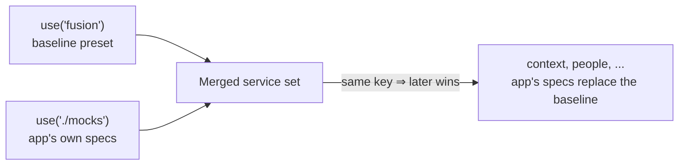

# Getting started

A `mocks/` directory of OpenAPI specs is all this package needs — it scans the directory, fakes a
response for every operation in each spec, and serves the result over HTTP. There's no build step
and no dev-server involved, so the same mocks work whether you're developing locally, running a
Playwright suite, or embedding the server inside something else entirely.

## Write your first spec

Add one `<service>.openapi.{json,yaml,yml}` file per service you want to mock. The file name
becomes both the service's key and its mount path:

```
mocks/
  context.openapi.json
  context.overrides.ts    # optional — fields, static paths, or middleware
  people.openapi.json
```

`context.openapi.json` becomes the `context` service, reachable at `/context` (or
`context.localhost:<port>` — see [Testing with Playwright](testing-with-playwright.md) for the
full route reference). A `context.overrides.{ts,js,json,yaml,yml}` sidecar next to it can supply
field-level faker overrides under `components` and static operation responses under `paths`.
TypeScript and JavaScript sidecars can also export functions and register `middleware`; JSON and
YAML sidecars are data-only. A minimal spec only needs enough paths for the operations your app
actually calls because the server fakes response bodies from each response schema.

## Start the server

```bash
pnpm exec fusion-mock ./mocks --port 4010

# layered: bundled Fusion baseline first, app overrides last
pnpm exec fusion-mock --preset=fusion ./mocks --port 4010
```

| Argument/Option | Description |
| --- | --- |
| `[dirs...]` | Directories of OpenAPI specs to serve, in ascending precedence — a later directory's services replace an earlier one's by key. |
| `--preset=<name>` | Bundled preset to layer in (e.g. `--preset=fusion`); repeatable. |
| `--port <port>` | Port to listen on (default: OS-assigned). |
| `--seed <seed>` | Seeds every service's faked responses, so the same document/fields/seed always fake the same values (default: unseeded/random). |

When no directory or preset is supplied, the CLI uses `./mocks`. The CLI binds to `localhost`;
use the programmatic `start({ host })` option when another bind address is required.

Runs in the foreground and shuts down on `SIGINT`/`SIGTERM` — pair it with Playwright's
`webServer` (or `concurrently`), rather than backgrounding it yourself, so nothing owns a process
it isn't also responsible for stopping.

Or start it from your own code — this mirrors Mock Service Worker's
`setupServer()`/`server.use()`: register sources, then start once.

```ts
import { createMockServer } from '@equinor/fusion-openapi-mock-server';

const server = createMockServer({ seed: 42 }).use('./mocks');
const { url } = await server.start({ host: 'localhost', port: 4010 });
// url -> 'http://localhost:4010'

await server.close();
```

Call `use()` before `start()` or the first `requestListener` request. `start()` rejects when the
host or port cannot be bound; `close()` is safe to call repeatedly and clears `server.url`.

Either way, this exposes a service-discovery response at
`http://localhost:4010/@fusion-mock/discovery` that any Fusion framework module can resolve
services from.

## The bundled Fusion baseline preset

A Fusion app's framework modules resolve several service-discovery keys during startup and may
fail when mandatory services are missing. The bundled `fusion` preset provides `app-state`,
`apps`, `bookmarks`, `context`, `notification`, `people`, `portal-config`, and `rolesv2`, including
schema-backed operations for common application flows:

```ts
const server = createMockServer().use('fusion').use('./mocks');
```

## Layering directories

Call `use()` once per source, in ascending precedence — whatever you register last wins. A later
source's service fully replaces an earlier one with the same key, so an app only needs to provide
specs for the services it actually wants to override:



This also makes it easy to compose multiple teams' specs, or layer a shared platform directory
underneath an app-specific one, without either side needing to know about the other.

A lone `<service>.overrides.*` sidecar without a matching local OpenAPI document is the exception:
its `components`, `paths`, and `middleware` are merged onto the nearest earlier same-key service.
This lets an app customize a bundled preset without copying its OpenAPI document.

## Choose an override mechanism

Use the narrowest mechanism that expresses the behavior you need:

| Mechanism | Use it for | Runtime override behavior |
| --- | --- | --- |
| OpenAPI schemas | Generated baseline responses for normal service operations. | Can be replaced by operation ID. |
| `components` in `<service>.overrides.*` | Field faker values or faker functions. | Feeds the generated baseline. |
| `paths` in `<service>.overrides.*` | Static or function-backed operation responses. | Becomes the reset baseline and can still be replaced by operation ID. |
| `middleware` in a TS/JS sidecar or `createService()` | Custom routes or request-aware behavior outside the OpenAPI operation model. | Runs before generated mocks, so runtime operation overrides do not replace it. |

Programmatic middleware receives a service-relative URL for both `/<service>/*` and
`<service>.localhost/*` requests. The context includes the parsed JSON body and the server-level
seed:

```ts
import { createService } from '@equinor/fusion-openapi-mock-server/discovery';

const people = createService('people', peopleDocument).middleware((router) => {
  router.post('/people-picker/resolve', (_req, res, { body, seed }) => {
    res.json({ body, seed });
  });
});

const server = createMockServer({ seed: 42 }).use([people]);
```

## Point your app at it

For a Fusion app running through `@equinor/fusion-framework-cli`, use `ffc app dev --mock`:

```bash
ffc app dev --mock http://localhost:4010
```

This rewrites the app's service-discovery URL to the mock server's `/@fusion-mock/discovery`
endpoint, so every framework module that resolves a service by key transparently gets the mock's
origin instead of the real one.
[`@equinor/fusion-framework-cli-plugin-mock-server`](../../../cli-plugins/mock-server/README.md)
wraps the same server as `ffc mock-server`, so you don't need a separate binary installed either.

## Embedding into an existing server

To serve mocks from a port you already own instead of a separate one, mount the plain
`(req, res)` request handler — it needs no Express (or any other framework) dependency, and works
without ever calling `start()`:

```ts
import { createServer } from 'node:http';
import { createMockServer } from '@equinor/fusion-openapi-mock-server';

const mocks = createMockServer().use('./mocks');
const app = createServer((req, res) => {
  // Handle application-owned routes first, then let the mock server own
  // /@fusion-mock/* and /<service>/* unchanged.
  if (req.url === '/ready') {
    res.writeHead(200).end('ready');
    return;
  }
  mocks.requestListener(req, res);
});
```

`requestListener` expects `/@fusion-mock/*` and `/<service>/*` at the root. If another framework
mounts it below a prefix such as `/mocks`, strip that prefix before delegating the request.

## Where to go next

Once the server is running, see [Testing with Playwright](testing-with-playwright.md) for
overriding a single operation's response for one test, and for the full route reference.
