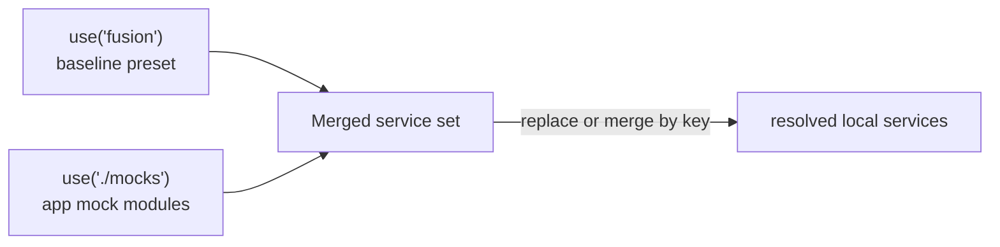

# Getting started

<!-- cspell:words rolesv -->

A `mocks/` directory of `<name>.mock.ts` modules is all this package needs. Each module defines
one service and imports the OpenAPI schema used to fake its responses. The same mocks work for
local development, Playwright, or an embedded server.

> [!TIP]
> Fusion application developers should install
> `@equinor/fusion-framework-cli-plugin-mock-server`, run `ffc mock-server`, and connect with
> `ffc app dev` or `ffc app dev --mock`. The programmatic APIs below are for test harnesses and
> hosts that need to own the HTTP server lifecycle directly.

## Define your first service

Add one `<name>.mock.ts` module per service:

```
mocks/
  context.mock.ts
  context.openapi.json
```

```ts
import schema from './context.openapi.json' with { type: 'json' };
import { defineService } from '@equinor/fusion-openapi-mock-server/discovery';

export default defineService({
  key: 'context',
  serviceDiscovery: 'replace',
  schema,
  components: { Context: { title: () => 'Local context' } },
});
```

The service is reachable at `/context` or `context.localhost:<port>`. `routes` declares fixed or
function-backed operation responses, and `middleware` registers request-aware routes.

## Start the server

```bash
pnpm exec fusion-mock ./mocks --port 4010

# layered: bundled Fusion baseline first, app overrides last
pnpm exec fusion-mock --preset=fusion ./mocks --port 4010
```

| Argument/Option | Description |
| --- | --- |
| `[dirs...]` | Directories of `<name>.mock.ts` modules, in ascending precedence. |
| `--preset=<name>` | Bundled preset to layer in (e.g. `--preset=fusion`); repeatable. |
| `--port <port>` | Port to listen on (default: OS-assigned). |
| `--seed <seed>` | Seeds every service's faked responses, so the same document/fields/seed always fake the same values (default: unseeded/random). |

When no directory or preset is supplied, the CLI uses `./mocks`. The CLI binds to `localhost`;
use the programmatic `start({ host })` option when another bind address is required.

Runs in the foreground and shuts down on `SIGINT`/`SIGTERM` — pair it with Playwright's
`webServer` (or `concurrently`), rather than running it in the background yourself, so nothing
owns a process it isn't also responsible for stopping.

Or start it from your own code — this mirrors Mock Service Worker's
`setupServer()`/`server.use()`: register sources, then start once.

```ts
import { createMockServer } from '@equinor/fusion-openapi-mock-server';

const server = createMockServer({
  seed: 42,
}).use('./mocks');
const { url } = await server.start({ host: 'localhost', port: 4010 });
// url -> 'http://localhost:4010'

await server.close();
```

Call `use()` before `start()` or the first `requestListener` request. `start()` rejects when the
host or port cannot be bound; `close()` is safe to call repeatedly and clears `server.url`.

Either way, this exposes a service-discovery response at
`http://localhost:4010/@fusion-mock/discovery` that any Fusion framework module can resolve
services from.

## The bundled Fusion baseline preset

A Fusion app's framework modules resolve several service-discovery keys during startup and may
fail when mandatory services are missing. The bundled `fusion` preset provides `app-state`,
`apps`, `bookmarks`, `context`, `notification`, `people`, `portal-config`, and `rolesv2`, including
schema-backed operations for common application flows:

```ts
const server = createMockServer().use('fusion').use('./mocks');
```

The `rolesv2` preset is derived from the versioned
`@equinor/fusion-services/roles/v1/openapi.json` contract. It covers the account reads and
claimable-role activation operations used by `@equinor/fusion-framework-module-roles`; application
policy and persona-specific responses remain application-owned overrides.

### Define persona-aware Roles V2 policy

Use `defineRolesV2Mock` when a local application or Playwright suite needs real Roles V2 HTTP
behavior rather than generated records. The helper returns a `rolesv2` service with
`serviceDiscovery: 'merge'`, so a `<name>.mock.ts` module can layer typed application policy onto
the bundled Fusion contract without writing routes:

```ts
import { defineRolesV2Mock } from '@equinor/fusion-openapi-mock-server/presets/fusion';

export default defineRolesV2Mock({
  accessRoles: [
    {
      id: 'access-role-id',
      name: 'Example.View',
      system: { id: 'system-id', name: 'Example' },
    },
  ],
  accounts: {
    'persona-a': {
      activeAccessRoleAssignments: [
        {
          systemName: 'Example',
          accessRoleName: 'Example.View',
          assignmentType: 'Global',
        },
      ],
    },
    'persona-b': {
      activeAccessRoleAssignments: [],
      claimableRoleAssignments: [],
    },
  },
});
```

Account keys are arbitrary application data and must match the `userId` selected through
`createMockAuth`. The helper implements:

- the paged access-role registry and account claimable-assignment collection;
- active, consolidated claimable, and consolidated standing assignment reads;
- activation/deactivation with schema-valid activation responses;
- expanded claimable-role mappings used by active checks and required-role recovery;
- isolated mutable activation state for each browser session and account, including identity
  switches in one browser context.

`claimableRoleAssignments` accepts the Roles V2 model from `@equinor/fusion-services/roles`.
Expanded `claimableRole.accessRoleMappings` let the helper derive effective active assignments
after activation. Use an assignment's `activations.activeAccessRoleAssignments` entry when the
application needs an explicit effective assignment shape, or `activations.error` to model a
deterministic HTTP failure. An assignment configured with `isActive: true` must provide
`activations[assignmentId].activeAccessRoleAssignments`; this explicit provenance lets
deactivation remove only access roles granted by that claim.

`POST /@fusion-mock/reset` clears persona activation state together with mock-auth sessions and
ordinary operation overrides. A subsequent request starts again from the account policy declared
in `defineRolesV2Mock`.

Behavior is explicit at the HTTP boundary:

- missing, malformed, or non-mock bearer tokens return `401`;
- a path account that differs from the selected persona returns `403`;
- an authenticated persona absent from `accounts` returns `404` rather than an empty no-role
  response;
- unknown assignment IDs return `404`, `$top=0` and malformed activation input return `400`, and
  invalid/repeated activation state returns `409`;
- empty accounts, duplicate/missing claimable assignment IDs, orphan activation policy, and
  non-error activation statuses throw while the mock module is loaded.

Repository maintainers update the curated preset after refreshing the Roles client snapshot:

```bash
pnpm --filter @equinor/fusion-openapi-mock-server preset:roles:update
pnpm exec vitest run --root packages/utils/openapi-mock-server
```

The compatibility test executes the public `RolesClient` against the bundled preset, so a missing
route, outdated path parameter, or incompatible response envelope fails before publication.

See the [Roles V2 end-to-end adoption guide](../../../framework/docs/roles-v2-adoption-guide.md)
for how this mock fits alongside `enableRolesMock` and session-scoped Playwright personas.

## Layering directories

Call `use()` once per source, in ascending precedence. Later sources are resolved according to each
service's discovery mode: `replace` replaces an earlier same-key service, while `merge` inherits
and customizes the earlier definition without copying its schema:


```mermaid
flowchart LR
    A["use('fusion')<br/>baseline preset"] --> C[Merged service set]
    B["use('./mocks')<br/>app mock modules"] --> C
    C -->|"replace or merge by key"| D["resolved local services"]
```

This also makes it easy to compose multiple teams' mocks, or layer a shared platform directory
underneath an app-specific one, without either side needing to know about the other.

A module with `serviceDiscovery: 'merge'` may omit `schema`; its `components`, `routes`, and
`middleware` merge onto the nearest earlier same-key service. Merged middleware routes are
checked first, and the earlier service's middleware still handles every route the merge layer
does not register. A server reset runs the `reset` hooks of both layers. Startup fails when no earlier
local or preset definition exists. The standalone mock server never fetches upstream service
discovery.

## Choose an override mechanism

Use the narrowest mechanism that expresses the behavior you need:

| Mechanism | Use it for | Runtime override behavior |
| --- | --- | --- |
| OpenAPI schemas | Generated baseline responses for normal service operations. | Can be replaced by operation ID. |
| `defineService.components` | Field faker values or faker functions. | Feeds the generated baseline. |
| `defineService.routes` | Static or function-backed operation responses. | Becomes the reset baseline and can still be replaced by operation ID. |
| `defineService.middleware` | Custom routes or request-aware behavior outside the OpenAPI operation model. | Runs before generated mocks, so runtime operation overrides do not replace it. |

Programmatic middleware receives a service-relative parsed `url` and `query` for both
`/<service>/*` and `<service>.localhost/*` requests. The original Node.js request remains
unchanged, while the context also includes decoded route `params`, parsed JSON `body`, the
server-level `seed`, and explicit mock-auth `identity` state:

```ts
import { createService } from '@equinor/fusion-openapi-mock-server/discovery';

const people = createService('people', peopleDocument).middleware((router) => {
  router.get('/accounts/:accountIdentifier/people', (_req, res, context) => {
    const filter = context.query.get('filter');

    if (context.identity.status !== 'authenticated') {
      res.statusCode = 401;
      res.json({ authentication: context.identity.status });
      return;
    }

    res.json({
      accountIdentifier: context.params.accountIdentifier,
      filter,
      userId: context.identity.userId,
    });
  });
});

const server = createMockServer({ seed: 42 }).use([people]);
```

The middleware router supports `get`, `post`, `put`, `patch`, `delete`, and `options` request
methods. Paths use `path-to-regexp` syntax, including named parameters such as
`:accountIdentifier`. Parameters are URL-decoded. Exact method/path registrations always take
precedence over parameterized routes; when multiple parameterized routes match, the first
registration wins.

`RouteContext.identity` is a discriminated union with `authenticated`, `missing`, `malformed`,
and `unsupported` states. An authenticated identity exposes the normalized `userId`, `claims`, and
an optional opaque `sessionId` when it came from this mock server's session-scoped mock-auth API.
The optional field preserves compatibility for callers that construct `MockRequestIdentity`
themselves. When a local dev-server proxy replaces the bearer value, the router resolves the same
identity from the existing mock-auth browser-session cookie instead of creating a second identity
store.

## Point your app at it

For a Fusion app running through `@equinor/fusion-framework-cli`, use `ffc app dev --mock`:

```bash
ffc app dev --mock http://localhost:4010
```

This rewrites the app's service-discovery URL to the mock server's `/@fusion-mock/discovery`
endpoint, so every framework module that resolves a service by key transparently gets the mock's
origin instead of the real one. The CLI also enables mock authentication with `Test User`; see
[Generate a mock user and update `.env`](../../../vite-plugins/spa/README.md#generate-a-mock-user-and-update-env)
to customize identity claims and token scopes.
[`@equinor/fusion-framework-cli-plugin-mock-server`](../../../cli-plugins/mock-server/README.md)
wraps the same server as `ffc mock-server`, so you don't need a separate binary installed either.

## Embedding into an existing server

To serve mocks from a port you already own instead of a separate one, mount the plain
`(req, res)` request handler — it needs no Express (or any other framework) dependency, and works
without ever calling `start()`:

```ts
import { createServer } from 'node:http';
import { createMockServer } from '@equinor/fusion-openapi-mock-server';

const mocks = createMockServer().use('./mocks');
const app = createServer((req, res) => {
  // Handle application-owned routes first, then let the mock server own
  // /@fusion-mock/* and /<service>/* unchanged.
  if (req.url === '/ready') {
    res.writeHead(200).end('ready');
    return;
  }
  mocks.requestListener(req, res);
});
```

`requestListener` expects `/@fusion-mock/*` and `/<service>/*` at the root. If another framework
mounts it below a prefix such as `/mocks`, strip that prefix before delegating the request.

## Where to go next

Once the server is running, see [Testing with Playwright](testing-with-playwright.md) for
overriding a single operation's response for one test, and for the full route reference.
