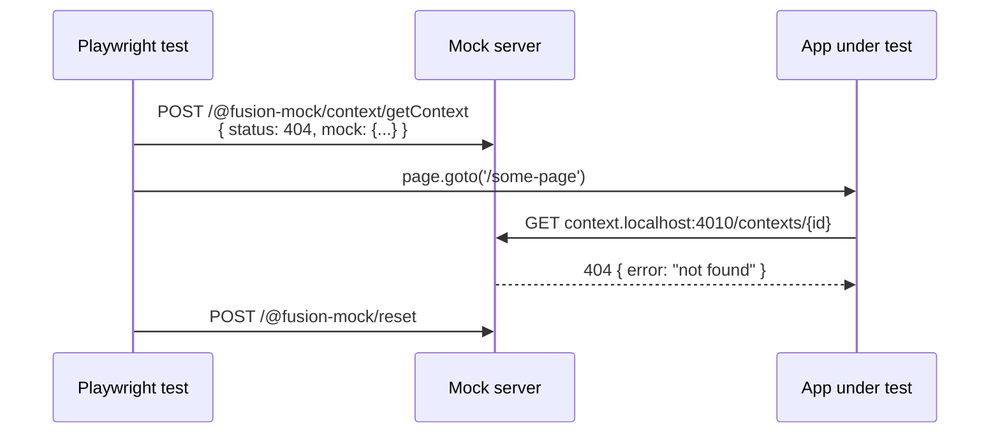

# Testing with Playwright

A running mock server accepts overrides over plain HTTP, so a Playwright test can shape one
operation's response for the duration of a single test, then reset it back to the document's
generated baseline before the next test runs:



Wire the mock server into `playwright.config.ts`'s `webServer` option alongside the app itself,
then reset runtime overrides in `afterEach` so a failed assertion cannot leak state into the next
test:

```ts
test.afterEach(async ({ request }) => {
  await request.post("http://localhost:4010/@fusion-mock/reset");
});

test("shows fallback UI when context resolution fails", async ({ page, request }) => {
  await request.post("http://localhost:4010/@fusion-mock/context/getContext", {
    data: { status: 404, mock: { error: "not found" } },
  });

  await page.goto("/some-context-dependent-page");
  await expect(page.getByText("Context not found")).toBeVisible();
});
```

The control request targets an OpenAPI `operationId`, not a URL path. Omitting `status` preserves
that operation's baseline status while replacing its response body.

See [`cookbooks/app-react-mock-playwright`](../../../../cookbooks/app-react-mock-playwright/README.md)
for a full app wired up this way, including its `playwright.config.ts`'s `webServer` entry for
`ffc mock-server`.

## Routes

Every override goes through the `/@fusion-mock/` control plane; everything else is proxied to the
matching service's own mock:

| Route | Method | Purpose |
| --- | --- | --- |
| `/@fusion-mock/discovery` | `GET` | Service-discovery response: each service's `key` and its own `http://<key>.localhost:<port>` origin — one origin per service, the same shape a real service-discovery response has, so it proxies through `@equinor/fusion-framework-dev-server`'s default `processServices` without overrides. |
| `/@fusion-mock/health` | `GET` | `200 OK` once the server is ready. |
| `/@fusion-mock/reset` | `POST` | Discards runtime operation overrides and rebuilds each source-defined baseline, including static `paths` sidecar overrides. |
| `/@fusion-mock/:service/:operationId` | `POST` | Registers a one-off override for that operation; body is `{ status?: number, mock: unknown }`. |
| `http://<service>.localhost:<port>/*` | any | Resolved against that service's middleware first, then its OpenAPI mock, using its discovered origin. |
| `/:service/*` | any | Same service-relative behavior, for embedding without relying on `*.localhost` DNS resolution. |

Override bodies missing the required `mock` field return `400`; unknown service keys and
unmatched data-plane operations return `404`. Invalid JSON, source-resolution failures, and
unexpected handler failures return `500` with an error body.

Avoid naming a service `@fusion-mock` — that segment is always routed to the control plane
first, so a service with that exact key would be unreachable. `health`, `discovery`, and `reset`
are only reserved as subpaths *under* `/@fusion-mock/`; a service named e.g. `health` is still
reachable at `/health/*` or `health.localhost`.
