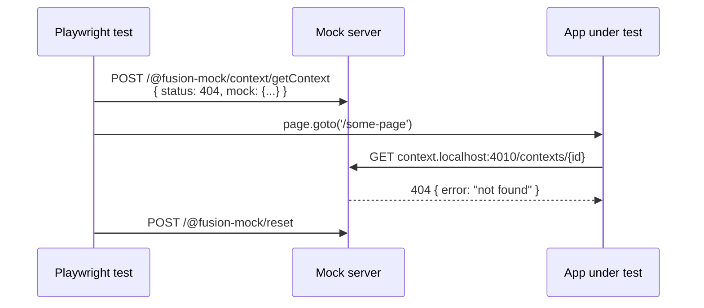

# Testing with Playwright

A running mock server accepts overrides over plain HTTP, so a Playwright test can shape one
operation's response for the duration of a single test, then reset it back to the document's
generated baseline before the next test runs:


```mermaid
sequenceDiagram
    participant Test as Playwright test
    participant Mock as Mock server
    participant App as App under test

    Test->>Mock: POST /@fusion-mock/context/getContext<br/>{ status: 404, mock: {...} }
    Test->>App: page.goto('/some-page')
    App->>Mock: GET context.localhost:4010/contexts/{id}
    Mock-->>App: 404 { error: "not found" }
    Test->>Mock: POST /@fusion-mock/reset
```

Wire the mock server into `playwright.config.ts`'s `webServer` option alongside the app itself,
then reset runtime overrides in `afterEach` so a failed assertion cannot leak state into the next
test:

```ts
test.afterEach(async ({ request }) => {
  await request.post("http://localhost:4010/@fusion-mock/reset");
});

test("shows fallback UI when context resolution fails", async ({ page, request }) => {
  await request.post("http://localhost:4010/@fusion-mock/context/getContext", {
    data: { status: 404, mock: { error: "not found" } },
  });

  await page.goto("/some-context-dependent-page");
  await expect(page.getByText("Context not found")).toBeVisible();
});
```

The control request targets an OpenAPI `operationId`, not a URL path. Omitting `status` preserves
that operation's baseline status while replacing its response body.

See [`cookbooks/app-react-mock-playwright`](../../../../cookbooks/app-react-mock-playwright/README.md)
for a full app wired up this way, including its `playwright.config.ts`'s `webServer` entry for
`ffc mock-server`.

## Emulate users without restarting the app

Start the standalone mock server, then run the app through
`ffc app dev --mock http://localhost:4010`:

```sh
ffc mock-server ./mocks --port 4010
ffc app dev --mock http://localhost:4010
```

The standalone mock server then acts as a test-only token issuer. A Playwright browser context
selects a deterministic user; the Fusion MSAL mock requests an unsigned OBO-style token for the
scopes required by each Fusion HTTP client.

> [!WARNING]
> Loopback origins are trusted as one local development boundary, so a page served by another
> local process can call the mock-auth API. The server issues unsigned mock tokens only; never
> connect this mode to real credentials or production services.

```ts
import { createMockAuth } from '@equinor/fusion-openapi-mock-server';

const mockAuth = createMockAuth('http://localhost:4010');

test('administrator can maintain a demand', async ({ context, page }) => {
  await mockAuth.setUser(context.request, {
    userId: 'administrator',
    name: 'Project Demand Administrator',
    username: 'administrator@example.test',
    claims: { roles: ['Demand.Admin'] },
  });

  await page.goto('/apps/pss-project-demand');
  // Assert administrator behavior.
});
```

`setUser` stores only mock identity metadata under an opaque, HTTP-only cookie. It never accepts
an access token or real credential. Two Playwright browser contexts have separate cookie jars and
can therefore run different users concurrently.

### Switch users and reset a session

Call `setUser` again on the same browser context, then reload or remount application state so
Fusion requests a fresh token. Call `reset` to remove the session persona and restore the MSAL
mock's built-in `fusion-mock-user`:

```ts
test('switches users without restarting servers', async ({ context, page }) => {
  await mockAuth.setUser(context.request, { userId: 'normal-user' });
  await page.goto('/apps/pss-project-demand');
  await expect(page.getByTestId('identity')).toContainText('normal-user');

  await mockAuth.setUser(context.request, {
    userId: 'administrator',
    claims: { roles: ['Demand.Admin'] },
  });
  await page.reload();
  await expect(page.getByTestId('identity')).toContainText('administrator');

  await mockAuth.reset(context.request);
  await page.reload();
  await expect(page.getByTestId('identity')).toContainText('fusion-mock-user');
});
```

Neither switching nor resetting restarts the mock server, dev server, or container.

### Configure and verify token scopes

The application defines scopes on its HTTP endpoint; tests do not pass scopes to `setUser`:

```ts
import { defineAppConfig } from '@equinor/fusion-framework-cli/app';

export default defineAppConfig(() => ({
  endpoints: {
    'project-demand': {
      url: 'http://project-demand.localhost:4010',
      scopes: ['api://project-demand/.default'],
    },
  },
}));
```

For every non-empty scope request, the mock server sorts and de-duplicates the scopes, writes the
normalized set to the token's `scp` claim, and derives `aud` from the first normalized scope after
removing a trailing `/.default`. A persona has no scope allowlist: the same selected user receives
a new deterministic token for every valid scope set requested by Fusion. Empty or non-string scope
sets return `400`, so invalid acquisition cannot silently fall back to another identity.

The token endpoint exists only on the separately started standalone mock server. The SPA calls it
only when launched with `ffc app dev --mock <mock-server-url>` or
`ffc app serve --mock <mock-server-url>`; production and ordinary development modes neither expose
nor call this mock-auth integration. Credentialed browser calls are accepted only when their exact
origin is a canonical loopback origin (`localhost`, `127.0.0.1`, or `[::1]`) or was configured
through `--allow-origin` or `createMockServer({ allowedOrigins })`.

## Routes

Every override goes through the `/@fusion-mock/` control plane; everything else is proxied to the
matching service's own mock:

| Route | Method | Purpose |
| --- | --- | --- |
| `/@fusion-mock/discovery` | `GET` | Service-discovery response for each discovery-visible service: its `key` and `http://<key>.localhost:<port>` origin. Direct-only definitions using `serviceDiscovery: false` remain routable but are omitted. |
| `/@fusion-mock/health` | `GET` | `200 OK` once the server is ready. |
| `/@fusion-mock/reset` | `POST` | Discards runtime operation overrides and rebuilds each source-defined baseline, including declarative `defineService` routes. |
| `/@fusion-mock/auth/user` | `PUT` | Selects a mock user for the caller's opaque browser session. Body is `{ userId, name?, username?, tenantId?, claims? }`. |
| `/@fusion-mock/auth/user` | `GET` | Returns non-sensitive selected-user metadata; arbitrary claims are omitted. |
| `/@fusion-mock/auth/user` | `DELETE` | Clears the selected user so Fusion MSAL returns to its startup mock identity. |
| `/@fusion-mock/auth/token` | `POST` | Internal OBO-style exchange used by Fusion MSAL. Body is `{ scopes: string[] }`; returns an unsigned token for the selected session user or `missing`. |
| `/@fusion-mock/:service/:operationId` | `POST` | Registers a one-off override for that operation; body is `{ status?: number, mock: unknown }`. |
| `http://<service>.localhost:<port>/*` | any | Resolved against that service's middleware first, then its OpenAPI mock, using its discovered origin. |
| `/:service/*` | any | Same service-relative behavior, for embedding without relying on `*.localhost` DNS resolution. |

Override bodies missing the required `mock` field return `400`; unknown service keys and
unmatched data-plane operations return `404`. Invalid JSON, source-resolution failures, and
unexpected handler failures return `500` with an error body.

Avoid naming a service `@fusion-mock` — that segment is always routed to the control plane
first, so a service with that exact key would be unreachable. `health`, `discovery`, and `reset`
are only reserved as paths *under* `/@fusion-mock/`; a service named e.g. `health` is still
reachable at `/health/*` or `health.localhost`.
