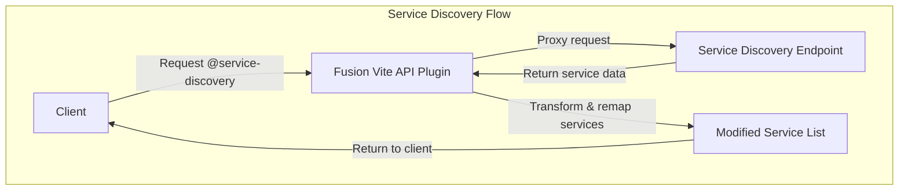
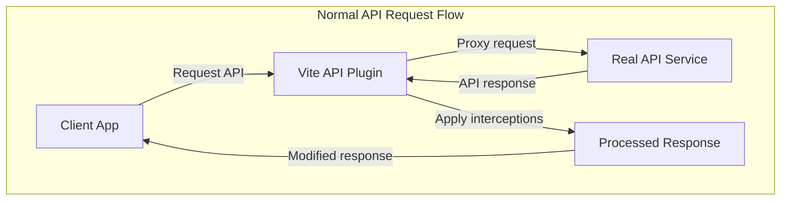
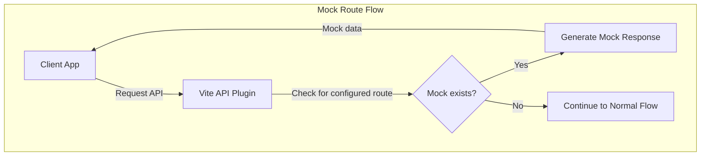

# Fusion Vite Api Plugin

This Vite plugin enhances the development experience for Fusion Framework applications by providing powerful API service handling capabilities. It solves common development challenges by:

1. **Enabling Service Discovery Integration**: Generates proxy routes that seamlessly connect to your service discovery system, allowing your application to work with multiple backend services during development.

2. **Simplifying API Mocking**: Provides an intuitive way to mock API responses without modifying your application code, accelerating development when backend services aren't available or are still in development.

3. **Creating Consistent Development Environments**: Ensures your application works with the same API structure in development as it would in production, reducing environment-specific bugs.

4. **Facilitating Local Testing**: Makes it easy to test your application against real or mocked API endpoints, with flexible configuration options for different development scenarios.

This plugin is a core component of the Fusion Framework Dev Server ecosystem, streamlining the way you interact with backend services during the development process.

## How It Works

The Fusion Vite API Plugin operates by intercepting API requests made from your application during development and intelligently routing them through configurable proxy paths. It dynamically creates route mappings between your local development environment and actual backend services, handling service discovery, request forwarding, and response processing. The plugin can transform backend responses, mock API endpoints when needed, and provide consistent service addressing regardless of the actual backend locations, creating a seamless development experience that closely mimics production behavior.


### Process Flow


1. Client requests the list of services (e.g., `/@service-discovery`)
2. Plugin proxies the request to the real configured service discovery endpoint
3. Plugin re-maps services (e.g., `@service/apps` => `https://apps-my-api/`)
4. Modified service list is returned to the client

__Example Proxy Response__
```json
[
  {
    "id": "id-of-service",
    "name": "name-of-service",
    "url": "https://service-url/"
  }
]
```

__Example Plugin Response__
```json
[
  {
    "id": "id-of-service",
    "name": "name-of-service",
    "url": "/@service/name-of-service",
  }
]
```

#### Normal API Request Flow


1. Client makes a request to a service using the proxy URL (e.g., `/@service/apps/all-apps`)
2. Plugin resolves the request to the corresponding real service and proxies the request.
3. Plugin applies any configured interceptions to the response
4. Result is returned to the client

#### Alternative: Mock Route Flow


1. Client makes a request to a service (e.g., `/@service/apps/all-apps`)
2. If the plugin is configured with a mock route matching the request path
3. Plugin returns the configured mock data directly, without proxying to any real service

## Configuration

```ts
import fusionApiPlugin, { createProxyHandler } from '@equinor/fusion-framework-vite-plugin-api-service';

fusionApiPlugin({
  proxyHandler: createProxyHandler({
    // proxy target for service discovery
    serviceDiscoveryUrl: 'https://location.of.your/service/discovery',
    // method for modifying the service discovery response and setting up routes
    processServices: (dataResponse, args) => {
      const { route, request } = args;
      const apiRoutes = [] as ApiRoute[];
      const apiServices = [];

      for (const service of data) {
        apiServices.push({ ...service, uri: /** local proxy url */ });
        apiRoutes.push({
          match: /** proxy route to match */,
          proxy: {
            target: /** proxy target */,
            rewrite: /** rewrite path */,
          },
        });
      }

      // add non-existing service to the list
      apiServices.push(/** non-existing service */);
      apiRoutes.push(/** non-existing service proxy route */);
    },
  }),
});
```

### Mock API Requests

```ts

fusionApiPlugin({
  routes: [
    {
      match: '/service-name/path-to/mock',
      middleware: (req, res) => {
        // handle request and response
        res.json({ data: 'mocked data' });
      },
    },
  ],
});
```

## API Reference

### Proxy Handler with createProxyHandler

The `createProxyHandler` utility function helps you create a proxy handler that can intercept and transform API requests and responses. It's particularly useful for setting up service discovery and API routing in development environments.

```ts
import { createProxyHandler } from '@equinor/fusion-framework-vite-plugin-api-service';

// Create a proxy handler for service discovery
const proxyHandler = createProxyHandler(
  // Target URL for service discovery
  'https://api.example.com/service-discovery',
  
  // Function to process API response data and generate routes
  (responseData, { route, request }) => {
    const routes = [];
    
    // Transform the response data and generate API routes
    for (const service of responseData.services) {
      routes.push({
        match: `/api/${service.name}/**`, 
        proxy: {
          target: service.url,
          rewrite: (path) => path.replace(`/api/${service.name}`, ''),
        },
      });
    }
    
    return {
      // Return transformed data that will be sent to the client
      data: {
        ...responseData,
        timestamp: new Date().toISOString(),
      },
      // Return routes that will be used for API proxying
      routes,
    };
  },
  
  // Optional configuration
  {
    // Base route for service discovery API (default: '/@services')
    route: '/@api/services',
    
    // API route path (default: '/api')
    apiRoute: '/api',
    
    // Additional proxy options
    proxyOptions: {
      changeOrigin: true,
      secure: false,
    },
    
    // Optional logger
    logger: console,
  }
);

// Use the proxy handler in a Vite plugin
fusionApiPlugin({
  proxyHandler,
});
```

### Route Matching with createRouteMatcher

The `createRouteMatcher` utility function creates a matcher that tests URL paths against a pattern and extracts parameters. This utility is built on [path-to-regexp](https://www.npmjs.com/package/path-to-regexp) and simplifies route handling in API services.

```ts
import { createRouteMatcher } from '@equinor/fusion-framework-vite-plugin-api-service';

// Basic route matching with path parameters
const matcher = createRouteMatcher({ match: '/api/users/:userId/profile' });

// Returns extracted parameters when matched
matcher('/api/users/123/profile', req); // { params: { userId: '123' } }

// Returns false when no match
matcher('/api/posts/123', req); // false
```

#### Wildcards

Wildcards allow matching multiple segments of a path, useful for catch-all routes or proxying to different services.

```ts
// Simple wildcard matching
const resourceMatcher = createRouteMatcher({ match: '/api/resources/*' });
resourceMatcher('/api/resources/users'); // { params: { 0: 'users' } }

// Named parameters with wildcards
const serviceMatcher = createRouteMatcher({ match: '/api/services/:serviceName/*' });
serviceMatcher('/api/services/auth/v1/token');
// { params: { serviceName: 'auth', 0: 'v1/token' } }
```

#### Custom Matcher

For complex matching requirements, you can provide a custom function that gives you full control over the matching logic.

```ts
const customMatcher = createRouteMatcher({
  match: (path, req) => {
    if (path.startsWith('/api/custom')) {
      return { params: { custom: path.substring(12) } };
    }
    return false;
  }
});
```

#### Example Usage

Matchers are typically used in middleware functions to handle API requests based on path patterns.

```ts
const middleware = (req, res, next) => {
  const match = matcher(req.url, req);
  if (match) {
    const { userId } = match.params;
    // Process the request with the extracted parameters
  } else {
    next();
  }
};
```

For more complex pattern matching, refer to the [path-to-regexp documentation](https://www.npmjs.com/package/path-to-regexp).

### Response Interceptor with createResponseInterceptor

The `createResponseInterceptor` utility function allows you to intercept and transform API responses before they are sent to the client. This is particularly useful for modifying response data, adding additional information, or normalizing data structures across different API services.

```ts
import { createResponseInterceptor } from '@equinor/fusion-framework-vite-plugin-api-service';

// Create a response interceptor that transforms API responses
const responseInterceptor = createResponseInterceptor(
  // Callback function that transforms the original response data
  (responseData) => {
    // Transform the response data
    return {
      ...responseData,
      timestamp: new Date().toISOString(),
      modified: true,
    };
  },
  // Optional configuration
  {
    logger: console,
  }
);

// Use the interceptor in a proxy configuration
const apiProxy = {
  match: '/api/data',
  proxy: {
    target: 'https://api.example.com',
    changeOrigin: true,
    selfHandleResponse: true, // Required for response interceptors
    onProxyRes: responseInterceptor,
  },
};

// Add to your Vite plugin configuration
fusionApiPlugin({
  routes: [apiProxy],
});
```

#### Handling Different Response Types

The interceptor automatically checks if the response is JSON before attempting transformation:

```ts
// Type-safe response transformation
interface OriginalResponse {
  items: string[];
  totalCount: number;
}

interface TransformedResponse {
  data: string[];
  metadata: {
    count: number;
    timestamp: string;
  };
}

const typedInterceptor = createResponseInterceptor<OriginalResponse, TransformedResponse>(
  (response) => ({
    data: response.items,
    metadata: {
      count: response.totalCount,
      timestamp: new Date().toISOString(),
    },
  })
);
```

> [!NOTE] 
> Non-JSON responses and error responses (status codes >= 400) are passed through without transformation.

