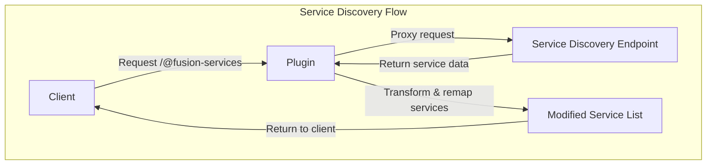
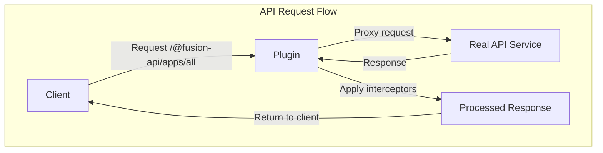
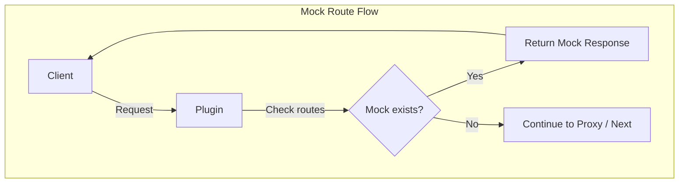

# @equinor/fusion-framework-vite-plugin-api-service

Vite plugin for proxying service discovery requests and mocking API endpoints during Fusion Framework application development.

Use this plugin when you need to:

- **Integrate with service discovery** — proxy requests to a remote discovery endpoint and remap service URLs to local routes the dev-server can manage.
- **Mock API responses** — define middleware routes that return test or static data without touching application code.
- **Intercept and transform responses** — modify proxy response payloads before they reach the client (normalise data, inject metadata, etc.).

The plugin is designed for the Fusion Framework Dev Server ecosystem but works in any Vite project.

## Installation

```bash
pnpm add -D @equinor/fusion-framework-vite-plugin-api-service
```

## Quick Start

```ts
// vite.config.ts
import { defineConfig } from 'vite';
import apiServicePlugin, { createProxyHandler } from '@equinor/fusion-framework-vite-plugin-api-service';

export default defineConfig({
  plugins: [
    apiServicePlugin({
      proxyHandler: createProxyHandler(
        'https://discovery.example.com/services',
        (services, { route }) => {
          const routes = services.map((svc) => ({
            match: `/${svc.name}/:path*`,
            proxy: {
              target: svc.url,
              rewrite: (p: string) => p.replace(`/${svc.name}`, ''),
            },
          }));
          return {
            data: services.map((svc) => ({ ...svc, uri: `${route}/${svc.name}` })),
            routes,
          };
        },
      ),
    }),
  ],
});
```

## How It Works

### Service Discovery Flow


```mermaid
flowchart TD
    subgraph "Service Discovery Flow"
        SD1[Client] -->|Request /@fusion-services| SD2[Plugin]
        SD2 -->|Proxy request| SD3[Service Discovery Endpoint]
        SD3 -->|Return service data| SD2
        SD2 -->|Transform & remap services| SD4[Modified Service List]
        SD4 -->|Return to client| SD1
    end
```

1. The client requests the list of services (e.g. `/@fusion-services`).
2. The plugin proxies the request to the real service discovery endpoint.
3. The `generateRoutes` callback remaps each service URL to a local proxy path and registers the routes.
4. The modified service list is returned to the client.

**Proxy response** (upstream):

```json
[{ "id": "abc", "name": "apps", "url": "https://apps.prod.example.com/" }]
```

**Plugin response** (to client):

```json
[{ "id": "abc", "name": "apps", "url": "/@fusion-api/apps" }]
```

### Normal API Request Flow


```mermaid
flowchart TD
    subgraph "API Request Flow"
        API1[Client] -->|Request /@fusion-api/apps/all| API2[Plugin]
        API2 -->|Proxy request| API3[Real API Service]
        API3 -->|Response| API2
        API2 -->|Apply interceptors| API4[Processed Response]
        API4 -->|Return to client| API1
    end
```

1. The client requests a service via the proxy URL (e.g. `/@fusion-api/apps/all`).
2. The plugin resolves the matching route and proxies the request to the upstream URL.
3. Optional response interceptors transform the payload.
4. The result is returned to the client.

### Mock Route Flow


```mermaid
flowchart TD
    subgraph "Mock Route Flow"
        M1[Client] -->|Request| M2[Plugin]
        M2 -->|Check routes| M3{Mock exists?}
        M3 -->|Yes| M4[Return Mock Response]
        M3 -->|No| M5[Continue to Proxy / Next]
        M4 --> M1
    end
```

1. The client makes a request that matches a middleware route.
2. The plugin executes the middleware handler directly, without proxying.
3. If no middleware route matches, the request falls through to proxy routes or the next middleware.

## Configuration

### Plugin Options

| Option    | Type                | Default              | Description |
| --------- | ------------------- | -------------------- | ----------- |
| `route`   | `string`            | `'/@fusion-api'`     | Base path where plugin middleware is mounted. |
| `process` | `ProcessRouteOptions` | —                  | Extra route processing options (e.g. `onProxyRes` listener). |
| `logger`  | `PluginLogger`      | —                    | Logger for debug/info/warn/error messages. Pass `console` for quick debugging. |

### Service Discovery with `createProxyHandler`

`createProxyHandler` creates an `ApiProxyHandler` that proxies to a service discovery endpoint and dynamically generates proxy routes from the response.

```ts
import { createProxyHandler } from '@equinor/fusion-framework-vite-plugin-api-service';

const proxyHandler = createProxyHandler(
  // URL of the upstream service discovery endpoint
  'https://api.example.com/service-discovery',

  // Callback that processes the response and returns routes
  (responseData, { route, request }) => {
    const routes = responseData.services.map((service) => ({
      match: `/${service.name}/:path*`,
      proxy: {
        target: service.url,
        rewrite: (path: string) => path.replace(`/${service.name}`, ''),
      },
    }));
    return {
      data: responseData,
      routes,
    };
  },

  // Optional configuration
  {
    route: '/@fusion-services',  // where discovery proxy is mounted (default)
    apiRoute: '/@fusion-api',    // base path for generated routes (default)
    proxyOptions: { changeOrigin: true, secure: false },
    logger: console,
  },
);

apiServicePlugin({ proxyHandler });
```

### Mock API Requests

Define middleware routes to return mocked responses without a real backend:

```ts
apiServicePlugin({
  routes: [
    {
      match: '/health',
      middleware: (_req, res) => {
        res.writeHead(200, { 'Content-Type': 'application/json' });
        res.end(JSON.stringify({ status: 'ok' }));
      },
    },
    {
      match: '/users/:userId',
      middleware: (req, res) => {
        const userId = req.params?.userId;
        res.writeHead(200, { 'Content-Type': 'application/json' });
        res.end(JSON.stringify({ id: userId, name: 'Test User' }));
      },
    },
  ],
});
```

### Combining Proxy and Mock Routes

You can supply both `proxyHandler` and `routes`. Custom routes are evaluated first, so mocks take priority over proxied services:

```ts
apiServicePlugin({
  proxyHandler,
  routes: [
    {
      match: '/apps/my-local-app',
      middleware: (_req, res) => {
        res.writeHead(200, { 'Content-Type': 'application/json' });
        res.end(JSON.stringify({ appKey: 'my-local-app', version: 'dev' }));
      },
    },
  ],
});
```

## Route Matching with `createRouteMatcher`

`createRouteMatcher` creates a matcher function that tests URL paths against a pattern and extracts path parameters. Built on [path-to-regexp](https://www.npmjs.com/package/path-to-regexp).

### Path Parameters

```ts
import { createRouteMatcher } from '@equinor/fusion-framework-vite-plugin-api-service';

const matcher = createRouteMatcher({ match: '/api/users/:userId/profile' });

matcher('/api/users/123/profile', req); // { params: { userId: '123' } }
matcher('/api/posts/123', req);         // false
```

### Wildcards

```ts
const serviceMatcher = createRouteMatcher({ match: '/api/services/:serviceName/:path*' });
serviceMatcher('/api/services/auth/v1/token', req);
// { params: { serviceName: 'auth', path: 'v1/token' } }
```

### Multiple Patterns

Pass an array of patterns to match any of them:

```ts
const multiMatcher = createRouteMatcher({
  match: ['/api/v1/users/:id', '/api/v2/users/:id'],
  middleware: handler,
});
```

### Custom Matcher Function

For advanced logic, supply a function instead of a string pattern:

```ts
const customMatcher = createRouteMatcher({
  match: (path, req) => {
    if (path.startsWith('/api/custom') && req.method === 'GET') {
      return { params: { custom: path.substring(12) } };
    }
    return false;
  },
  middleware: handler,
});
```

See the [path-to-regexp documentation](https://www.npmjs.com/package/path-to-regexp) for the full pattern syntax.

## Response Interceptor with `createResponseInterceptor`

`createResponseInterceptor` intercepts JSON proxy responses and transforms them before they reach the client. Non-JSON responses and error responses (status >= 400) pass through untouched.

```ts
import { createResponseInterceptor } from '@equinor/fusion-framework-vite-plugin-api-service';

const interceptor = createResponseInterceptor(
  (data) => ({
    ...data,
    timestamp: new Date().toISOString(),
  }),
  { logger: console },
);
```

### Type-Safe Transformations

```ts
interface OriginalResponse {
  items: string[];
  totalCount: number;
}

interface TransformedResponse {
  data: string[];
  metadata: { count: number; timestamp: string };
}

const typedInterceptor = createResponseInterceptor<OriginalResponse, TransformedResponse>(
  (response) => ({
    data: response.items,
    metadata: {
      count: response.totalCount,
      timestamp: new Date().toISOString(),
    },
  }),
);
```

> **Note:** The interceptor requires `selfHandleResponse: true` on the proxy configuration. This is set automatically when using `createProxyHandler`.

## API Reference

### Exports

| Export | Description |
| --- | --- |
| `plugin` (default) | Vite plugin factory — pass `PluginArguments` and optional `PluginOptions`. |
| `createProxyHandler` | Creates an `ApiProxyHandler` for service discovery proxying. |
| `createRouteMatcher` | Creates a path matcher from a route definition. |
| `createResponseInterceptor` | Creates a proxy response interceptor for JSON transformation. |
| `DEFAULT_VALUES` | Enum with default route paths (`API_PATH`, `SERVICES_PATH`). |

### Types

| Type | Description |
| --- | --- |
| `PluginArguments` | Arguments for the plugin factory (`routes`, `proxyHandler`). |
| `PluginOptions` | Optional plugin configuration (`route`, `process`, `logger`). |
| `ApiProxyHandler` | Interface for proxy handlers returned by `createProxyHandler`. |
| `ApiDataProcessor` | Callback type for processing service discovery responses. |
| `ApiRoute` | Union of `MiddlewareRoute` and `ProxyRoute`. |
| `MiddlewareRoute` | Route definition with a custom middleware handler. |
| `ProxyRoute` | Route definition that proxies to a remote target. |
| `ApiRouteProxyOptions` | Proxy configuration options for `ProxyRoute`. |
| `Matcher` | Function type for route matching. |
| `MatchResult` | Return type of a `Matcher` — `boolean` or `{ params }`. |
| `PluginLogger` | Subset of `Console` used for plugin logging. |
| `JsonData` | Union of JSON-serializable value types. |
