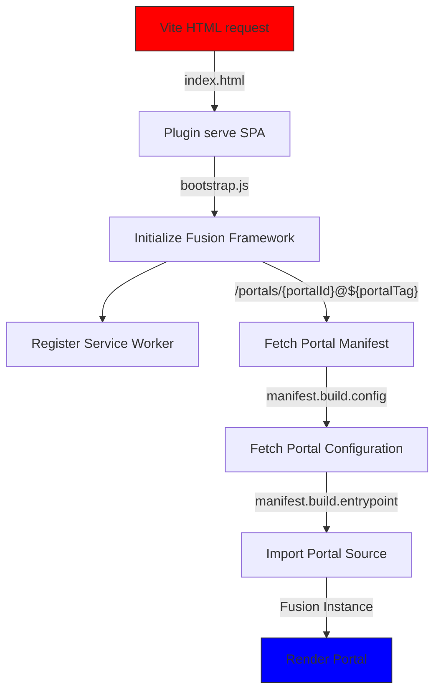
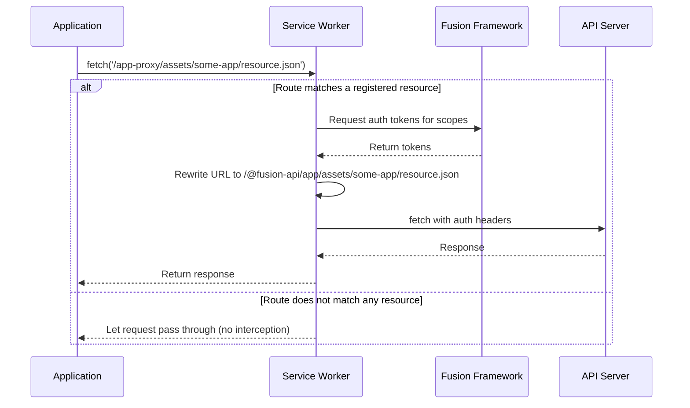

# Fusion Framework Vite SPA Plugin

[](https://www.npmjs.com/package/@equinor/fusion-framework-vite-plugin-spa)
[](./LICENSE)

A powerful Vite plugin for building Single Page Applications (SPAs) with the Fusion Framework. It automates HTML template generation, bootstraps authentication and service discovery, and streamlines portal loading and API proxying. Designed for seamless integration with the Fusion Framework CLI, this plugin provides flexible configuration for both standard and advanced SPA scenarios.

> [!CAUTION] 
> This plugin is intended for use in non-production environments only.

> [!WARNING]
> This plugin is developed for usage with [`@equinor/fusion-framework-cli`](https://github.com/equinor/fusion-framework/tree/main/packages/cli) and this documentation is intended for deeper understanding of the plugin's capabilities and configuration options.
>
> **NOTE:** _Just because there are buttons available doesn't mean you need to press them 🐒_
>
> The plugin is written in a modular fashion, allowing for easy customization and extension __IF__ the developer has a deep understanding of the Fusion Framework and its internals.

## Table of Contents

- [Fusion Framework Vite SPA Plugin](#fusion-framework-vite-spa-plugin)
  - [Table of Contents](#table-of-contents)
  - [What It Does](#what-it-does)
  - [How the Plugin Works](#how-the-plugin-works)
  - [Getting Started](#getting-started)
  - [Configuration Options](#configuration-options)
    - [Basic Configuration](#basic-configuration)
    - [Service Discovery](#service-discovery)
    - [MSAL](#msal)
    - [Service Worker](#service-worker)
  - [Configuring through `.env` File](#configuring-through-env-file)
    - [How Environment Variables Work](#how-environment-variables-work)
    - [Naming Convention](#naming-convention)
    - [Example Conversion](#example-conversion)
    - [Complete `.env` Example](#complete-env-example)
  - [Advanced Customization](#advanced-customization)
    - [Providing a Custom Template](#providing-a-custom-template)
    - [Providing Custom Bootstrap](#providing-custom-bootstrap)
  - [Examples](#examples)
    - [Basic SPA Configuration](#basic-spa-configuration)
    - [Using with API Service Plugin](#using-with-api-service-plugin)
  - [Troubleshooting \& FAQ](#troubleshooting--faq)
    - [Common Issues](#common-issues)
    - [Known Issues](#known-issues)
    - [Best Practices \& FAQ](#best-practices--faq)
  - [Contributing](#contributing)


## What It Does

The plugin:

1. **Bootstraps the Fusion Framework** - Initializes core modules including MSAL authentication and service discovery
2. **Renders a Configured Portal** - Loads and renders any portal by ID, as long as it exports a render function
3. **Registers a Service Worker** - Enables authenticated API requests by automatically injecting auth tokens
4. **Configures Development Environment** - Works with `plugin-api-service` to intercept and proxy authenticated requests during development

> [!TIP]
> The plugin will render the configured portal which can be sourced from:
> - A local npm package (like `@equinor/fusion-framework-dev-portal`, the default used by CLI)
> - The Fusion Portal Service (using a portal identifier)
> - Any custom portal implementation configured in your environment

## How the Plugin Works



**Flow Explanation:**
1. **Vite HTML Request**: The plugin hooks into the Vite dev-server and intercepts SPA requests.
2. **Serve SPA**: The plugin serves the SPA by returning the `index.html` file.
3. **Initialize Fusion Framework**: `bootstrap.js` is loaded
   - configures the framework (e.g. MSAL, service discovery)
   - initializes the framework
   - registers service worker (connects to fusion framework)
4. **Fetch Portal Manifest**: The framework fetches the manifest describing the portal to load.
5. **Fetch Portal Configuration**: Additional configuration for the portal is retrieved.
6. **Load Portal Source File**: The main entry file for the portal is loaded based on the manifest.
7. **Render Portal**: Renders the portal with the Fusion Framework.

## Getting Started

> [!WARNING]
> This plugin is primarily designed to be used with the [Fusion Framework CLI](https://github.com/equinor/fusion-framework-cli). The CLI scaffolds all required configuration and wiring for you.

**Standalone usage is advanced:** If you use this plugin outside the CLI, you must provide detailed configuration for authentication, service discovery, portal loading, and more. There is no "one-line" quick start for custom setups. See the [Basic Configuration](#basic-configuration) and [Configuration Options](#configuration-options) sections below.

> [!NOTE]
> This plugin should cover most use cases for building SPAs with the Fusion Framework, but advanced configurations may require additional setup. 
> If for some reason you are adventurous enough to write your custom implementation of developer utilities, this guide should help you get started.

## Configuration Options

The plugin accepts a variety of configuration options to tailor the SPA to your project's needs. These options control authentication flows, service discovery, and routing behaviors.

### Basic Configuration

Here's a comprehensive example showing all major configuration options:

```ts
fusionSpaPlugin({
  generateTemplateEnv: () => ({
    // HTML page title
    title: 'My App',

    // Portal configuration: specify which portal to load
    portal: {
      id: 'my-portal', // Portal ID to load and render
      // Can be:
      //   1. A package name (e.g. '@equinor/fusion-framework-dev-portal', default for CLI)
      //   2. An ID from the Fusion Portal Service
      //   3. Any other configured portal ID
      tag: 'latest', // (Optional) Version tag (defaults to 'latest')
    },

    // Service Discovery configuration
    serviceDiscovery: {
      url: 'https://my-server.com/service-discovery',
      scopes: ['api://my-app/scope'],
    },

    // MSAL (Microsoft Authentication Library) configuration
    msal: {
      tenantId: 'my-tenant-id',
      clientId: 'my-client-id',
      redirectUri: 'https://my-app.com/auth-callback',
      requiresAuth: 'true',
    },

    // Service Worker configuration for API proxying and authentication
    serviceWorker: {
      resources: [
        {
          url: '/app-proxy',
          rewrite: '/@fusion-api/app',
          scopes: ['xxxxxxxx-xxxx-xxxx-xxxx-xxxxxxxxxxxx/.default'],
        },
      ],
    },
  })
});
```
See [@equinor/fusion-framework-vite-plugin-api-service](https://github.com/equinor/fusion-framework/tree/main/packages/vite-plugins/api-service) for advanced API proxying.

### Service Discovery

The Service Discovery component provides a dynamic way to discover and connect to backend services. It's a crucial part of the Fusion Framework architecture that helps applications locate and communicate with various microservices.

**Configuration Options:**

- `url`: The endpoint URL where the service discovery configuration can be fetched from
- `scopes`: Array of OAuth scopes required to authenticate service discovery requests

**Benefits:**
- Eliminates hardcoded service endpoints in your application
- Enables dynamic service routing based on environment
- Centralizes service endpoint management

### MSAL

The Microsoft Authentication Library (MSAL) configuration handles user authentication with Azure Active Directory. This enables single sign-on capabilities and secure access to protected resources.

**Configuration Options:**

- `tenantId`: The Azure AD tenant ID associated with your organization
- `clientId`: The client/application ID registered in Azure AD
- `redirectUri`: The URL where users are redirected after authentication
- `requiresAuth` _(optional)_: When set to "true", the application will automatically prompt for login on initial load

### Service Worker

The Service Worker component provides powerful capabilities for handling network requests, adding authentication, and enabling offline capabilities in your SPA.

#### How It Works



The Service Worker intercepts network requests made by your application and can modify them before they're sent. This is particularly useful for:

1. Adding authentication tokens automatically to API calls
2. Rewriting request URLs for proxying purposes
3. Enabling offline functionality
4. Improving performance through caching

#### Configuration Options

- `resources`: An array of resource configurations the service worker will manage
  - `url`: Path pattern to match incoming requests against
  - `rewrite` _(optional)_: Path to rewrite the matched URL to
  - `scopes` _(optional)_: OAuth scopes to use for authenticating this resource

#### Complete Example

Here's a detailed example of the Service Worker in action:

```ts
// Service Worker configuration example
const serviceWorker = {
  resources: [
    {
      url: '/app-proxy',
      rewrite: '/@fusion-api/app',
      scopes: [
        '2bed749c-843b-413d-8b17-e7841869730f/.default',
        '8c24cf81-de7a-435b-ab74-e90b1a7bda0a/.default',
      ],
    },
  ],
};

// Example: Making a request in your application code
fetch('/app-proxy/assets/some-app/resource-path/resource.json');
```

#### Request Processing Flow

When the above `fetch` request is made, the following happens:

1. The Service Worker intercepts the request matching the `/app-proxy` pattern
2. It sends a message to the main thread requesting authentication tokens for the specified scopes
3. The main thread generates the necessary authentication tokens
4. The Service Worker rewrites the URL from `/app-proxy/assets/some-app/resource-path/resource.json` to `/@fusion-api/app/assets/some-app/resource-path/resource.json`
5. It adds the authentication headers to the request and executes it against the rewritten URL
6. The response is returned to the application as if the original URL was called

> [!TIP]
> The `url` path doesn't need to correspond to an actual endpoint—it's simply a pattern used for matching requests. This allows you to emulate proxy services in production environments without changing your application code.

> [!TIP]
> For enhanced development capabilities, consider using the `@equinor/fusion-framework-vite-plugin-api-service` plugin. This plugin creates a dynamic proxy service that can handle requests to the `/@fusion-api/app` path by intercepting them in the dev-server and routing them based on service discovery configuration.  

## Configuring through `.env` File

For greater flexibility—especially in CI/CD pipelines and deployment scenarios—the plugin supports configuration through environment variables in a `.env` file.

### How Environment Variables Work

The plugin reads the `.env` file and overrides any properties defined in the `generateTemplateEnv` function with the corresponding environment variables. This approach allows you to:

- Maintain different configurations for development, testing, and production
- Keep sensitive information out of your source code
- Override configuration values during deployment pipelines

### Naming Convention

Environment variables follow a specific naming pattern:
1. All variables are prefixed with `FUSION_SPA_`
2. Object paths are converted to snake case with underscores
3. Arrays and objects are serialized as JSON strings

### Example Conversion

Here's how JavaScript configuration objects map to environment variables:

```ts
// JavaScript configuration
{
  serviceWorker: {
    resources: [...],
  },
}

// Becomes this environment variable
FUSION_SPA_SERVICE_WORKER_RESOURCES=[...]

// And can be accessed in your code as
import.meta.env.FUSION_SPA_SERVICE_WORKER_RESOURCES
```

### Complete `.env` Example

```sh
# Application basics
FUSION_SPA_TITLE=My App
FUSION_SPA_PORTAL_ID=my-portal  # Can be a package name, Fusion Portal Service ID, or any configured portal ID

# Service Discovery configuration
FUSION_SPA_SERVICE_DISCOVERY_URL=https://my-server.com/service-discovery
FUSION_SPA_SERVICE_DISCOVERY_SCOPES=[api://my-app/scope]

# MSAL Authentication configuration
FUSION_SPA_MSAL_TENANT_ID=my-tenant-id
FUSION_SPA_MSAL_CLIENT_ID=my-client-id
FUSION_SPA_MSAL_REDIRECT_URI=https://my-app.com/auth-callback
FUSION_SPA_MSAL_REQUIRES_AUTH=true

# Service Worker configuration (as JSON string)
FUSION_SPA_SERVICE_WORKER_RESOURCES=[{"url":"/app-proxy","rewrite":"/@fusion-api/app","scopes":["xxxxxxxx-xxxx-xxxx-xxxx-xxxxxxxxxxxx/.default"]}]
```

> [!TIP]
> While environment variables are convenient for deployment scenarios, it's generally recommended to use the `generateTemplateEnv` function during development for better type checking and easier debugging.

> [!IMPORTANT]
> The `.env` file must be placed in the root of your project. Values defined in the `.env` file will override any corresponding values from the `generateTemplateEnv` function.

## Advanced Customization

For advanced scenarios, the plugin provides options to customize both the HTML template and the application bootstrapping process. These customizations should be approached carefully as they may require deeper understanding of the framework.

### Providing a Custom Template

You can provide a completely custom HTML template for your application. This gives you full control over the document structure while still leveraging the plugin's environment variable injection.

> [!WARNING]
> Custom templates move you closer to the edge of the framework's capabilities. Proceed with caution as you'll be responsible for ensuring proper structure and bootstrapping.

#### Example Custom Template

```ts
// Define your custom HTML template
const template = `
<!DOCTYPE html>
<html lang="en">
  <head>
    <meta charset="UTF-8">
    <meta name="viewport" content="width=device-width, initial-scale=1.0">
    <title>%MY_CUSTOM_TITLE%</title>
    <script type="module" src="./src/my-custom-bootloader"></script>
  </head>
  <body>
    <h1>%MY_CUSTOM_PROPERTY%</h1>
    <div id="app"></div>
  </body>
</html>
`;

// Configure Vite with your custom template
import { defineConfig } from 'vite';
import { createViteSPAPlugin } from '@equinor/fusion-framework-vite-plugin-spa';

// Custom prefix for environment variables
const templateEnvPrefix = 'MY_CUSTOM_';

export default defineConfig({
  // Define environment variables to inject into the template
  define: {
    [`import.meta.env.${templateEnvPrefix}PROPERTY`]: '"my-custom-value"',
    [`import.meta.env.${templateEnvPrefix}TITLE`]: '"My Application"',
  },
  // Use the custom template with the plugin
  plugins: [createViteSPAPlugin({ template, templateEnvPrefix })],
});
```

> [!TIP]
> For more details on how HTML template variable replacement works in Vite, see the [Vite documentation](https://vite.dev/guide/env-and-mode.html#html-constant-replacement).

### Providing Custom Bootstrap

For even more control, you can specify a custom bootstrap file that handles the initialization of your application:

```ts
fusionSpaPlugin({
  generateTemplateEnv: () => {
    return {
      // Points to your custom bootstrap file
      bootstrap: 'src/my-custom-bootloader.ts',
    }
  }
});
```

#### Implementing Your Custom Bootloader

When implementing a custom bootloader, you'll need to handle all the initialization logic that would normally be managed by the default bootloader, including service worker registration:

```ts
// custom-bootloader.ts
import { registerServiceWorker } from '@equinor/fusion-framework-vite-plugin-spa/html';
import initializeFramework from './my-custom-framework.js';

// Initialize your framework and register the service worker
const app = await initializeFramework();
registerServiceWorker(app);

// Additional custom initialization code
document.addEventListener('DOMContentLoaded', () => {
  console.log('Application fully loaded');
});
```

> [!WARNING]
> When using a custom bootloader, the default ServiceWorker registration is bypassed. You must explicitly call `registerServiceWorker()` in your custom bootloader to maintain this functionality, as shown in the example above.


## Examples

Here are some common implementation examples to help you get started quickly:

### Basic SPA Configuration

```ts
// vite.config.ts
import { defineConfig } from 'vite';
import { plugin as fusionSpaPlugin } from '@equinor/fusion-framework-vite-plugin-spa';
import react from '@vitejs/plugin-react';

export default defineConfig({
  plugins: [
    react(),
    fusionSpaPlugin({
      generateTemplateEnv: () => ({
        title: 'My React App',
        portal: { id: 'my-portal' },
        serviceDiscovery: {
          url: 'https://dev-server.com/service-discovery',
          scopes: ['api://my-app/user.read'],
        },
        msal: {
          tenantId: process.env.TENANT_ID,
          clientId: process.env.CLIENT_ID,
          redirectUri: 'http://localhost:3000/auth-callback',
          requiresAuth: 'true',
        },
      }),
    }),
  ],
});
```

### Using with API Service Plugin

```ts
// vite.config.ts
import { defineConfig } from 'vite';
import { plugin as fusionSpaPlugin } from '@equinor/fusion-framework-vite-plugin-spa';
import { plugin as apiServicePlugin } from '@equinor/fusion-framework-vite-plugin-api-service';
import react from '@vitejs/plugin-react';

export default defineConfig({
  plugins: [
    react(),
    fusionSpaPlugin({
      generateTemplateEnv: () => ({
        title: 'API Service Example',
        // Portal to load
        portal: {
          id: 'my-portal',
          tag: 'latest',
        },
        serviceDiscovery: {
          url: 'https://dev-server.com/service-discovery',
          scopes: ['api://my-app/user.read'],
        },
        serviceWorker: {
          resources: [
            {
              url: '/api-proxy',
              rewrite: '/@fusion-api/service',
              scopes: ['api://backend-service/.default'],
            },
          ],
        },
      }),
    }),
    // API Service plugin enables portal loading from service discovery
    apiServicePlugin(),
  ],
});
```
See [API Service Plugin docs](https://github.com/equinor/fusion-framework/tree/main/packages/vite-plugins/api-service) for more details.

## Troubleshooting & FAQ

### Common Issues

1. **Authentication Failures**
  - Ensure your `tenantId` and `clientId` values are correct
  - Check that your application is properly registered in Azure AD
  - Verify that the required scopes are configured correctly

2. **Service Worker Not Working**
  - Ensure the service worker is properly registered in your bootstrap process
  - Check browser console for any registration errors
  - Verify that the URL patterns in the resources configuration match your fetch calls

3. **Environment Variables Not Applied**
  - Confirm your `.env` file is in the project root
  - Verify the naming convention follows `FUSION_SPA_*` with proper snake_casing
  - Restart your development server after changing environment variables

### Known Issues

| Issue | Impact | Description |
| ----- | ------ | ----------- |
| [#3266](https://github.com/equinor/fusion-framework/issues/3266) | **Missing bearer token on proxy assets** | When loading remote applications that use assets or code-splitting, the service worker may fail to attach the required Bearer token to requests for these resources. This occurs because the service worker rewrites `import.url`, which can interfere with proper token injection for asset requests. As a result, protected assets may not load correctly in some scenarios.|

### Best Practices & FAQ

- **Keep secrets out of source code** — use environment variables for sensitive values.
- **Leverage the [API Service Plugin](https://github.com/equinor/fusion-framework/tree/main/packages/vite-plugins/api-service)** for advanced API proxying and local development.
- **When customizing templates or bootloaders,** always test service worker registration and authentication flows.
- **For local development:**
  - Use [Vite's environment variable system](https://vitejs.dev/guide/env-and-mode.html)

## Contributing

Contributions, bug reports, and feature requests are welcome! See [CONTRIBUTING.md](../../../CONTRIBUTING.md) for guidelines.


