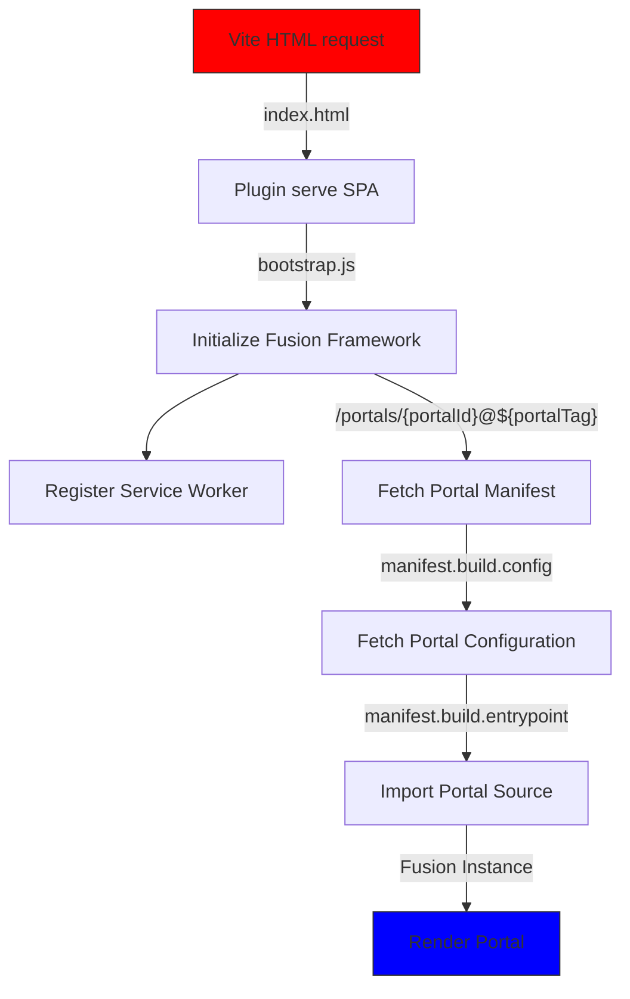
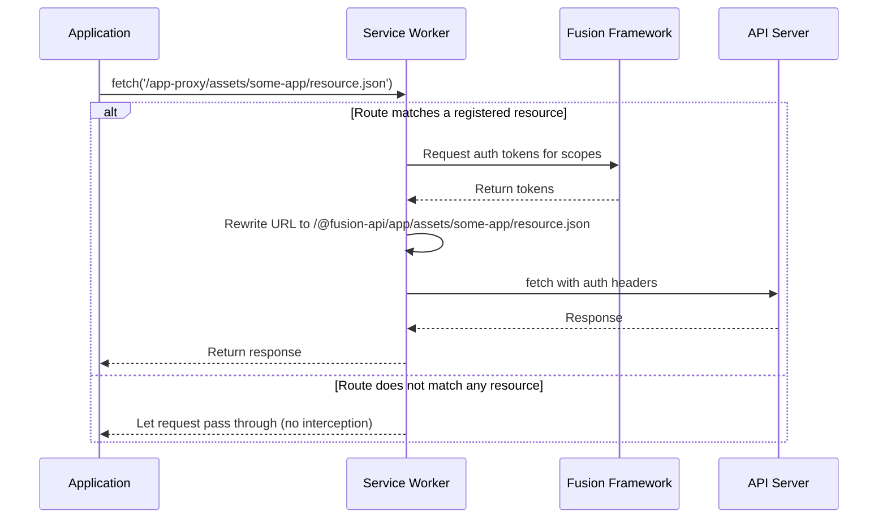

# @equinor/fusion-framework-vite-plugin-spa

[](https://www.npmjs.com/package/@equinor/fusion-framework-vite-plugin-spa)
[](./LICENSE)

Vite plugin for building Fusion Framework Single Page Applications (SPAs). It generates an HTML shell, bootstraps MSAL authentication and service discovery, loads a portal by manifest, and registers a service worker that injects Bearer tokens into outgoing API requests.

> [!CAUTION]
> This plugin is intended for **non-production development environments** only.

> [!WARNING]
> This plugin is designed for use with [`@equinor/fusion-framework-cli`](https://github.com/equinor/fusion-framework/tree/main/packages/cli). The CLI scaffolds all required configuration automatically.
>
> Standalone usage is an advanced scenario that requires deep understanding of the Fusion Framework internals. The documentation below covers the full configuration surface for those who need it.

## What It Does

| Responsibility | Description |
| --- | --- |
| **Bootstrap the Fusion Framework** | Initializes MSAL authentication, service discovery, and telemetry modules |
| **Render a configured portal** | Fetches a portal manifest by ID and loads its entry point |
| **Register a service worker** | Intercepts fetch requests, rewrites URLs, and attaches OAuth Bearer tokens |
| **Configure the dev environment** | Works with `@equinor/fusion-framework-vite-plugin-api-service` to proxy authenticated requests during development |

> [!TIP]
> The portal to render can be sourced from:
> - A **local npm package** (e.g. `@equinor/fusion-framework-dev-portal`, the default used by CLI)
> - The **Fusion Portal Service** (using a portal identifier)
> - Any **custom portal** implementation that exports a `render` function

## How the Plugin Works


```mermaid
flowchart
  A[Vite HTML request] -->|index.html| B[Plugin serve SPA]
  B -->|bootstrap.js| C[Initialize Fusion Framework]
  C --> D[Register Service Worker]
  C -->|"/portals/{portalId}@${portalTag}"| E[Fetch Portal Manifest]
  E -->|manifest.build.config| F[Fetch Portal Configuration]
  F -->|manifest.build.entrypoint| G[Import Portal Source]
  G -->|"Fusion Instance"| H[Render Portal]

  style A fill:#F00,stroke:#333,stroke-width:1px
  style H fill:#00F,stroke:#333,stroke-width:1px
```

**Flow Explanation:**
1. **Vite HTML Request**: The plugin hooks into the Vite dev-server and intercepts SPA requests.
2. **Serve SPA**: The plugin serves the SPA by returning the `index.html` file.
3. **Initialize Fusion Framework**: `bootstrap.js` is loaded
   - configures the framework (e.g. MSAL, service discovery)
   - initializes the framework
   - registers service worker (connects to fusion framework)
4. **Fetch Portal Manifest**: The framework fetches the manifest describing the portal to load.
5. **Fetch Portal Configuration**: Additional configuration for the portal is retrieved.
6. **Load Portal Source File**: The main entry file for the portal is loaded based on the manifest.
7. **Render Portal**: Renders the portal with the Fusion Framework.

## Getting Started

> [!WARNING]
> This plugin is primarily designed to be used with the [Fusion Framework CLI](https://github.com/equinor/fusion-framework-cli). The CLI scaffolds all required configuration and wiring automatically.

Standalone usage requires you to supply authentication, service discovery, portal loading, and service worker configuration yourself. See [Configuration Options](#configuration-options) below.

### Installation

```sh
pnpm add -D @equinor/fusion-framework-vite-plugin-spa
```

### Minimal Vite Config

```ts
// vite.config.ts
import { defineConfig } from 'vite';
import { fusionSpaPlugin } from '@equinor/fusion-framework-vite-plugin-spa';

export default defineConfig({
  plugins: [
    fusionSpaPlugin({
      generateTemplateEnv: () => ({
        title: 'My App',
        portal: { id: 'my-portal' },
        serviceDiscovery: {
          url: 'https://my-server.com/service-discovery',
          scopes: ['api://my-app/scope'],
        },
        msal: {
          tenantId: 'my-tenant-id',
          clientId: 'my-client-id',
          redirectUri: 'http://localhost:3000/auth-callback',
          requiresAuth: 'true',
        },
      }),
    }),
  ],
});
```

## Configuration Options

The `fusionSpaPlugin` (also exported as `plugin`) accepts a `PluginOptions` object with the following properties:

| Option | Type | Default | Description |
| --- | --- | --- | --- |
| `template` | `string` | Built-in HTML | Custom HTML template string with `%VAR%` placeholders |
| `templateEnvPrefix` | `string` | `'FUSION_SPA_'` | Prefix for environment variable names |
| `generateTemplateEnv` | `(env: ConfigEnv) => Partial<TemplateEnv>` | — | Factory producing environment values |
| `logger` | `Pick<Console, 'debug'\|'info'\|'warn'\|'error'>` | — | Optional logger for plugin diagnostics |

### Template Environment (`generateTemplateEnv`)

The `generateTemplateEnv` callback returns an object whose shape matches `FusionTemplateEnv`. All properties are flattened to `FUSION_SPA_*` environment variables at build time.

Here's a comprehensive example:

```ts
fusionSpaPlugin({
  generateTemplateEnv: () => ({
    // HTML page title
    title: 'My App',

    // Portal configuration: specify which portal to load
    portal: {
      id: 'my-portal', // Portal ID to load and render
      // Can be:
      //   1. A package name (e.g. '@equinor/fusion-framework-dev-portal', default for CLI)
      //   2. An ID from the Fusion Portal Service
      //   3. Any other configured portal ID
      tag: 'latest', // (Optional) Version tag (defaults to 'latest')
      proxy: false, // (Optional) Whether to proxy portal requests through /portal-proxy (defaults to false)
    },

    // Service Discovery configuration
    serviceDiscovery: {
      url: 'https://my-server.com/service-discovery',
      scopes: ['api://my-app/scope'],
    },

    // MSAL (Microsoft Authentication Library) configuration
    msal: {
      tenantId: 'my-tenant-id',
      clientId: 'my-client-id',
      redirectUri: 'https://my-app.com/auth-callback',
      requiresAuth: 'true',
    },

    // Service Worker configuration for API proxying and authentication
    serviceWorker: {
      resources: [
        {
          url: '/app-proxy',
          rewrite: '/@fusion-api/app',
          scopes: ['xxxxxxxx-xxxx-xxxx-xxxx-xxxxxxxxxxxx/.default'],
        },
      ],
    },
  })
});
```

### Portal Proxy

The portal proxy feature allows you to route portal entry point requests through a `/portal-proxy` path prefix. When enabled, the plugin will attempt to load portal code from URLs prefixed with `/portal-proxy/`, which can be useful when working with proxy servers or development environments that need to intercept and route portal requests.

**Behavior:**

- `proxy: true` → Portal loads from `/portal-proxy/{assetPath}/{templateEntry}` (allows proxy interception)
- `proxy: false` → Portal loads from `{assetPath}/{templateEntry}` (direct loading)

**Configuration Options:**

- `proxy`: When set to `true`, portal entry points will be prefixed with `/portal-proxy`

**When to Use Portal Proxy:**

- Development environments where portal assets need to be served through a proxy
- Deployment scenarios requiring portal routing through specific paths
- When working with the API Service Plugin for advanced portal loading

**Example:**

```ts
portal: {
  id: 'my-portal',
  tag: 'latest',
  proxy: true, // Portal will be loaded from /portal-proxy/{assetPath}/{templateEntry}
}
```

See [@equinor/fusion-framework-vite-plugin-api-service](https://github.com/equinor/fusion-framework/tree/main/packages/vite-plugins/api-service) for advanced API proxying.

### Service Discovery

Configures the endpoint the Fusion Framework uses to discover backend service URLs at runtime.

- `url` — Endpoint URL of the service discovery configuration
- `scopes` — OAuth scopes required to authenticate requests to the service discovery endpoint

### MSAL Authentication

Configures Azure AD authentication via the Microsoft Authentication Library (MSAL).

- `tenantId` — Azure AD tenant identifier
- `clientId` — Application (client) ID registered in Azure AD
- `redirectUri` — URL to redirect to after authentication
- `requiresAuth` _(optional, string)_ — When `'true'`, automatically prompts for login on first load

- `tenantId` — Azure AD tenant identifier
- `clientId` — Application (client) ID registered in Azure AD
- `redirectUri` — URL to redirect to after authentication
- `requiresAuth` _(optional, string)_ — When `'true'`, automatically prompts for login on first load

### Service Worker

The service worker intercepts outgoing fetch requests, matches them against configured `ResourceConfiguration` patterns, optionally rewrites the URL, and attaches a Bearer token.

#### How It Works


```mermaid
sequenceDiagram
  participant App as Application
  participant SW as Service Worker
  participant Main as Fusion Framework
  participant API as API Server

  App->>SW: fetch('/app-proxy/assets/some-app/resource.json')
  alt Route matches a registered resource
    SW->>Main: Request auth tokens for scopes
    Main-->>SW: Return tokens
    SW->>SW: Rewrite URL to /@fusion-api/app/assets/some-app/resource.json
    SW->>API: fetch with auth headers
    API-->>SW: Response
    SW-->>App: Return response
  else Route does not match any resource
    SW-->>App: Let request pass through (no interception)
  end
```

The Service Worker intercepts network requests and can:

1. Attach OAuth Bearer tokens to matched requests
2. Rewrite request URLs for proxying
3. Pass unmatched requests through unmodified

#### Resource Configuration

Each entry in the `resources` array is a `ResourceConfiguration` object:

| Property | Type | Description |
| --- | --- | --- |
| `url` | `string` | Path prefix to match against fetch requests |
| `rewrite` | `string?` | Replacement path prefix for matched requests |
| `scopes` | `string[]?` | OAuth scopes to acquire a Bearer token for matched requests |

#### Complete Example

Here's a detailed example of the Service Worker in action:

```ts
// Service Worker configuration example
const serviceWorker = {
  resources: [
    {
      url: '/app-proxy',
      rewrite: '/@fusion-api/app',
      scopes: [
        '2bed749c-843b-413d-8b17-e7841869730f/.default',
        '8c24cf81-de7a-435b-ab74-e90b1a7bda0a/.default',
      ],
    },
  ],
};

// Example: Making a request in your application code
fetch('/app-proxy/assets/some-app/resource-path/resource.json');
```

#### Request Processing Flow

When the above `fetch` request is made, the following happens:

1. The Service Worker intercepts the request matching the `/app-proxy` pattern
2. It sends a message to the main thread requesting authentication tokens for the specified scopes
3. The main thread generates the necessary authentication tokens
4. The Service Worker rewrites the URL from `/app-proxy/assets/some-app/resource-path/resource.json` to `/@fusion-api/app/assets/some-app/resource-path/resource.json`
5. It adds the authentication headers to the request and executes it against the rewritten URL
6. The response is returned to the application as if the original URL was called

> [!TIP]
> The `url` path doesn't need to correspond to an actual endpoint—it's simply a pattern used for matching requests. This allows you to emulate proxy services in production environments without changing your application code.

> [!TIP]
> For enhanced development capabilities, consider using the `@equinor/fusion-framework-vite-plugin-api-service` plugin. This plugin creates a dynamic proxy service that can handle requests to the `/@fusion-api/app` path by intercepting them in the dev-server and routing them based on service discovery configuration.

## Telemetry

The plugin configures console telemetry via `@equinor/fusion-framework-module-telemetry`. Severity levels map to integers:

| Level | Value | Description |
| --- | --- | --- |
| Debug | 0 | Detailed debugging information |
| Information | 1 | General operational information |
| Warning | 2 | Potential issues that are not critical |
| Error | 3 | Errors that do not prevent continued operation |
| Critical | 4 | Severe errors that may halt functionality |

### Controlling Console Output

Set `FUSION_SPA_TELEMETRY_CONSOLE_LEVEL` to the minimum level to display. Default is `1` (Information).

```sh
FUSION_SPA_TELEMETRY_CONSOLE_LEVEL=2  # Warning and above
```

For advanced telemetry (e.g. Application Insights), provide a [custom bootstrap file](#providing-custom-bootstrap).

## Configuring through `.env` Files

The plugin reads environment variables from `.env` files (via Vite's `loadEnv`) and **merges them on top of** values from `generateTemplateEnv`. This lets you keep secrets and per-environment values out of source code.

### Naming Convention

1. Prefix all variables with `FUSION_SPA_` (or your custom `templateEnvPrefix`).
2. Convert nested object paths to `UPPER_SNAKE_CASE` (e.g. `serviceDiscovery.url` → `FUSION_SPA_SERVICE_DISCOVERY_URL`).
3. Serialize arrays and objects as JSON strings.

### Mapping Example

```ts
// JavaScript configuration
{
  serviceWorker: {
    resources: [...],
  },
}

// Becomes this environment variable
FUSION_SPA_SERVICE_WORKER_RESOURCES=[...]

// And can be accessed in your code as
import.meta.env.FUSION_SPA_SERVICE_WORKER_RESOURCES
```

### Complete `.env` Example

```sh
# Page title
FUSION_SPA_TITLE=My App

# Portal manifest
FUSION_SPA_PORTAL_ID=my-portal
FUSION_SPA_PORTAL_TAG=latest
FUSION_SPA_PORTAL_PROXY=false

# Service Discovery
FUSION_SPA_SERVICE_DISCOVERY_URL=https://my-server.com/service-discovery
FUSION_SPA_SERVICE_DISCOVERY_SCOPES=[api://my-app/scope]

# MSAL
FUSION_SPA_MSAL_TENANT_ID=my-tenant-id
FUSION_SPA_MSAL_CLIENT_ID=my-client-id
FUSION_SPA_MSAL_REDIRECT_URI=https://my-app.com/auth-callback
FUSION_SPA_MSAL_REQUIRES_AUTH=true

# Telemetry
FUSION_SPA_TELEMETRY_CONSOLE_LEVEL=2

# Service Worker (JSON string)
FUSION_SPA_SERVICE_WORKER_RESOURCES=[{"url":"/app-proxy","rewrite":"/@fusion-api/app","scopes":["xxxxxxxx-xxxx-xxxx-xxxx-xxxxxxxxxxxx/.default"]}]
```

> [!TIP]
> Use `generateTemplateEnv` during development for type safety and easier debugging. Use `.env` files for CI/CD and deployment overrides.

> [!IMPORTANT]
> The `.env` file must be in the project root (or the directory specified by Vite's `envDir`). Values from `.env` files override matching values from `generateTemplateEnv`.

## Advanced Customization

### Providing a Custom Template

Override the built-in HTML template by passing a `template` string to the plugin. Placeholders use the `%VAR%` syntax from [Vite's HTML constant replacement](https://vite.dev/guide/env-and-mode.html#html-constant-replacement).

> [!WARNING]
> Custom templates bypass the default structure. You are responsible for loading the bootstrap script and ensuring proper document structure.

#### Example Custom Template

```ts
// Define your custom HTML template
const template = `
<!DOCTYPE html>
<html lang="en">
  <head>
    <meta charset="UTF-8">
    <meta name="viewport" content="width=device-width, initial-scale=1.0">
    <title>%MY_CUSTOM_TITLE%</title>
    <script type="module" src="./src/my-custom-bootloader"></script>
  </head>
  <body>
    <h1>%MY_CUSTOM_PROPERTY%</h1>
    <div id="app"></div>
  </body>
</html>
`;

// Configure Vite with your custom template
import { defineConfig } from 'vite';
import { createViteSPAPlugin } from '@equinor/fusion-framework-vite-plugin-spa';

// Custom prefix for environment variables
const templateEnvPrefix = 'MY_CUSTOM_';

export default defineConfig({
  // Define environment variables to inject into the template
  define: {
    [`import.meta.env.${templateEnvPrefix}PROPERTY`]: '"my-custom-value"',
    [`import.meta.env.${templateEnvPrefix}TITLE`]: '"My Application"',
  },
  // Use the custom template with the plugin
  plugins: [createViteSPAPlugin({ template, templateEnvPrefix })],
});
```

> [!TIP]
> For more details on how HTML template variable replacement works in Vite, see the [Vite documentation](https://vite.dev/guide/env-and-mode.html#html-constant-replacement).

### Providing Custom Bootstrap

For even more control, you can specify a custom bootstrap file that handles the initialization of your application:

```ts
fusionSpaPlugin({
  generateTemplateEnv: () => {
    return {
      // Points to your custom bootstrap file
      bootstrap: 'src/my-custom-bootloader.ts',
    }
  }
});
```

#### Implementing Your Custom Bootloader

When implementing a custom bootloader, you'll need to handle all the initialization logic that would normally be managed by the default bootloader, including service worker registration:

```ts
// custom-bootloader.ts
import { registerServiceWorker } from '@equinor/fusion-framework-vite-plugin-spa/html';
import initializeFramework from './my-custom-framework.js';

// Initialize your framework and register the service worker
const app = await initializeFramework();
registerServiceWorker(app);

// Additional custom initialization code
document.addEventListener('DOMContentLoaded', () => {
  console.log('Application fully loaded');
});
```

> [!WARNING]
> When using a custom bootloader, the default ServiceWorker registration is bypassed. You must explicitly call `registerServiceWorker()` in your custom bootloader to maintain this functionality, as shown in the example above.


## Examples

### Basic SPA with React

```ts
// vite.config.ts
import { defineConfig } from 'vite';
import { plugin as fusionSpaPlugin } from '@equinor/fusion-framework-vite-plugin-spa';
import react from '@vitejs/plugin-react';

export default defineConfig({
  plugins: [
    react(),
    fusionSpaPlugin({
      generateTemplateEnv: () => ({
        title: 'My React App',
        portal: { id: 'my-portal' },
        serviceDiscovery: {
          url: 'https://dev-server.com/service-discovery',
          scopes: ['api://my-app/user.read'],
        },
        msal: {
          tenantId: process.env.TENANT_ID,
          clientId: process.env.CLIENT_ID,
          redirectUri: 'http://localhost:3000/auth-callback',
          requiresAuth: 'true',
        },
        telemetry: {
          consoleLevel: 2, // Show Warning, Error, and Critical events
        },
      }),
    }),
  ],
});
```

### Using with API Service Plugin

```ts
// vite.config.ts
import { defineConfig } from 'vite';
import { plugin as fusionSpaPlugin } from '@equinor/fusion-framework-vite-plugin-spa';
import { plugin as apiServicePlugin } from '@equinor/fusion-framework-vite-plugin-api-service';
import react from '@vitejs/plugin-react';

export default defineConfig({
  plugins: [
    react(),
    fusionSpaPlugin({
      generateTemplateEnv: () => ({
        title: 'API Service Example',
        // Portal to load
        portal: {
          id: 'my-portal',
          tag: 'latest',
        },
        serviceDiscovery: {
          url: 'https://dev-server.com/service-discovery',
          scopes: ['api://my-app/user.read'],
        },
        serviceWorker: {
          resources: [
            {
              url: '/api-proxy',
              rewrite: '/@fusion-api/service',
              scopes: ['api://backend-service/.default'],
            },
          ],
        },
      }),
    }),
    // API Service plugin enables portal loading from service discovery
    apiServicePlugin(),
  ],
});
```
See [API Service Plugin docs](https://github.com/equinor/fusion-framework/tree/main/packages/vite-plugins/api-service) for more details.

## Troubleshooting

### Common Issues

| Symptom | Likely Cause | Fix |
| --- | --- | --- |
| Authentication failures | Wrong `tenantId` or `clientId` | Verify Azure AD app registration and scope configuration |
| Service worker not intercepting | Worker not registered or not controlling | Check browser console for registration errors; ensure `registerServiceWorker` is called |
| `.env` values ignored | Wrong prefix or missing restart | Confirm `FUSION_SPA_*` naming; restart the dev server |

### Known Issues

| Issue | Impact | Description |
| ----- | ------ | ----------- |
| [#3266](https://github.com/equinor/fusion-framework/issues/3266) | **Missing bearer token on proxy assets** | When loading remote applications that use assets or code-splitting, the service worker may fail to attach the required Bearer token to requests for these resources. This occurs because the service worker rewrites `import.url`, which can interfere with proper token injection for asset requests. As a result, protected assets may not load correctly in some scenarios.|

### Best Practices

- Keep secrets out of source code — use `.env` files or CI/CD variables.
- Use the [API Service Plugin](https://github.com/equinor/fusion-framework/tree/main/packages/vite-plugins/api-service) for advanced proxy routing during development.
- When using custom templates or bootstrap files, always verify service worker registration and authentication flows.

## Contributing

Contributions, bug reports, and feature requests are welcome! See [CONTRIBUTING.md](../../../CONTRIBUTING.md) for guidelines.


