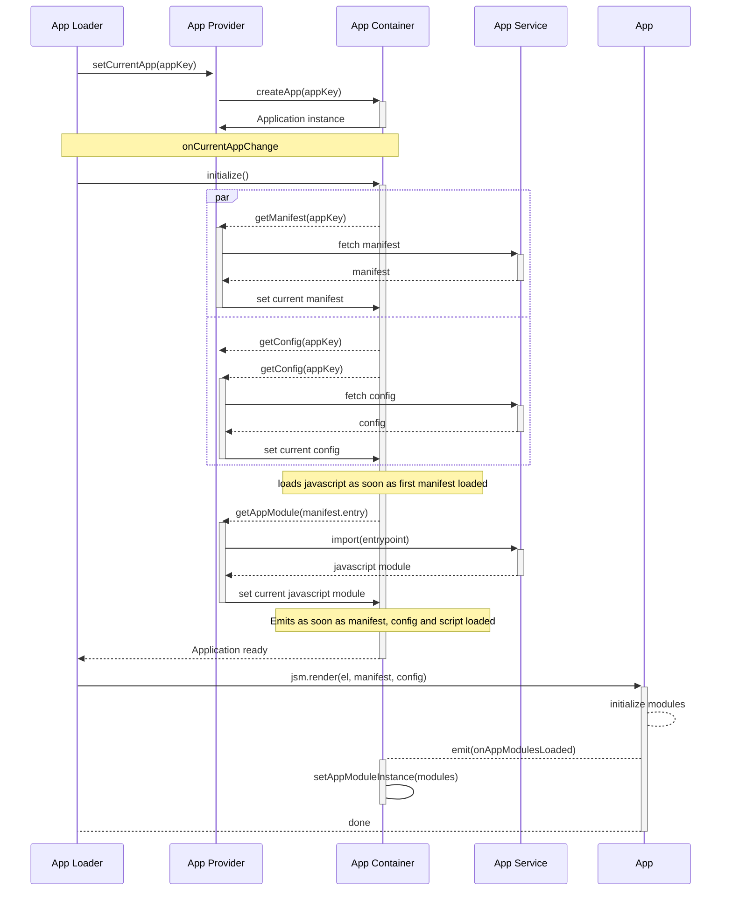

This module purpose is:
- [x] load application manifest.
- [x] load application configuration.
- [x] load application javascript bundle.
- [x] keep track of current selected application

> This module is mainly developed for helping portal for keeping track of selected application and loading of application.

## Application instance

### Manifest

Meta data description of application, loaded from the Fusion Application Store

### Config

Configuration for the application 

### Script Modules

imported javascript script modules

### Instance

Collection of initialized modules of the application