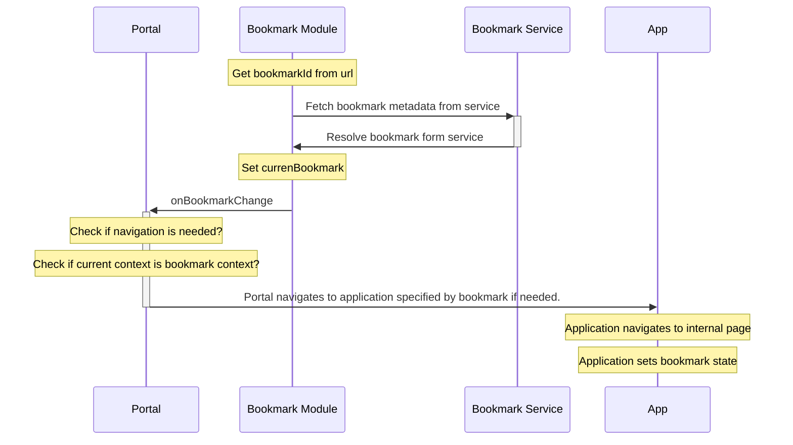

## Concept

Bookmarks are used to save the state of an application at a specific point in time, so that users can easily return to that state later. A bookmark is for any application, as long that it has been enabled in the given environment. The bookmark module is created to orchestrate this behavior.



## Configuration

```ts
import { enableContext } from '@equinor/fusion-framework-module-bookmark';
export const configure = (configurator) => {
    // Some portal configuration
    enableBookmark(configurator, (builder) => {
        builder.setSourceSystem({
            subSystem: 'fusion',
            identifier: 'fusion-classic',
            name: 'Fusion Classic',
        });
    });
    // more configuration...
};
```

## BookmarkProvider

The public properties of the class are:

-   bookmarkClient: an instance of the BookmarkClient class, which is used to interact with the bookmarks API.
-   currentBookmark: the currently selected bookmark.
-   bookmarks$: an observable stream of all bookmarks.
-   currentBookmark$: an observable stream of the current bookmark.

BookmarkProvider has several public methods:

### Public Functions

#### addStateCreator

The state creator is used to collect the state stored in a bookmark. and by adding a creator will enable the bookmark functionality for an application this is used.
cb - For creating the bookmark payload, this should ne wrapped in a useCallback, payload return can be a partial.

```ts
addStateCreator(cb: CreateBookmarkFn<TData>, key?: keyof TData): VoidFunction
```

#### createBookmark

Creates a new bookmark with the given arguments, and utilizes teh provided stateCreator to create the bookmark payload.

```TS
createBookmark(args: { name: string; description: string; isShared: boolean }): Promise<void>:
```

#### dispose

disposes of the class and unsubscribes all subscriptions.

```TS
dispose(): void:
```

#### getBookmarkById

     Function for resolving a bookmark form api client
     @param {string} bookmarkId - bookmark indemnificator.

```TS
   getBookmarkById(bookmarkId: string): void;
```

#### getAllBookmarks

    Function for resoling all bookmarks current sub system.

```TS
    getBookmarkById(): void;
```

    Function for updating bookmark a bookmark when successful this will update the bookmark list.

#### updateBookmark

@param {string} bookmarkId
@param {Bookmark<unknown>} bookmark

```TS
    updateBookmark(bookmark: Bookmark<unknown>): void;
```

#### deleteBookmarkById

Function for deleting a bookmark, when successful this will update the bookmark list.
@param {string} bookmarkId

```TS
    deleteBookmarkById(bookmarkId: string): void;
```

#### setCurrentBookmark

Function for setting the current bookmark, when successful this will update the bookmark list.
@template TData - Bookmark payload type.
@param {(string | Bookmark<TData> | undefined)} idOrItem - can be full bookmark object or bookmarkId.
If not provided the current bookmark state will be set to undefined.

```TS
setCurrentBookmark<TData>(idOrItem?: string | Bookmark<TData>): void;

```

### Configuration Options

#### setSourceSystem

This will sett the SourceSystem used when creating a new bookmark, used as the identifier frr the current client. Only used in app shell / portal configuration.

> @param {SourceSystem} sourceSystem
>
> ```ts
> interface SourceSystem {
>     identifier: string;
>     name: string;
>     subSystem: string;
> }
> ```

```ts
enableBookmark(configurator, (builder) => {
    builder.setSourceSystem({
        subSystem: 'fusion',
        identifier: 'fusion-classic',
        name: 'Fusion Classic',
    });
});
```

#### setBookmarkIdResolver

Used to over write the default Url id resolving.

> @param {(() => string | null)} fn - Resolver for bookmarkId

```ts
    enableBookmark(configurator, (builder) => {
        builder.setBookmarkIdResolver(()=>{
            const params = new URLSearchParams(document.location.search);
            return params.get("bookmarkId");
        });
```

#### setCurrentAppIdResolver

```ts
    enableBookmark(configurator, (builder) => {
        const appModule = await builder.requireInstance('app')
        builder.setCurrentAppIdResolver(()=> appModule.current?.appKey);
```

#### setEventProvider

```ts
    enableBookmark(configurator, async (builder) => {
        const event = await builder.requireInstance('event')
        builder.setEventProvider(event);
    }
```

#### setCurrentAppStateCreator

```ts
    enableBookmark(configurator, (builder) => {
        const appProvider = await builder.requireInstance('app')

        builder.setCurrentAppStateCreator(()=> {
            if (!appProvider.current) return;

                const currentAppBookmarkProvider = (
                    appModule.current.instance as AppModulesInstance<[BookmarkModule]>
                ).bookmark;

            return currentAppBookmarkProvider.bookmarkCreators
        });
```

#### setContextIdResolver

Used to over withe the default context id resolver.

> param {(() => string | undefined)} fn - Function for providing current contextId

```ts
    enableBookmark(configurator, async (builder) => {
        const contextProvider = await builder.requireInstance('context')
        builder.setContextIdResolver(()=> {
           return contextProvider.currentContext?.id;
        } );
```

#### setBookmarkQueryClient

Use for override the bookmark query client.

```ts
export const configure = (configurator) => {
    enableBookmark(configurator, (builder) => {

        builder.setBookmarkQueryClient({
            getAllBookmarks: {
                                key: () => 'all-bookmarks',
                                client: {
                                    fn: client.getAllBookmarks,
                                },
                                validate: ({ args }) => args.isValid,
                            }
             getBookmarkById: {
                                key: ({ id }) => id,
                                client: {
                                    fn: client.getBookmarkById,
                                },
                                expire: 60000,
                            }

    }, 0 );
};
```

 <ModuleBadge module="module-bookmark" />
