<ModuleBadge module="modules/context" />

## Concept

By design all instances of the context module is synced by derived modules `observer` its nearest ancestor current context and ancestors listen to change `events` that bubbles up.

> - a module might choose to `stopPropagation` which will not share it`s context with ancestors and sibling
> - a module might choose to `preventDefault` when an ancestor changes context
> - a module might not be able to validate and resolve provided context

```mermaid
flowchart TD
  p1 --> a1
  subgraph "parent(portal)"
    p1[setCurrentContext]
    p3["observe ⚡️onCurrentContextChanged"] --> p4{event source}
    p4 -- "different provider" --> p1
  end
  subgraph "child(application)"
    a1["ref.currentContext$.subscribe"] --> a2["⚡️onParentContextChanged"]
    a2 -- "not canceled" --> a3["validate context"]
    a3 -- "not validated" --> a4["resolve context"]
    a3 -- "validated" --> ae["⚡️onCurrentContextChanged"]
    a4 -- "resolved" --> ae["⚡️onCurrentContextChanged"]
    ae["⚡️onCurrentContextChanged"] -- not prevented --> p3
  end
```



:::info Parent context changes (triggered initially)
When parent context changes, `setCurrentContext`is called with option `{ resolve: true, validate: true }`
:::warning Incompatible context
When a child module fails to resolve context parent, current context for the module is __not set!__

read how to configure - [resolve context](#setresolvecontext) and [validate context](#setvalidatecontext)
:::
### Setting context

- __validate__ _[optional]_ -  will validate context before setting current context
- __resolve__ _[optional]_ -  will try to resolve provided context if validation fails

```mermaid
flowchart TD
  A[setCurrentContext] --> B{compare}
  B -- not matching current context --> BA{validate?}
  B -- match current context --> XB[context]

  BA -- no --> eventA["⚡️onCurrentContextChange"]

  eventA --> CA[change context] --> XB[context]
  eventA -- canceled --> XC[throw error]

  BA -- yes --> BAA["validateContext()"]
  BAA -- validates --> BAAA{resolve?}
  BAA -- failed --> XC[throw error]
  BAAA -- yes --> BAAAA["⚡️onSetContextResolve"]
  BAAA -- failed --> XC[throw error]
  BAAAA --> BAAAAA["resolveContext()"]
  BAAAA -- canceled --> XC[throw error]

  BAAAAA -- failed --> XC[throw error]
  BAAAAA --> BAAAAAA["⚡️onSetContextResolved"]
  BAAAAAA -- canceled --> XC[throw error]
  BAAAAAA --> A
```



:::danger
by default context `bubbles`up to ancestors (which is a feature, to allow context between instances),
__BUT__ if need to constrain context within runtime scope of current modules instance use:
```ts
modules.event.addEventListener('onCurrentContextChange', e => {
  if(e.source === modules.context){
    e.stopPropagation();
    }
})
```
_we might in future include config flag for propagation_
:::

### Resolving context

When setting context and validation fails, the module will try to resolve a related context

:::info onSetContextResolve
before resolving context when setting context, the `onSetContextResolve` is fired
```ts
/** disable resolve of context, NOT RECOMMENDED */
module.addEventListener('onSetContextResolve', (e) => e.preventDefault());
```
:::


::: warning
if no context type is configure fo the module, all context will validate , see [configure resolve context](#setresolvecontext)
:::

## Configuration

::: code-tabs

@tab poj
```ts
import { enableContext } from '@equinor/fusion-framework-module-context';
```

@tab react
```ts
import { enableContext } from '@equinor/fusion-framework-react-module-context';
```
:::

```ts
export const configure = (configurator) => enableContext(configurator);
```

::: info Custom error
You can set your own error message by throwing `FusionContextSearchError` in
`setContextClient`'s `query`.

```tsx
import type { AppModuleInitiator } from '@equinor/fusion-framework-react-app';
import {
    ContextItem,
    FusionContextSearchError,
    enableContext,
} from '@equinor/fusion-framework-react-module-context';

export const configure: AppModuleInitiator = (configurator) => {
    enableContext(configurator, async (builder) => {
        builder.setContextClient({
            get: async () => {
                return undefined as unknown as ContextItem;
            },
            query: async () => {
                throw new FusionContextSearchError({
                    title: 'This is a custom error',
                    description: 'This error is intentional',
                });
            },
        });
    });
};
```
:::

### Options

#### setContextType

```ts
export const configure = (configurator) => {
  enableContext(configurator, (builder) => {
    /** optional filter for query types, array of string */
    builder.setContextType(['project']);
  });
}
```

array of context types which queries are filtered by.
A complete list of valid context types can be fetched from [/contexts/types](https://fusion-s-context-ci.azurewebsites.net/swagger/index.html) endpoint

#### setValidateContext
By _default_ the provider will only check if the context item is within provided context types _(support legacy usage)_
```ts
export const configure = (configurator) => {
  enableContext(configurator, (builder) => {
    builder.setValidateContext((item) => item.title.match(/a/));
  });
}
```

#### setResolveContext
By _default_ this method will use the [query function](#setcontextclient) for resolving related context and return the first valid context item.
This option allows the developer to fine tune how related context is resolved.
> note this must return an observable, use `from` when async and `of` when sync
```ts
export const configure = (configurator) => {
  enableContext(configurator, (builder) => {
    builder.setValidateContext(function(){
      this.relatedContexts({ item, filter: myCustomFilter }).pipe(
        map((x) => x.filter((item) => this.validateContext(item))),
        map((values) => {
            const value = values.shift();
            if (!value) {
                throw Error('failed to resolve context');
            }
            if (values.length) {
                console.warn(
                    'ContextProvider::relatedContext',
                    'multiple items found 🤣',
                    values
                );
            }
            return value;
        })
      )
    });
  });
}
```

#### setContextFilter

```ts
export const configure = (configurator) => {
  enableContext(configurator, (builder) => {
    /** optional filter of query result */
    builder.setContextFilter((items) => items.filter(item => item.title.match(/a/)));
  });
}
```

#### setContextParameterFn

Set method which generates the parameters for the query function. see [Query Context](../services/context/#query-context).

::: code-tabs

@tab Standard
```ts
export const configure = (configurator) => {
  enableContext(configurator, (builder) => {
    builder.setContextParameterFn((args) => {
      const { search, type } = args;
      // Modify search and type ??
      return {
          search,
          filter: {
              type,
              externalId: 'foobar36-8890-4b16-b973-9e13b9a72c26'
          }
      };
    }
  });
}
```

@tab OData
```ts
/** helper method for generating odata */
import buildQuery from 'odata-query';

export const configure = (configurator) => {
  enableContext(configurator, (builder) => {
    builder.setContextParameterFn((args) => {
      const { search, type } = args;
      return buildQuery({
          search,
          filter: {
              type: {
                  in: type,
              },
          },
      });
    }
  });
}
```
:::

::: info QueryClient
currently `setContextParameterFn` requires an return type of `string | QueryContextParameters`,
but this method is creating the parameters to the query function.

If using a custom client with custom parameters, use this method to generate the custom parameters.

If there is a demand for generic query parameters we will in the future make the return type more generic.
:::


#### setContextClient

```ts
export const configure = (configurator) => {
  enableContext(configurator, (builder) => {
    /** request another module that is enabled */
    const httpProvider = await builder.requireInstance('http');
    const client = httpProvider.createClient('my-api');

    /**
     * By default the Framework will resolve the context service
     * @see {@link QueryCtorOptions} for advance configuration of query client
     * @see [ObservableInput - RxJS](https://rxjs.dev/api/index/type-alias/ObservableInput)
     * @return object for getting and querying context
     */
    return builder.setContextClient({
        get: (args) => client.json$(`/api/context/${args.id}`),
        query: (args) =>
            client.json$(`/api/context/search/`, {
                method: 'post',
                body: JSON.stringify(args),
            }),
        /** optional, note will clear context if invalid context provided **/
        resolve: (item, filter) =>
            client.json$(`/api/context/${item.id}/resolve/`, {
                method: 'post',
                body: JSON.stringify(filter),
            }),
    });
  });
}
```

query post request processor, called after query is executed

## Events

#### onCurrentContextChange
dispatch before current context changes

#### onCurrentContextChanged
dispatch when current context changed

#### onParentContextChanged
dispatch when parent context changed

#### onSetContextResolve
dispatch before resolving context when setting current context

#### onSetContextResolved
dispatch when context resolved when setting current context

#### onSetContextResolveFailed
dispatch when failed to resolve context when setting current context

### onSetContextValidationFailed
dispatch when failed to validate context when setting current context
> will only trigger when not resolving context

## React

<ModuleBadge module="react/modules/context" />


### Example

> [cookbook -see example](https://github.com/equinor/fusion-framework/tree/main/cookbooks/app-react-context/src)

#### config.ts
@[code](@cookbooks/app-react-context/src/config.ts)

#### App.tsx
@[code](@cookbooks/app-react-context/src/App.tsx)
