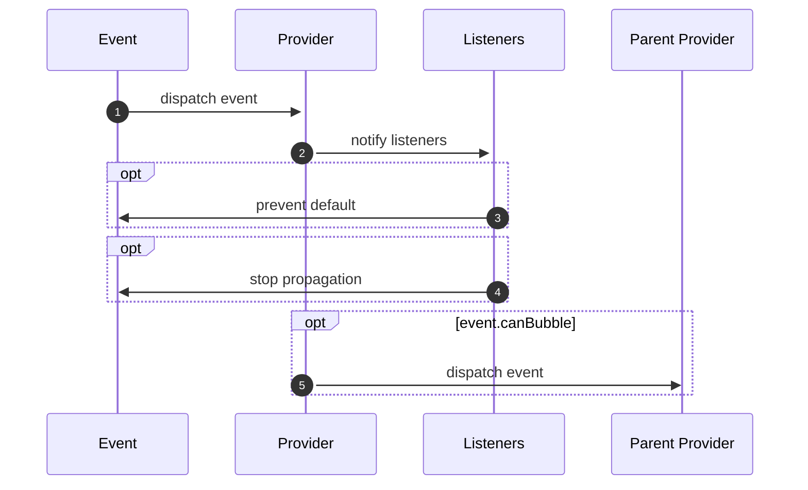
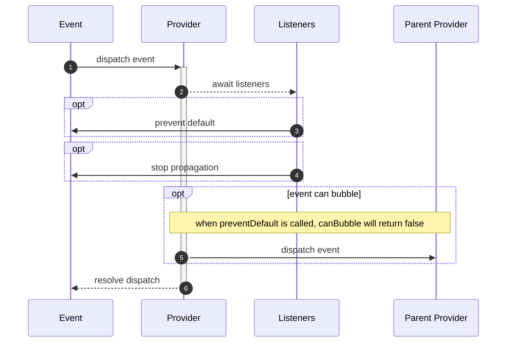

<ModuleBadge module="modules/event" package="@equinor/fusion-framework-module-event" />

## Concept

Since module instances are loosely coupled, the message module allows modules to communicate together internally.

::: tip Event Bubbling
when initializing modules with reference to instance of modules, the event module will by default subscribe to reference event provider.

For example when the Provider (Portal) initializes a consumer (App), the app will dispatch events that `canBubble` to its parent event module instance.
:::

::: warning Async listeners
event handlers are allowed to execute async, so when `event.cancelable = false` the dispatcher will not await resolution, which means the cancellation might not happen in the order which handlers where added 
:::

### Dispatch event


```ts
modules.event.dispatchEvent(
  'myEvent', 
  { detail: myObj, source: mySource }
);
// alternative
modules.event.dispatchEvent(
  new FrameworkEvent(
    'myEvent', 
    { detail: myObj, source: mySource }
  )
);

```

### Cancelable events




```ts
const event = await module.event.dispatchEvent(
  'myEvent', 
  { detail: myObj, source: mySource, cancelable: true }
);

if(event.defaultPrevented){
  console.log('event was canceled');
} else {
  console.log('event was dispatched successfully');
}
```

## Customize

### Declare event type

declaring a module will not add any functionality, __but__ provide type hinting/completion 

```ts
declare module '@equinor/fusion-framework-module-event' {
  interface FrameworkEventMap {
    myOwnType: FrameworkEvent<
      FrameworkEventInit<
        MyDetailType,
        MySourceType
      >
    >;
  }
}
```

### Custom event
```ts
// define a custom event class
class MyEvent extends FrameworkEvent<MyDetailType, MySourceType>{
  constructor(
    readonly obj: MyObj,
    init: FrameworkEventInit<MyDetailType,MySourceType>
  ) {
    super('onMyEvent', init);
  }
}

// add type hinting
declare module '@equinor/fusion-framework-module-event' {
  interface FrameworkEventMap {
    onMyEvent: MyEvent
  }
}

module.event.dispatch(new MyEvent(someObj, {detail, source}));

module.event.addEventListener('onMyEvent', (e) => {
  console.log('is my custom object:', e instanceof MyEvent);
  console.log('my custom obj', e.obj);
});
```


## Config

### Handling events before dispatch
```ts
const doNotHandleEvents = ['onMyEvent'];
const doNotPropagateEvents = ['myOtherEvent'];

config.event.onDispatch = (e) => {
  if(doNotHandleEvents.includes(e.type)){
    e.preventDefault();
  }
  if(doNotPropagateEvents.includes(e.type)){
    e.stopPropagation();
  }
}
```

### Handling bubbling
```ts
// prevent default bubbling to ref modules
config.event.onBubble = undefined;

// custom handling
config.event.onBubble = (e) => {
  console.log(`event [${e.type}] is bubbling`);
  ref.event.dispatch(e);
}
```
