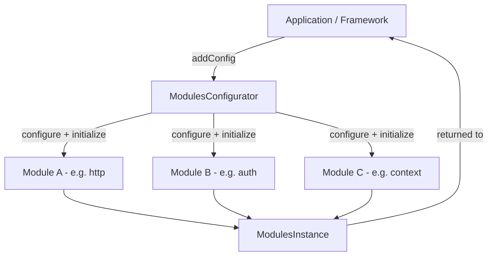

<ModuleBadge module="modules/module" package="@equinor/fusion-framework-module" />

Core module system for Fusion Framework. This package defines the contracts, base classes, and orchestration logic that every Fusion Framework module depends on.

A Fusion application is assembled from **modules**. Each module owns a slice of runtime capability — an HTTP client, an auth provider, a context selector — and exposes it through a typed **provider** instance. The **`ModulesConfigurator`** drives the three-phase lifecycle that wires modules together: configure → initialize → dispose.



## Installation

```sh
pnpm add @equinor/fusion-framework-module
```

## Quick Start

```typescript
import {
  ModulesConfigurator,
  type Module,
  BaseConfigBuilder,
  type ConfigBuilderCallback,
} from '@equinor/fusion-framework-module';
import { BaseModuleProvider } from '@equinor/fusion-framework-module/provider';

interface GreeterConfig { greeting: string }

class GreeterConfigurator extends BaseConfigBuilder<GreeterConfig> {
  setGreeting(cb: ConfigBuilderCallback<string>) { this._set('greeting', cb); }
}

class GreeterProvider extends BaseModuleProvider {
  constructor(private config: GreeterConfig, args: ConstructorParameters<typeof BaseModuleProvider>[0]) {
    super(args);
  }
  greet(name: string) { return `${this.config.greeting}, ${name}!`; }
}

const greeterModule: Module<'greeter', GreeterProvider, GreeterConfigurator> = {
  name: 'greeter',
  configure: () => new GreeterConfigurator(),
  initialize: async ({ config, hasModule, requireInstance, ref }) => {
    const resolved = await config.createConfigAsync({ config: {}, hasModule, requireInstance, ref });
    return new GreeterProvider(resolved, { version: '1.0.0' });
  },
};

const configurator = new ModulesConfigurator();
configurator.addConfig({
  module: greeterModule,
  configure: (builder) => builder.setGreeting(() => 'Hello'),
});

const modules = await configurator.initialize();
console.log(modules.greeter.greet('World')); // Hello, World!
```

## Documentation

| Document | Description |
|---|---|
| [Concepts](./docs/concepts.md) | Mental model — what a module, provider, and configurator are |
| [Lifecycle](./docs/lifecycle.md) | The five phases: configure, post-configure, initialize, post-initialize, dispose |
| [Authoring Modules](./docs/authoring-modules.md) | Step-by-step guide for writing a new module |
| [Configuration](./docs/configuration.md) | How `BaseConfigBuilder`, `_set`, and `ConfigBuilderCallback` work |
| [Cross-Module Dependencies](./docs/cross-module-deps.md) | `requireInstance`, `postInitialize`, optional deps, circular dep avoidance |
| [Events and Observability](./docs/events.md) | `configurator.event$`, `ModuleEvent`, telemetry patterns |
| [Common Mistakes](./docs/common-mistakes.md) | Pitfalls — accessing modules early, missing `await`, no timeout, circular deps |

## Exports

### Main Entry Point (`@equinor/fusion-framework-module`)

| Export | Kind | Description |
|---|---|---|
| `Module` | type | Interface describing a module's structure and lifecycle hooks |
| `AnyModule` | type | `Module<any, any, any, any>` — used for generic constraints |
| `ModulesConfigurator` | class | Orchestrates configure → initialize → dispose for a set of modules |
| `IModulesConfigurator` | interface | Public contract for the modules configurator |
| `IModuleConfigurator` | interface | Descriptor for registering a single module with lifecycle hooks |
| `BaseConfigBuilder` | class | Abstract config builder with dot-path targeting and async callbacks |
| `ConfigBuilderCallback` | type | Callback signature used by config builder setters |
| `ConfigBuilderCallbackArgs` | type | Arguments passed to config builder callbacks |
| `ModuleConfigType` | type | Extracts the config builder type from a `Module` |
| `ModuleType` | type | Extracts the provider type from a `Module` |
| `initializeModules` | function | Convenience wrapper around `configurator.initialize()` |
| `SemanticVersion` | class | Extended `SemVer` with a `satisfies()` method |
| `ModuleConsoleLogger` | class | Styled console logger with module-name prefix |

### Provider Sub-path (`@equinor/fusion-framework-module/provider`)

| Export | Kind | Description |
|---|---|---|
| `IModuleProvider` | interface | Contract every module provider must satisfy |
| `BaseModuleProvider` | class | Abstract base with version, subscription management, and dispose |
| `BaseModuleProviderCtorArgs` | type | Constructor arguments for `BaseModuleProvider` |
